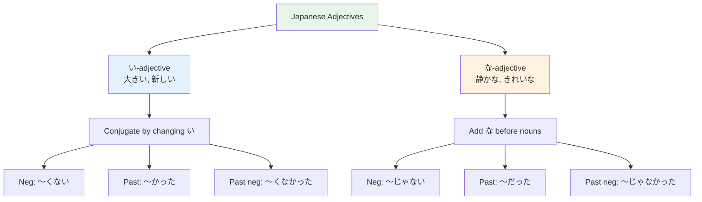

# N5 Grammar — Adjectives

> **Japanese has two types of adjectives that conjugate differently. Yes, adjectives conjugate in Japanese!**

## 🎯 Intuition

**The Core Idea:** Japanese has two adjective types with different conjugation rules — い-adjectives and な-adjectives.
**Analogy:** Like the difference between 'big/bigger/biggest' (inflects) and 'beautiful/more beautiful' (uses helper words).
**Why It Matters:** Adjectives let you describe things, express opinions, and build more natural sentences.

## ⚙️ Core Mechanics

## Two Types

### い-Adjectives (i-adjectives)
Native Japanese adjectives ending in い:
- 大きい (ōkii) — big
  ![[adj-001-okii.mp3]]
- 小さい (chiisai) — small
  ![[adj-002-chiisai.mp3]]
- 新しい (atarashii) — new
  ![[adj-003-atarashii.mp3]]
- 古い (furui) — old
  ![[adj-004-furui.mp3]]
- 美しい (utsukushii) — beautiful
  ![[adj-005-utsukushii.mp3]]
- おいしい (oishii) — delicious
  ![[adj-006-oishii.mp3]]
- 暑い (atsui) — hot
  ![[adj-007-atsui.mp3]]
- 寒い (samui) — cold
  ![[adj-008-samui.mp3]]
**い-Adjective Conjugation:**

| Form | Rule | Example (おいしい) | Audio |
| ------ | ------ | --------- | --- |
| Present | As-is | おいしい (oishii) | ![[gap-007-(oishii).mp3]] |
| Negative | Drop い, add くない | おいしくない (oishikunai) | ![[gap-008-Drop-,-add.mp3]] |
| Past | Drop い, add かった | おいしかった (oishikatta) | ![[gap-009-Drop-,-add.mp3]] |
| Past neg | Drop い, add くなかった | おいしくなかった | ![[gap-010-Drop-,-add.mp3]] |
| Adverb | Drop い, add く | おいしく (oishiku) | ![[gap-011-Drop-,-add.mp3]] |
| Polite | Add です | おいしいです (oishii desu) | ![[gap-012-Add.mp3]] |

Audio:
- おいしくない ![[adj-009-oishikunai.mp3]]
- おいしかった ![[adj-010-oishikatta.mp3]]
- おいしくなかった ![[adj-011-oishikunakatta.mp3]]
- おいしく ![[adj-012-oishiku.mp3]]
- おいしいです ![[adj-013-oishii-desu.mp3]]
**Exception:** いい (ii, good) conjugates as よい:
- よくない, よかった, よくなかった
  - よくない ![[adj-014-yokunai.mp3]]
  - よかった ![[adj-015-yokatta.mp3]]
  - よくなかった ![[adj-016-yokunakatta.mp3]]

### な-Adjectives (na-adjectives)
Originally nouns that function as adjectives. Add な before nouns:
- 元気な (genki na) — energetic
  ![[adj-017-genki-na.mp3]]
- 静かな (shizuka na) — quiet
  ![[adj-018-shizuka-na.mp3]]
- 有名な (yūmei na) — famous
  ![[adj-019-yumei-na.mp3]]
- 綺麗な (kirei na) — beautiful/clean
  ![[adj-020-kirei-na.mp3]]
- 便利な (benri na) — convenient
  ![[adj-021-benri-na.mp3]]
- 好きな (suki na) — liked/favorite
  ![[adj-022-suki-na.mp3]]
- 嫌いな (kirai na) — disliked
  ![[adj-023-kirai-na.mp3]]
- 大変な (taihen na) — tough/terrible
  ![[adj-024-taihen-na.mp3]]
**な-Adjective Conjugation:**

| Form | Rule | Example (元気) | Audio |
| ------ | ------ | --------- | --- |
| Before noun | + な | 元気な人 (genki na hito) | ![[gap-013-+.mp3]] |
| Predicate | + です | 元気です (genki desu) | ![[gap-014-+.mp3]] |
| Negative | + じゃない | 元気じゃない (genki ja nai) | ![[gap-015-+.mp3]] |
| Past | + でした | 元気でした (genki deshita) | ![[gap-016-+.mp3]] |
| Past neg | + じゃなかった | 元気じゃなかった | ![[gap-017-+.mp3]] |
| Adverb | + に | 元気に (genki ni) | ![[gap-018-+.mp3]] |

Audio:
- 元気な人 ![[adj-025-genki-na-hito.mp3]]
- 元気です ![[adj-026-genki-desu.mp3]]
- 元気じゃない ![[adj-027-genki-ja-nai.mp3]]
- 元気でした ![[adj-028-genki-deshita.mp3]]
- 元気じゃなかった ![[adj-029-genki-janakatta.mp3]]
- 元気に ![[adj-030-genki-ni.mp3]]

## Connecting Adjectives

| Type | "and" form | Example | Audio |
| ------ | ----------- | --------- | --- |
| い-adj | Drop い, add くて | 安くておいしい (cheap and delicious) | ![[gap-019-adj.mp3]] |
| な-adj | Add で | 静かできれい (quiet and beautiful) | ![[gap-020-adj.mp3]] |

Audio:
- 安くておいしい ![[adj-033-cheap-delicious.mp3]]
- 静かできれい ![[adj-034-quiet-beautiful.mp3]]

## Comparison

| English | Japanese | Pattern | Audio |
| --------- | ---------- | --------- | --- |
| A is more ~ than B | Aは Bより ~ です | 犬は猫より大きいです | ![[gap-021-A-B-~.mp3]] |
| A is the most ~ | Aが一番 ~ です | 富士山が一番高いです | ![[gap-022-A-~.mp3]] |
| Which is more ~? | どちらが ~ ですか | どちらが安いですか | ![[gap-023-~.mp3]] |

Audio:
- 犬は猫より大きいです ![[adj-035-inu-ha-neko-yori-ookii-desu.mp3]]
- 富士山が一番高いです ![[adj-036-fujisan-ga-ichiban-takai-desu.mp3]]
- どちらが安いですか ![[adj-037-dochiraga-yasui-desuka.mp3]]

## Practice
1. Describe 5 objects near you using both types of adjectives
2. Conjugate each adjective through all 4 forms (present/neg/past/past neg)
3. Make comparison sentences with より and 一番

## 🔬 Deep Dive

### Tricky Cases
- きれい (kirei) looks like an い-adj but is actually な-adj
  ![[adj-031-kirei.mp3]]
- 嫌い (kirai) also looks like い-adj but is な-adj
  ![[adj-032-kirai.mp3]]
- **Test:** If removing い leaves a real word, it's probably な-adj

### Nuances and Exceptions
- Pay attention to context — the same grammar point can have different nuances in formal vs casual speech.
- Exceptions often come from classical Japanese or set phrases that don't follow modern rules.

### Formal vs Informal Usage
- Most patterns have both polite (です/ます) and casual (dictionary form) variants.
- Choose formality based on your relationship with the listener and the situation.

### Common Mistakes by English Speakers
- Applying English word order (SVO) instead of Japanese (SOV).
- Overusing pronouns — Japanese drops subjects when context is clear.
- Translating literally instead of using natural Japanese patterns.

## 🏋️ Practice

### Warm-Up — Recognition
1. Is きれい an い-adjective or な-adjective? → (な-adjective — trick question!)
2. What's the negative form of 高い? → (高くない)
3. What's the past form of 静かな? → (静かだった)

### Core Exercises — Production
1. **Conjugate 新しい:** Negative → 新しくない | Past → 新しかった | Past neg → 新しくなかった
2. **Translate:** "That restaurant wasn't quiet." → あのレストランは静かじゃなかった。

### Challenge — Real World
Write a review of your favorite restaurant using at least 3 い-adjectives and 2 な-adjectives in various forms (present, negative, past).

## 🔊 Audio
- Practice saying adjective conjugation patterns aloud
- Describe things around you using both い and な adjectives

## References
- [[Sources Index]]
