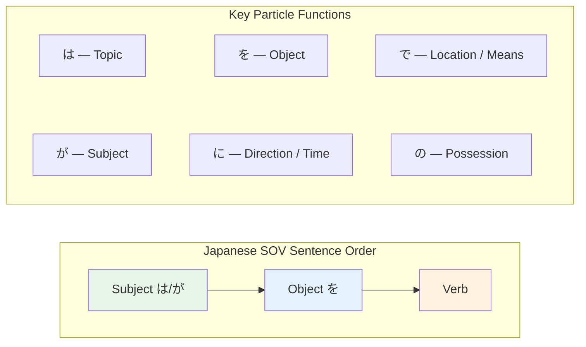

# N5 Grammar — Particles

> **Particles are the glue of Japanese. They mark grammatical roles and relationships between words. Master these and Japanese sentence structure clicks.**

## 🎯 Intuition

**The Core Idea:** Particles are tiny grammatical markers that define the role of every word in a sentence.
**Analogy:** Like prepositions on steroids — particles tell you WHO did WHAT to WHOM, WHERE, WHEN, and HOW.
**Why It Matters:** Without particles, Japanese is just a pile of words — with them, meaning clicks into place.

## ⚙️ Core Mechanics

## The Essential Particles

### は (wa) — Topic Marker
![[particle-001-wa.mp3]]
Marks what the sentence is ABOUT (not necessarily the subject).
- 私は学生です。 (Watashi wa gakusei desu.) — "I am a student."
  ![[particle-002-watashi-wa-gakusei-desu.mp3]]
- これは本です。 (Kore wa hon desu.) — "This is a book."
  ![[particle-003-kore-wa-hon-desu.mp3]]
- **Note:** Written は but pronounced "wa" when used as particle

### が (ga) — Subject Marker
![[particle-004-ga.mp3]]
Marks the grammatical subject, especially for new information or emphasis.
- 雨が降っています。 (Ame ga futte imasu.) — "It's raining."
  ![[particle-005-ame-ga-futte-imasu.mp3]]
- 誰が来ましたか。 (Dare ga kimashita ka.) — "Who came?"
  ![[particle-006-dare-ga-kimashita-ka.mp3]]
- **は vs が:** は = "as for X..." (known info), が = "X is the one that..." (new/emphasized info)

### を (o) — Object Marker
![[particle-007-o.mp3]]
Marks the direct object of a verb.
- 本を読みます。 (Hon o yomimasu.) — "I read a book."
  ![[particle-008-hon-o-yomimasu.mp3]]
- コーヒーを飲みます。 (Kōhī o nomimasu.) — "I drink coffee."
  ![[particle-009-kohi-o-nomimasu.mp3]]
- **Note:** Written を but pronounced "o"

### に (ni) — Direction / Time / Indirect Object
![[particle-010-ni.mp3]]
Multiple uses — context determines meaning.
- **Direction:** 学校に行きます。 (Gakkō ni ikimasu.) — "I go to school."
  ![[particle-011-direction-gakkou-ni-iki-masu.mp3]]
- **Time:** 七時に起きます。 (Shichiji ni okimasu.) — "I wake up at 7."
  ![[particle-012-time-shichiji-ni-oki-masu.mp3]]
- **Existence:** 部屋に猫がいます。 (Heya ni neko ga imasu.) — "There's a cat in the room."
  ![[particle-013-existence-heya-ni-neko-gaimasu.mp3]]
- **Indirect object:** 友達にあげます。 (Tomodachi ni agemasu.) — "I give to my friend."
  ![[particle-014-indirect-object-tomodachi-niagemasu.mp3]]

### で (de) — Location of Action / Means
![[particle-015-de.mp3]]
- **Location:** 図書館で勉強します。 (Toshokan de benkyō shimasu.) — "I study at the library."
  ![[particle-016-location-toshokan-de-benkyou-shimasu.mp3]]
- **Means:** バスで行きます。 (Basu de ikimasu.) — "I go by bus."
  ![[particle-017-means-basu-de-iki-masu.mp3]]
- **に vs で:** に = static location (existence), で = where action happens

### へ (e) — Direction (toward)
![[particle-018-e.mp3]]
Similar to に for direction, but emphasizes the journey, not the destination.
- 日本へ行きます。 (Nihon e ikimasu.) — "I'm going to Japan."
  ![[particle-019-nihon-e-ikimasu.mp3]]
- **Note:** Written へ but pronounced "e" when used as particle

### と (to) — And / With / Quotation
![[particle-020-audio.mp3]]
- **And (nouns):** 犬と猫 (inu to neko) — "dog and cat" (exhaustive list)
- **With:** 友達と行きます。 (Tomodachi to ikimasu.) — "I go with my friend."
  ![[particle-021-tomodachi-iki-masu.mp3]]
- **Quotation:** 「行く」と言いました。 ("Iku" to iimashita.) — 'Said "I'll go."'
  ![[particle-022-quotation-iku-ii-mashita.mp3]]

### も (mo) — Also / Too
![[particle-023-mo.mp3]]
Replaces は/が/を to add "also."
- 私も学生です。 (Watashi mo gakusei desu.) — "I'm also a student."
  ![[particle-024-watashi-mo-gakusei-desu.mp3]]
- これもいいです。 (Kore mo ii desu.) — "This is also good."
  ![[particle-025-kore-mo-ii-desu.mp3]]

### の (no) — Possession / Modifier
![[particle-026-no.mp3]]
Connects nouns (like English "'s" or "of").
- 私の本 (watashi no hon) — "my book"
  ![[particle-027-watashi-no-hon.mp3]]
- 日本の食べ物 (Nihon no tabemono) — "Japanese food"
  ![[particle-028-nihon-no-tabemono.mp3]]

### から (kara) — From
![[particle-029-kara.mp3]]
- **Place:** 東京から来ました。 (Tōkyō kara kimashita.) — "I came from Tokyo."
  ![[particle-030-place-toukyou-kara-kima-shita.mp3]]
- **Time:** 九時からです。 (Kuji kara desu.) — "It's from 9 o'clock."
  ![[particle-031-time-kuji-karadesu.mp3]]

### まで (made) — Until / Up to
![[particle-032-made.mp3]]
- 五時までです。 (Goji made desu.) — "It's until 5 o'clock."
  ![[particle-033-goji-made-desu.mp3]]
- 東京から大阪まで (Tōkyō kara Ōsaka made) — "From Tokyo to Osaka"
  ![[particle-034-tokyo-kara-osaka-made.mp3]]

## Particle Cheat Sheet

| Particle | Function | Remember | Audio |
| ---------- | ---------- | ---------- | --- |
| は | Topic | "As for X..." | ![[gap-024-phrase.mp3]] |
| が | Subject | "X is the one that..." | ![[gap-025-phrase.mp3]] |
| を | Object | What the verb acts on | ![[gap-026-phrase.mp3]] |
| に | To/at/time | Static location, time, direction | ![[gap-027-phrase.mp3]] |
| で | At/by/with | Where action happens, means | ![[gap-028-phrase.mp3]] |
| へ | Toward | Direction (journey focus) | ![[gap-029-phrase.mp3]] |
| と | And/with | Exhaustive list, companion | ![[gap-030-phrase.mp3]] |
| も | Also | Replaces は/が/を | ![[gap-031-phrase.mp3]] |
| の | Of/'s | Noun connector | ![[gap-032-phrase.mp3]] |
| から | From | Starting point | ![[gap-033-phrase.mp3]] |
| まで | Until | Ending point | ![[gap-034-phrase.mp3]] |

## 🔬 Deep Dive

### Common Mistakes
1. Confusing は and が — this is the #1 struggle for all learners
2. Using に when で is needed (and vice versa)
3. Forgetting particles entirely (sounds like baby talk)
4. Doubling particles (には is OK, をは is wrong)

### Nuances and Exceptions
- Pay attention to context — the same grammar point can have different nuances in formal vs casual speech.
- Exceptions often come from classical Japanese or set phrases that don't follow modern rules.

### Formal vs Informal Usage
- Most patterns have both polite (です/ます) and casual (dictionary form) variants.
- Choose formality based on your relationship with the listener and the situation.

## 🏋️ Practice

### Warm-Up — Recognition
1. Which particle marks the topic? → (は)
2. What's the difference between に and で for location? → (に = existence; で = action location)
3. Which particle means 'also' and replaces は/が/を? → (も)

### Core Exercises — Production
1. **Fill in all particles:** 昨日友達＿東京＿電車＿行きました。 → (と / に / で)
2. **Translate:** "I drink coffee at the café." → カフェでコーヒーを飲みます。

### Challenge — Real World
Describe your morning routine using at least 5 different particles (は、を、に、で、と). Example: 私は七時に起きます。

## 🔊 Audio
- Practice particle drills: fill in the correct particle
- Listen for particles in natural speech — they're often swallowed

## References
- [[Japanese/Sources/Sources Index|Sources Index]]
