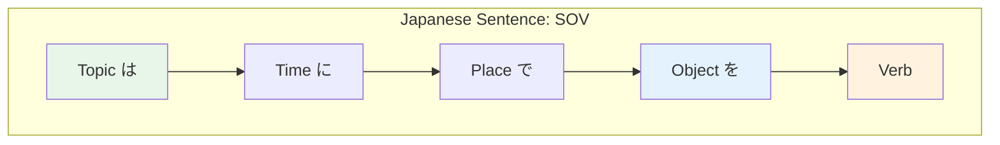

# N5 Grammar — Sentence Patterns

> **Core sentence structures that form the backbone of basic Japanese.**

## 🎯 Intuition

**The Core Idea:** Core sentence patterns are reusable templates for building your first Japanese sentences.
**Analogy:** Japanese sentences are like fill-in-the-blank templates: [Topic] は [Comment] です is the most basic one.
**Why It Matters:** These patterns let you stop memorizing isolated phrases and start making controlled sentences.

## Study Order

Do these in order:

1. XはYです.
2. Questions with か.
3. います / あります.
4. Wanting with ほしい and たい.
5. Requests and invitations after you know enough verb forms.

Do not try to master every pattern here in one sitting. Phase 1 only needs the first three well enough to recognize and produce simple examples.

## ⚙️ Core Mechanics

## Copula: です (desu) — "is/am/are"
The simplest sentence: X は Y です。
![[nontbl-040-wa-ha-particle.mp3]]
- 私は学生です。 (Watashi wa gakusei desu.) — "I am a student."
  ![[gramn5-001-watashi-wa-gakusei-desu.mp3]]
- これは本です。 (Kore wa hon desu.) — "This is a book."
  ![[gramn5-002-kore-wa-hon-desu.mp3]]
- **Negative:** じゃありません / じゃないです
  - じゃありません ![[sentpat-001-jaarimasen.mp3]]
  - じゃないです ![[sentpat-002-janaidesu.mp3]]
- **Past:** でした
  ![[sentpat-003-deshita.mp3]]
- **Past negative:** じゃありませんでした
  ![[sentpat-004-jaarimasendeshita.mp3]]

## Questions with か (ka)
Add か to make a question:
- 学生ですか。 (Gakusei desu ka?) — Are you a student?
  ![[gramn5-013-gakusei-desu-ka.mp3]]
- **Question words:** 何 (nani/what), 誰 (dare/who), どこ (doko/where), いつ (itsu/when), なぜ (naze/why), どう (dō/how)
  - 何 ![[sentpat-005-nani-what.mp3]]
  - 誰 ![[sentpat-006-dare-who.mp3]]
  - どこ ![[sentpat-007-doko-where.mp3]]
  - いつ ![[sentpat-008-itsu-when.mp3]]
  - なぜ ![[sentpat-009-naze-why.mp3]]
  - どう ![[sentpat-010-how.mp3]]
- 何を食べますか。 (Nani wo tabemasu ka.) — What will you eat?
  ![[gramn5-014-nani-wo-tabemasu-ka.mp3]]
- どこに行きますか。 (Doko ni ikimasu ka.) — Where will you go?
  ![[gramn5-015-doko-ni-ikimasu-ka.mp3]]

## Existence: います / あります
![[nontbl-041-imasu-arimasu.mp3]]
- います ![[sentpat-011-imasu.mp3]]
- あります ![[sentpat-012-arimasu.mp3]]
- **います (imasu)** — animate things (people, animals): 猫がいます。 (Neko ga imasu.) — There is a cat.
  ![[gramn5-003-neko-ga-imasu.mp3]]
- **あります (arimasu)** — inanimate things: 本があります。 (Hon ga arimasu.) — There is a book.
  ![[gramn5-004-hon-ga-arimasu.mp3]]
- Pattern: Place に Thing が います/あります

## Wanting: ほしい / たい
- ほしい ![[sentpat-013-hoshii.mp3]]
- たい ![[sentpat-014-tai.mp3]]
- **ほしい (hoshii)** — want a thing: 水がほしいです。 (Mizu ga hoshii desu.) — I want water.
  ![[gramn5-005-mizu-ga-hoshii-desu.mp3]]
- **たい (tai)** — want to do: 食べたいです。 (Tabetai desu.) — I want to eat.
  ![[gramn5-006-tabetai-desu.mp3]]
- 日本に行きたいです。 (Nihon ni ikitai desu.) — I want to go to Japan.
  ![[gramn5-007-nihon-ni-ikitai-desu.mp3]]
- **Note:** Only use for YOUR wants — use たがっています for others

## Giving Reasons: から (because)
- 雨だから、行きません。 (Ame dakara, ikimasen.) — Because it's raining, I won't go.
  ![[gramn5-011-ame-dakara-ikimasen.mp3]]

## Listing Actions: て-form Sequence
- 起きて、シャワーを浴びて、朝ごはんを食べます。 (Okite, shawaa o abite, asagohan o tabemasu.) — I wake up, shower, and eat breakfast.
  ![[gramn5-012-okite-shawaa-asagohan.mp3]]

## Invitations: ませんか
![[sentpat-015-masenka.mp3]]
- 一緒に食べませんか。 (Issho ni tabemasen ka?) — Won't you eat together?
  ![[gramn5-010-issho-ni-tabemasen-ka.mp3]]

## Common Beginner Mistakes

- Treating は as the subject marker. In Phase 1, think "topic" or "as for X."
- Translating English word order directly. Japanese puts the main verb or copula at the end.
- Overusing 私. Japanese drops obvious subjects.
- Using あります for people or animals. Use います for animate beings.
- Trying to express someone else's wants with たい too early.

## Practice

### Recognition

1. 私＿学生です。 -> は
2. 猫＿います。 -> が
3. 本＿あります。 -> が
4. 学生です＿。 -> か

### Production

Make five sentences using this frame:

| Frame | Example |
| --- | --- |
| XはYです | 私は学生です。 |
| XはYですか | これは本ですか。 |
| PlaceにThingがあります | ここに本があります。 |
| PlaceにPerson/Animalがいます | そこに猫がいます。 |
| Thingがほしいです | 水がほしいです。 |

### Phase 1 Checkpoint

You are done with this page for now when you can explain:

- What は does in XはYです.
- Why 猫がいます and 本があります use different verbs.
- How to turn 学生です into a question.

## References
- [[Sources Index]]
- [[chunk-jp-028]]
- [[chunk-jp-029]]
- [[chunk-jp-030]]
- [[chunk-jp-031]]
