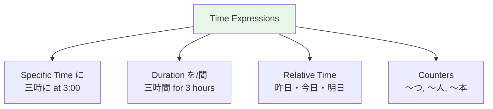

# N5 Grammar — Time and Counting

> **Japanese counting uses different counter words for different types of objects.**

## 🎯 Intuition

**The Core Idea:** Time expressions and counting in Japanese follow specific patterns with particles and counters.
**Analogy:** Time words + に particle = when something happens; counters = how many — more systematic than English.
**Why It Matters:** You need these for scheduling, shopping, telling time, and any daily-life conversation.

## ⚙️ Core Mechanics

## Telling Time

### Hours (時 ji)
![[time-001-ji.mp3]]

| Time | Japanese | Reading | Notes | Audio |
| ------ | ---------- | --------- | ------- | --- |
| 1:00 | 一時 | ichiji | ![[gap-035-phrase.mp3]] |
| 4:00 | 四時 | **yoji** | Not shiji | ![[gap-036-phrase.mp3]] |
| 7:00 | 七時 | **shichiji** | ![[gap-037-phrase.mp3]] |
| 9:00 | 九時 | **kuji** | ![[gap-038-phrase.mp3]] |

Audio:
- 一時 ![[time-002-ichiji.mp3]]
- 四時 ![[time-003-yoji.mp3]]
- 七時 ![[time-004-shichiji.mp3]]
- 九時 ![[time-005-kuji.mp3]]

午前 (gozen) = AM, 午後 (gogo) = PM. Placed BEFORE the time.
- 午前 ![[time-006-gozen.mp3]]
- 午後 ![[time-007-gogo.mp3]]

### Minutes (分 fun/pun)
![[time-008-fun.mp3]]
Sound changes at 1, 3, 4, 6, 8, 10:

| Min | Reading | Min | Reading | Audio |
| ----- | --------- | ----- | --------- | --- |
| 1 | いっぷん | 6 | ろっぷん | ![[gap-039-phrase.mp3]] |
| 3 | さんぷん | 8 | はっぷん | ![[gap-040-phrase.mp3]] |
| 5 | ごふん | 10 | じゅっぷん | ![[gap-041-phrase.mp3]] |

Audio:
- いっぷん ![[time-009-ippun.mp3]]
- ろっぷん ![[time-010-roppun.mp3]]
- さんぷん ![[time-011-sanpun.mp3]]
- はっぷん ![[time-012-happun.mp3]]
- ごふん ![[time-013-gofun.mp3]]
- じゅっぷん ![[time-014-juppun.mp3]]

### Half (半 han)
![[time-015-han.mp3]]
3:30 = 三時半 (sanji han)
![[time-016-sanji-han.mp3]]

## Days of the Month
First 10 days use special native readings:

| Day | Japanese | Day | Japanese | Audio |
| ----- | ---------- | ----- | ---------- | --- |
| 1st | ついたち | 6th | むいか | ![[gap-042-phrase.mp3]] |
| 2nd | ふつか | 7th | なのか | ![[gap-043-phrase.mp3]] |
| 3rd | みっか | 8th | ようか | ![[gap-044-phrase.mp3]] |
| 4th | よっか | 9th | ここのか | ![[gap-045-phrase.mp3]] |
| 5th | いつか | 10th | とおか | ![[gap-046-phrase.mp3]] |
| 20th | はつか | | ![[gap-047-phrase.mp3]] |

Audio:
- ついたち ![[time-017-tsuitachi.mp3]]
- むいか ![[time-018-muika.mp3]]
- ふつか ![[time-019-futsuka.mp3]]
- なのか ![[time-020-nanoka.mp3]]
- みっか ![[time-021-mikka.mp3]]
- ようか ![[time-022-youka.mp3]]
- よっか ![[time-023-yokka.mp3]]
- ここのか ![[time-024-kokonoka.mp3]]
- いつか ![[time-025-itsuka.mp3]]
- とおか ![[time-026-tooka.mp3]]
- はつか ![[time-027-hatsuka.mp3]]

## Essential Counters

| Counter | For | Example | Audio |
| --------- | ----- | --------- | --- |
| つ (tsu) | General objects | 一つ (hitotsu), 二つ (futatsu) | ![[gap-048-(tsu).mp3]] |
| 人 (nin) | People | 一人 (hitori), 二人 (futari), 三人 (sannin) | ![[gap-049-(nin).mp3]] |
| 本 (hon) | Long objects | 一本 (ippon), 三本 (sanbon) | ![[gap-050-(hon).mp3]] |
| 枚 (mai) | Flat objects | 一枚 (ichimai) | ![[gap-051-(mai).mp3]] |
| 杯 (hai) | Cups/glasses | 一杯 (ippai), 三杯 (sanbai) | ![[gap-052-(hai).mp3]] |
| 冊 (satsu) | Books | 一冊 (issatsu) | ![[gap-053-(satsu).mp3]] |
| 台 (dai) | Machines | 一台 (ichidai) | ![[gap-054-(dai).mp3]] |
| 匹 (hiki) | Small animals | 一匹 (ippiki) | ![[gap-055-(hiki).mp3]] |

Audio:
- つ ![[time-028-tsu.mp3]]
- 一つ ![[time-029-hitotsu.mp3]]
- 二つ ![[time-030-futatsu.mp3]]
- 人 ![[time-031-nin.mp3]]
- 一人 ![[time-032-hitori.mp3]]
- 二人 ![[time-033-futari.mp3]]
- 三人 ![[time-034-sannin.mp3]]
- 本 ![[time-035-hon.mp3]]
- 一本 ![[time-036-ippon.mp3]]
- 三本 ![[time-037-sanbon.mp3]]
- 枚 ![[time-038-mai.mp3]]
- 一枚 ![[time-039-ichimai.mp3]]
- 杯 ![[time-040-hai.mp3]]
- 一杯 ![[time-041-ippai.mp3]]
- 三杯 ![[time-042-sanbai.mp3]]
- 冊 ![[time-043-satsu.mp3]]
- 一冊 ![[time-044-issatsu.mp3]]
- 台 ![[time-045-dai.mp3]]
- 一台 ![[time-046-ichidai.mp3]]
- 匹 ![[time-047-hiki.mp3]]
- 一匹 ![[time-048-ippiki.mp3]]

## Duration

| Expression | Meaning | Audio |
| ----------- | --------- | --- |
| 一時間 (ichijikan) | one hour | ![[gap-056-(ichijikan).mp3]] |
| 一週間 (isshūkan) | one week | ![[gap-057-(isshkan).mp3]] |
| 一か月 (ikkagetsu) | one month | ![[gap-058-(ikkagetsu).mp3]] |
| 一年間 (ichinenkan) | one year | ![[gap-059-(ichinenkan).mp3]] |

Audio:
- 一時間 ![[time-049-ichijikan.mp3]]
- 一週間 ![[time-050-isshukan.mp3]]
- 一か月 ![[time-051-ikkagetsu.mp3]]
- 一年間 ![[time-052-ichinenkan.mp3]]

## 🔬 Deep Dive

### Nuances and Exceptions
- Pay attention to context — the same grammar point can have different nuances in formal vs casual speech.
- Exceptions often come from classical Japanese or set phrases that don't follow modern rules.

### Formal vs Informal Usage
- Most patterns have both polite (です/ます) and casual (dictionary form) variants.
- Choose formality based on your relationship with the listener and the situation.

### Common Mistakes by English Speakers
- Applying English word order (SVO) instead of Japanese (SOV).
- Overusing pronouns — Japanese drops subjects when context is clear.
- Translating literally instead of using natural Japanese patterns.

## 🏋️ Practice

### Warm-Up — Recognition
1. Which particle completes this sentence? 私＿学生です。 → (は)
2. Is this sentence correct? 本が読みます。 → (No — should be 本を読みます)
3. What does この mean in: この本は面白い → (this)

### Core Exercises — Production
1. **Translate:** "I go to school by bus every day."
   → 毎日バスで学校に行きます。
2. **Fill in:** 友達＿映画＿見ました。 → (と / を)

### Challenge — Real World
You're at a konbini (convenience store). The clerk asks これでよろしいですか？ How do you respond if you also want to add a drink? Use appropriate particles and polite form.

## 🔊 Audio
- Counter sound changes are critical — practice with audio

## References
- [[Sources Index]]
