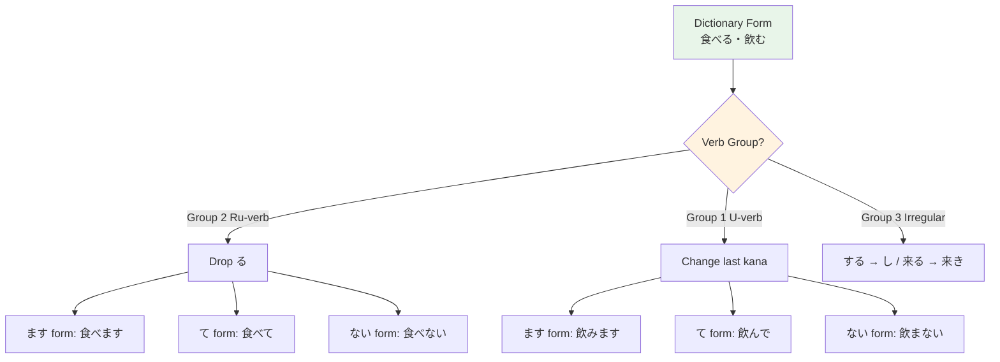

# N5 Grammar — Verb Forms

> **Japanese verbs conjugate for tense, negation, and formality. Understanding the verb system is the key to everything.**

## 🎯 Intuition

**The Core Idea:** Japanese verbs conjugate for tense, negation, and politeness — they're the engine of every sentence.
**Analogy:** Like English 'go/goes/went/gone/going' but more systematic — Japanese verbs follow predictable group rules.
**Why It Matters:** Verb forms unlock every sentence pattern: asking, refusing, connecting, requesting, and more.

## ⚙️ Core Mechanics

## Verb Groups

### Group 1: Godan (五段) — U-verbs
- End in an u-sound consonant + u: 書く (kaku), 話す (hanasu), 買う (kau)
  - 書く ![[verb-001-kaku.mp3]]
  - 話す ![[verb-002-hanasu.mp3]]
  - 買う ![[verb-003-kau.mp3]]
- The most common group with the most conjugation variation

### Group 2: Ichidan (一段) — Ru-verbs
- End in -iru or -eru: 食べる (taberu), 見る (miru), 起きる (okiru)
  - 食べる ![[verb-004-taberu.mp3]]
  - 見る ![[verb-005-miru.mp3]]
  - 起きる ![[verb-006-okiru.mp3]]
- Simpler conjugation — just drop る and add endings

### Group 3: Irregular
- Only two verbs: する (suru, to do) and くる (kuru, to come)
  - する ![[verb-007-suru.mp3]]
  - くる ![[verb-008-kuru.mp3]]
- Must memorize each form separately

## The Five Essential Forms

### 1. ます-form (Polite Present/Future)
![[verb-009-masu.mp3]]

| Group | Rule | Example | Audio |
| ------- | ------ | --------- | --- |
| G1 | Change final -u to -imasu | 書く → 書きます (kakimasu) | ![[gap-060-(kakimasu).mp3]] |
| G2 | Drop る, add ます | 食べる → 食べます (tabemasu) | ![[gap-061-Drop-,-add.mp3]] |
| Irr | する → します, くる → きます | ![[gap-062-,.mp3]] |

Audio:
- 書きます ![[verb-010-kakimasu.mp3]]
- 食べます ![[verb-011-tabemasu.mp3]]
- します ![[verb-012-shimasu.mp3]]
- きます ![[verb-013-kimasu.mp3]]
Negative: ません | Past: ました | Past neg: ませんでした

### 2. て-form (Connective — THE most important form)
![[verb-014-te.mp3]]
Used for: requests, progressive, permission, prohibition, connecting actions.
**Group 1 rules (memorize the song!):**

| Ending | て-form | Example | Audio |
| -------- | --------- | --------- | --- |
| く | いて | 書く → 書いて (kaite) | ![[gap-063-phrase.mp3]] |
![[nontbl-043-kaite-form.mp3]]

| ぐ | いで | 泳ぐ → 泳いで (oyoide) | ![[gap-064-phrase.mp3]] |
| す | して | 話す → 話して (hanashite) | ![[gap-065-phrase.mp3]] |
| ぶ/む/ぬ | んで | 飛ぶ → 飛んで (tonde) | ![[gap-066-.mp3]] |
| つ/る/う | って | 待つ → 待って (matte) | ![[gap-067-.mp3]] |
| Exception: 行く | 行って | (itte, NOT iite) | ![[gap-068-Exception.mp3]] |

Audio:
- いて ![[verb-015-ite.mp3]]
- 書いて ![[verb-016-kaite.mp3]]
- いで ![[verb-017-ide.mp3]]
- 泳ぐ ![[verb-018-oyogu.mp3]]
- 泳いで ![[verb-019-oyoide.mp3]]
- して ![[verb-020-shite.mp3]]
- 話して ![[verb-021-hanashite.mp3]]
- んで ![[verb-022-nde.mp3]]
- 飛ぶ ![[verb-023-tobu.mp3]]
- 飛んで ![[verb-024-tonde.mp3]]
- って ![[verb-025-tte.mp3]]
- 待つ ![[verb-026-matsu.mp3]]
- 待って ![[verb-027-matte.mp3]]
- 行く ![[verb-028-iku.mp3]]
- 行って ![[verb-029-itte.mp3]]
**Group 2:** Drop る, add て: 食べる → 食べて
![[nontbl-042-tabete-form.mp3]]
**Irregular:** する → して, くる → きて
**て-form patterns:**
- てください = Please do ~ (教えてください = Please tell me / teach me)
  ![[gramn5-008-oshiete-kudasai.mp3]]
- ています = Currently doing ~ (食べています = I am eating)
  - ています ![[verb-030-teimasu.mp3]]
  - 食べています ![[verb-031-tabete-imasu.mp3]]
- てもいいですか = May I ~? (写真を撮ってもいいですか = May I take a picture?)
  ![[gramn5-009-shashin-wo-tottemo-ii-desu-ka.mp3]]
- てはいけません = Must not ~ (食べてはいけません = Must not eat)
  - てはいけません ![[verb-032-tehaikemasen.mp3]]
  - 食べてはいけません ![[verb-033-tabete-haikemasen.mp3]]

### 3. ない-form (Negative Plain)
![[verb-034-nai.mp3]]

| Group | Rule | Example | Audio |
| ------- | ------ | --------- | --- |
| G1 | Change final -u to -anai | 書く → 書かない (kakanai) | ![[gap-069-(kakanai).mp3]] |
| G2 | Drop る, add ない | 食べる → 食べない (tabenai) | ![[gap-070-Drop-,-add.mp3]] |
| Irr | する → しない, くる → こない | ![[gap-071-,.mp3]] |
| Exception | ある → ない (NOT あらない) | ![[gap-072-(NOT-).mp3]] |

Audio:
- 書かない ![[verb-035-kakanai.mp3]]
- 食べない ![[verb-036-tabenai.mp3]]
- しない ![[verb-037-shinai.mp3]]
- こない ![[verb-038-konai.mp3]]
- ある ![[verb-039-aru.mp3]]

### 4. た-form (Past Plain)
![[verb-040-ta.mp3]]
Same sound changes as て-form, but with た/だ instead of て/で:
- 書く → 書いた (kaita)
  ![[verb-041-kaita.mp3]]
- 食べる → 食べた (tabeta)
  ![[verb-042-tabeta.mp3]]

### 5. Dictionary Form (Plain Present)
The base form found in dictionaries: 書く, 食べる, する
- Used in casual speech, before certain grammar patterns, and in relative clauses

## Conjugation Summary Table

|  | Polite | Polite Neg | Polite Past | Plain | Plain Neg | Plain Past | Audio |
| -- | -------- | ----------- | ------------- | ------- | ---------- | ----------- | --- |
| 書く | 書きます | 書きません | 書きました | 書く | 書かない | 書いた | ![[gap-073-phrase.mp3]] |
| 食べる | 食べます | 食べません | 食べました | 食べる | 食べない | 食べた | ![[gap-074-phrase.mp3]] |
| する | します | しません | しました | する | しない | した | ![[gap-075-phrase.mp3]] |

Audio:
- 書きません ![[verb-043-kaki-masen.mp3]]
- 書きました ![[verb-044-kaki-mashita.mp3]]
- 食べません ![[verb-045-tabe-masen.mp3]]
- 食べました ![[verb-046-tabe-mashita.mp3]]
- しません ![[verb-047-shimasen.mp3]]
- しました ![[verb-048-shimashita.mp3]]
- した ![[verb-049-shita.mp3]]

## Practice
1. Conjugate 10 common verbs through all 5 forms daily
2. The て-form song helps with Group 1: "ite, ide, shite, nde, tte"
3. Practice て-form patterns in sentences — they're everywhere in real Japanese

## 🔬 Deep Dive

### Nuances and Exceptions
- Pay attention to context — the same grammar point can have different nuances in formal vs casual speech.
- Exceptions often come from classical Japanese or set phrases that don't follow modern rules.

### Formal vs Informal Usage
- Most patterns have both polite (です/ます) and casual (dictionary form) variants.
- Choose formality based on your relationship with the listener and the situation.

### Common Mistakes by English Speakers
- Applying English word order (SVO) instead of Japanese (SOV).
- Overusing pronouns — Japanese drops subjects when context is clear.
- Translating literally instead of using natural Japanese patterns.

## 🏋️ Practice

### Warm-Up — Recognition
1. What group does 食べる belong to? → (Group 2 / Ichidan / Ru-verb)
2. What is the て-form of 書く? → (書いて)
3. Is 帰る a Group 1 or Group 2 verb? → (Group 1 — trap word!)

### Core Exercises — Production
1. **Conjugate 飲む into:** ます-form → 飲みます | て-form → 飲んで | ない-form → 飲まない
2. **Translate using て-form:** "Please eat." → 食べてください。

### Challenge — Real World
Your Japanese friend asks 今日何する？ (What are you doing today?). Respond using at least 3 verb forms: a ます-form, a て-form (to connect actions), and a ない-form (something you won't do).

## 🔊 Audio
- Listen to verb conjugation drills
- Shadow native speakers using different verb forms

## References
- [[Japanese/Sources/Sources Index|Sources Index]]
