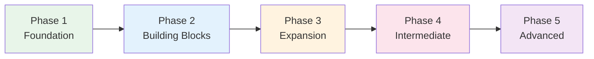

# Phase 1 — Foundation

> **Weeks 1–4 · Goal: Read kana, say basic phrases, build study habits***

## 🎯 Intuition

**The Core Idea:** Phase 1 builds your foundation — kana, first 100 words, basic patterns, and study habits.
**Analogy:** Like learning to walk before running — this phase gives you the tools everything else depends on.
**Why It Matters:** Without a solid Phase 1, everything later becomes harder. Invest the time here.

## ⚙️ Core Mechanics

## Week 1–2: The Writing System

### Step 1: Learn Hiragana
Read and drill until you can read all 46 characters without hesitation.
- 📖 [[Hiragana Complete Guide]]
- 🧩 Chunks: [[chunk-jp-001|Origin]], [[chunk-jp-002|Gojūon Chart]], [[chunk-jp-003|Dakuten & Handakuten]], [[chunk-jp-004|Modern Usage]]

### Step 2: Learn Katakana
Same approach — drill until automatic.
- 📖 [[Katakana Complete Guide]]
- 🧩 Chunks: [[chunk-jp-005|Origin]], [[chunk-jp-006|Primary Uses]], [[chunk-jp-007|Confusing Pairs]]

### Step 3: Understand How Japanese Writing Works
Get the big picture of the three-script system before diving into kanji.
- 📖 [[Writing Systems Overview]]

---

## Week 2–3: Survival Grammar & Vocabulary

### Step 4: First 100 Words
These cover ~50% of all Japanese text.
- 📖 [[Core 100 — Survival Japanese]]
- 🧩 Chunks: [[chunk-jp-051|Top 100 Coverage]], [[chunk-jp-052|Ko-So-A-Do System]]

### Step 5: Basic Sentence Patterns
XはYです, existence (います/あります), questions with か.
- 📖 [[N5 Grammar — Sentence Patterns]]
- 🧩 Chunks: [[chunk-jp-028|Copula XはYです]], [[chunk-jp-029|います vs あります]], [[chunk-jp-030|Wanting — ほしい/たい]], [[chunk-jp-031|Requests & Permissions]]

### Step 6: Essential Set Phrases
These are social contracts, not optional niceties.
- 📖 [[Conversation Patterns — Greetings and Introductions]]
- 📖 [[Self-Introduction Template]]
- 🧩 Chunks: [[chunk-jp-085|Self-Intro Fixed Format]], [[chunk-jp-113|Set Phrases — Social Contracts]]

---

## Week 3–4: Study Setup & First Listening

### Step 7: Set Up Your Study System
Choose textbook, install Anki, establish daily routine.
- 📖 [[Resources Index — Textbooks, Apps, and Tools]]
- 📖 [[Daily Study Routine Templates]]
- 🧩 Chunks: [[chunk-jp-126|SRS — The #1 Technique]], [[chunk-jp-127|Optimal Anki Card Format]], [[chunk-jp-133|Beginner Daily Routine]]

### Step 8: Start Listening from Day 1
Even if you understand almost nothing, start training your ears.
- 📖 [[Beginner Listening Resources]]
- �� [[NHK World — News Listening Practice]]
- 🧩 Chunks: [[chunk-jp-089|Four Levels of Listening]], [[chunk-jp-095|NHK Easy News]]

### Step 9: Understand the JLPT Roadmap
Know where you're headed.
- 📖 [[JLPT Overview — N5 to N1]]
- 📖 [[Study Roadmap — Beginner to Intermediate]]
- 🧩 Chunks: [[chunk-jp-130|JLPT Structure]], [[chunk-jp-131|Level Requirements]], [[chunk-jp-150|Learning Milestones]]

---

## ✅ Phase 1 Checkpoint
Before moving to Phase 2, verify:
- [ ] Can read all hiragana without hesitation
- [ ] Can read all katakana (may be slower — that's OK)
- [ ] Know ~100 basic words
- [ ] Can say self-introduction smoothly
- [ ] Anki set up with daily habit started
- [ ] Listening to beginner audio daily (even 5 min)

**Next:** [[Phase 2 — Building Blocks]]

---

## 🔬 Deep Dive

### Nuances and Exceptions
- Context is king in Japanese — the same expression can have different nuances in different situations.
- Pay attention to how native speakers use these patterns in real conversation.

### Formal vs Informal Usage
- Most patterns have both polite (です/ます) and casual (dictionary form) variants.
- Choose formality based on your relationship with the listener and the situation.

### Common Mistakes by English Speakers
- Transferring English pronunciation habits to Japanese sounds.
- Missing register differences that are critical in Japanese social contexts.
- Underestimating the importance of non-verbal communication.

## 🏋️ Practice

### Warm-Up — Self-Assessment
1. Can you read all hiragana without hesitation? → (If no, stay in current phase)
2. Can you introduce yourself in Japanese? → (Test with a native speaker or tutor)
3. Do you study Japanese every day, even briefly? → (Consistency > intensity)

### Core Exercises — Application
1. **Set a goal:** Write one SMART goal for this phase (Specific, Measurable, Achievable, Relevant, Time-bound).
2. **Build a routine:** Create a 30-minute daily study plan that covers reading, listening, and review.

### Challenge — Real World
Find one Japanese person to have a 5-minute conversation with (in person, online, or via language exchange app). Use ONLY what you've learned in this phase.

## References
- [[Sources Index]]
