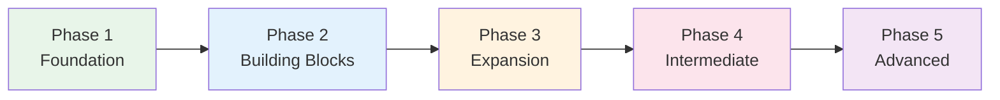

# Phase 1 — Foundation

> Weeks 1-4. Goal: read kana, understand first sentence patterns, say a basic self-introduction, and build a daily review habit.

## What This Phase Is For

Phase 1 is not about "learning all beginner Japanese." It is about removing the first blockers:

- You can read hiragana and katakana without constantly checking a chart.
- You know enough survival vocabulary to recognize the shape of simple sentences.
- You understand the first reusable sentence frames.
- You have a repeatable daily routine, so reviews do not pile up.

If a page feels advanced, skip it for now. The work queue is the sequence below.

## Phase 1 Map

| Week | Primary outcome | Pages | Proof |
| --- | --- | --- | --- |
| 1 | Hiragana recognition | [[Hiragana Complete Guide]] | Read the base kana chart without romaji |
| 2 | Katakana recognition | [[Katakana Complete Guide]], [[Writing Systems Overview]] | Read common loanwords like コーヒー and タクシー |
| 3 | First sentences | [[Core 100 — Survival Japanese]], [[N5 Grammar — Sentence Patterns]], [[Phase 1 Local Audio Practice]], [[Phase 1 Authentic Audio Spine]] | Parse and produce XはYです questions |
| 4 | Routine and first output | [[Daily Study Routine Templates]], [[Conversation Patterns — Greetings and Introductions]], [[Self-Introduction Template]], [[Phase 1 Local Audio Practice]], [[Phase 1 Authentic Audio Spine]] | Deliver a short self-introduction from memory |

## Week 1: Hiragana

Read [[Hiragana Complete Guide]] once, then treat it as a drill sheet. You do not need deep history yet; you need fast recognition.

Daily:

- Review one row at a time: あ row, か row, さ row, etc.
- Say each sound aloud.
- Cover the romaji and read only kana.
- Mix old rows with new rows before moving on.
- Use Week 1 of [[Phase 1 Local Audio Practice]] to check particle は/へ and small っ pronunciation.

Supporting evidence: [[chunk-jp-001|Hiragana origin]], [[chunk-jp-002|gojūon chart]], [[chunk-jp-003|dakuten and handakuten]], [[chunk-jp-004|modern usage]].

## Week 2: Katakana and the Three-Script System

Read [[Katakana Complete Guide]] and [[Writing Systems Overview]]. Katakana is easy to neglect because it appears less often at first, but it is essential for menus, signs, names, technology, and loanwords.

Daily:

- Drill シ/ツ and ソ/ン deliberately.
- Read real katakana words, not isolated characters only.
- Keep hiragana warm with 5 minutes of mixed review.
- Use Week 2 of [[Phase 1 Local Audio Practice]] for common loanwords and timing.

Supporting evidence: [[chunk-jp-005|katakana origin]], [[chunk-jp-006|primary uses]], [[chunk-jp-007|confusing pairs]].

## Week 3: First Words and First Sentences

Study [[Core 100 — Survival Japanese]] and [[N5 Grammar — Sentence Patterns]] together. Vocabulary without sentence frames is inert; sentence frames without words are empty.

Priority patterns:

- XはYです: 私は学生です。
- XはYですか: 学生ですか。
- PlaceにThingがあります / います.
- これをください.
- どこですか.
- Shadow the Week 3 clips in [[Phase 1 Local Audio Practice]] until the survival phrases are automatic.

Supporting evidence: [[chunk-jp-028|copula sentences]], [[chunk-jp-029|います vs あります]], [[chunk-jp-031|requests and permissions]], [[chunk-jp-051|top 100 words]], [[chunk-jp-052|ko-so-a-do system]].

## Week 4: Routine, Listening, and Self-Introduction

Set your routine with [[Daily Study Routine Templates]], then practice [[Conversation Patterns — Greetings and Introductions]] and [[Self-Introduction Template]] until your intro is automatic.

Daily:

- Do due reviews first.
- Spend 15-25 minutes on the course spine.
- Listen to 5-10 minutes from [[Phase 1 Local Audio Practice]] and [[Phase 1 Authentic Audio Spine]], even if comprehension is partial.
- Speak the self-introduction out loud once.

Supporting evidence: [[chunk-jp-085|self-introduction fixed format]], [[chunk-jp-089|four levels of listening]], [[chunk-jp-126|spaced repetition]], [[chunk-jp-127|card format]], [[chunk-jp-133|beginner routine]], [[chunk-jp-150|learning milestones]].

## First-Pass Rule

Do not optimize the system before it exists. For the first month:

- Keep one course spine.
- Keep one SRS tool.
- Do not chase kanji lists beyond the beginner course.
- Do not add native TV, manga, business Japanese, or keigo as required work.
- Make the daily habit boring and repeatable.

Use [[Phase 1 Weekly Review]] at the end of each week.

## Phase 1 Checkpoint

Before moving to [[Phase 2 — Building Blocks]], verify:

- [ ] Can read all hiragana without hesitation
- [ ] Can read all katakana, even if slower than hiragana
- [ ] Know ~100 basic words
- [ ] Can explain XはYです, questions with か, and います vs あります
- [ ] Can say a basic self-introduction smoothly
- [ ] Have SRS or review routine set up
- [ ] Have listened to beginner audio on at least 10 days, including the [[Phase 1 Local Audio Practice]] ladder and one source from [[Phase 1 Authentic Audio Spine]]

**Next:** [[Phase 2 — Building Blocks]]

## References
- [[Sources Index]]
