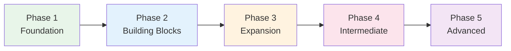

# Phase 2 — Building Blocks

> **Months 2–3 · Goal: Basic conversations, read simple texts, N5 level***

## 🎯 Intuition

**The Core Idea:** Phase 2 adds the building blocks — core grammar, verb forms, particles, and expanding vocabulary.
**Analogy:** Like going from letters to sentences — you start combining what you know into real communication.
**Why It Matters:** This is where Japanese starts to 'click' and you can form your own sentences.

## ⚙️ Core Mechanics

## Grammar Core

### Step 10: Particles — The Skeleton of Japanese
Master these and you can decode any sentence structure.
- 📖 [[N5 Grammar — Particles]]
- 🧩 Chunks: [[chunk-jp-022|Core Particles は/が/を/に/で]], [[chunk-jp-023|Secondary Particles の/と/から/まで/も]]

### Step 11: Verb System — Three Groups
The conjugation system you'll use every single sentence.
- 📖 [[N5 Grammar — Verb Forms]]
- 🧩 Chunks: [[chunk-jp-024|Three Verb Groups]], [[chunk-jp-025|Key Conjugations — Masu/Nai/Te/Ta]]

### Step 12: Adjective System — Two Types
い-adjectives and な-adjectives conjugate completely differently.
- 📖 [[N5 Grammar — Adjectives]]
- 🧩 Chunks: [[chunk-jp-026|い-Adjectives]], [[chunk-jp-027|な-Adjectives]]

### Step 13: Time, Counting, and Counters
The counter system is unique to Japanese — start early.
- 📖 [[N5 Grammar — Time and Counting]]
- 📖 [[Counters — The Japanese Counting System]]
- 🧩 Chunks: [[chunk-jp-060|Why You Can't Just Say Numbers]], [[chunk-jp-061|Essential Counters — Top 10]], [[chunk-jp-062|Counter Sound Changes]]

---

## Vocabulary Expansion

### Step 14: Core 500 — Daily Life Words
Learn in antonym pairs and semantic clusters.
- 📖 [[Core 500 — Daily Life Vocabulary]]
- 🧩 Chunks: [[chunk-jp-053|Learn in Antonym Pairs]], [[chunk-jp-054|Time Words]]

### Step 15: Food & Daily Life Vocabulary
High-frequency, immediately useful.
- 📖 [[Thematic Vocabulary — Food and Drink]]
- 📖 [[Thematic Vocabulary — Home and Daily Life]]
- 🧩 Chunks: [[chunk-jp-063|Restaurant Vocabulary]], [[chunk-jp-064|Daily Routine Narration]], [[chunk-jp-074|Home Life Vocabulary]]

---

## Writing — First Kanji

### Step 16: How Kanji Work
Understand the system before memorizing characters.
- 📖 [[Kanji — How Kanji Work]]
- 📖 [[Radicals — The Building Blocks]]
- 🧩 Chunks: [[chunk-jp-008|On'yomi vs Kun'yomi]], [[chunk-jp-009|Six Categories]], [[chunk-jp-011|214 Kangxi Radicals]], [[chunk-jp-012|Radical Positions]]

### Step 17: N5 Kanji — First 100
Numbers, time, nature, people, directions.
- 📖 [[Kanji N5 Essentials]]
- 📖 [[Kanji Learning Strategies]]
- 🧩 Chunks: [[chunk-jp-016|N5 Numbers & Time]], [[chunk-jp-017|N5 People & Directions]], [[chunk-jp-013|Heisig Method]], [[chunk-jp-014|Context Method]], [[chunk-jp-015|SRS for Kanji]]

---

## Speaking & Listening

### Step 18: Pronunciation Fundamentals
Fix these early — bad habits are hard to unlearn.
- 📖 [[Pronunciation — Difficult Sounds for English Speakers]]
- 🧩 Chunks: [[chunk-jp-079|The Japanese R]], [[chunk-jp-080|Long vs Short Vowels]], [[chunk-jp-081|Double Consonants & Devoicing]]

### Step 19: Daily Conversation Patterns
Practical scripts for real situations.
- 📖 [[Conversation Patterns — Daily Interactions]]
- 📖 [[Conversation Patterns — Shopping and Restaurants]]
- 🧩 Chunks: [[chunk-jp-082|Aizuchi — Back-Channel Responses]], [[chunk-jp-084|Turn-Taking Patterns]]

### Step 20: Start Shadowing
The #1 combined listening+speaking technique.
- 📖 [[Shadowing — Technique and Practice Guide]]
- 📖 [[Podcast Guide — Japanese Learning Podcasts]]
- 🧩 Chunks: [[chunk-jp-086|Shadowing — 0.5s Delay]], [[chunk-jp-087|Five Levels]], [[chunk-jp-088|Daily 15-Min Session]], [[chunk-jp-091|Beginner Podcasts — The Big Three]]

---

## Culture — Basics

### Step 21: Politeness Basics — です/ます
Understand why politeness level matters from day one.
- 📖 [[Keigo — Teineigo (Polite)]]
- 📖 [[Social Register — When to Use What]]
- 🧩 Chunks: [[chunk-jp-105|Teineigo — です/ます Baseline]], [[chunk-jp-107|Five Register Levels]]

---

## ✅ Phase 2 Checkpoint
Before moving to Phase 3, verify:
- [ ] Can conjugate verbs in masu/nai/te/ta forms
- [ ] Know all basic particles and their functions
- [ ] ~500 word vocabulary
- [ ] Can read ~100 kanji
- [ ] Shadowing 10+ min daily
- [ ] Can handle basic restaurant/shop interactions
- [ ] Comfortable with です/ます politeness level

**Previous:** [[Phase 1 — Foundation]]
**Next:** [[Phase 3 — Expansion]]

---

## 🔬 Deep Dive

### Nuances and Exceptions
- Context is king in Japanese — the same expression can have different nuances in different situations.
- Pay attention to how native speakers use these patterns in real conversation.

### Formal vs Informal Usage
- Most patterns have both polite (です/ます) and casual (dictionary form) variants.
- Choose formality based on your relationship with the listener and the situation.

### Common Mistakes by English Speakers
- Transferring English pronunciation habits to Japanese sounds.
- Missing register differences that are critical in Japanese social contexts.
- Underestimating the importance of non-verbal communication.

## 🏋️ Practice

### Warm-Up — Self-Assessment
1. Can you read all hiragana without hesitation? → (If no, stay in current phase)
2. Can you introduce yourself in Japanese? → (Test with a native speaker or tutor)
3. Do you study Japanese every day, even briefly? → (Consistency > intensity)

### Core Exercises — Application
1. **Set a goal:** Write one SMART goal for this phase (Specific, Measurable, Achievable, Relevant, Time-bound).
2. **Build a routine:** Create a 30-minute daily study plan that covers reading, listening, and review.

### Challenge — Real World
Find one Japanese person to have a 5-minute conversation with (in person, online, or via language exchange app). Use ONLY what you've learned in this phase.

## References
- [[Sources Index]]
