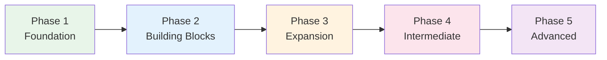

# Phase 3 — Expansion

> **Months 3–6 · Goal: Handle daily situations, read simple articles, N4 level***

## 🎯 Intuition

**The Core Idea:** Phase 3 expands your range — more grammar, kanji, and real-world listening/reading practice.
**Analogy:** Like the transition from textbook exercises to reading real articles — your world of Japanese expands.
**Why It Matters:** This phase transitions you from guided learning to independent exploration.

## ⚙️ Core Mechanics

## Audio Support

Before starting Steps 22-35, open [[Fourth Month Japanese Study Plan]], [[Fifth Month Japanese Study Plan]], [[Sixth Month Japanese Study Plan]], [[Phase 3 Block 4 Japanese Study Plan]], [[Phase 3 Authentic Audio Spine]], [[Phase 3 Local Audio Practice]], [[Phase 3 Audio Assignment Ladder]], and [[Phase 3 Audio Coverage Map]].

Use a repeatable human-recorded or official-course segment as the model. Use [[Phase 3 Audio Assignment Ladder]] to choose the current block, [[Phase 3 Local Audio Practice]] as the ordered local drill ladder, and the MP3 clips embedded in the Phase 3 grammar, vocabulary, kanji, pitch, listening, and culture pages when a topic needs more examples.

Use [[Phase 3 Weekly Review]] at the end of each week to record the exact authentic segment, local clip set, pitch or reading check, and shadowing or transcription proof.

Phase 3 introduces pitch accent, intermediate listening, media, and keigo recognition, so do not use local TTS as the only audio authority. Every block should have:

- One authentic audio segment you repeat across multiple days.
- One current block copied from [[Phase 3 Audio Assignment Ladder]].
- One local clip set from [[Phase 3 Local Audio Practice]] or the current grammar, vocabulary, pitch, media, or culture page.
- One pitch, reading, rhythm, or suspect-clip issue checked through [[Pronunciation and Audio Accuracy]] or [[Pronunciation Correction Log]].

## Grammar — N4 Level

### Step 22: Te-Form Mastery
The Swiss army knife of Japanese grammar — unlock dozens of patterns.
- 📖 [[N5 Grammar — Verb Forms]] (review te-form section)
- 🧩 Chunks: [[chunk-jp-038|Te-Form Formation]], [[chunk-jp-039|Te-Form Extensions]]

### Step 23: Conditional Forms — Four Ways to Say "If"
たら, ば, なら, と — each with different nuances.
- 📖 [[N4 Grammar — Conditional Forms]]
- 🧩 Chunks: [[chunk-jp-032|たら — Versatile]], [[chunk-jp-033|ば — Logical]], [[chunk-jp-034|なら and と]]

### Step 24: Passive and Causative
Who does the action, who is affected — including Japan's unique "suffering passive."
- 📖 [[N4 Grammar — Passive and Causative]]
- 🧩 Chunks: [[chunk-jp-035|Passive Including Suffering]], [[chunk-jp-036|Causative — Make and Let]]

### Step 25: Giving and Receiving
あげる/もらう/くれる encode social relationships in grammar.
- 📖 [[N4 Grammar — Giving and Receiving]]
- 🧩 Chunks: [[chunk-jp-037|Social Direction in Grammar]]

### Step 26: Compound Sentences & More
Building longer, more complex sentences.
- 📖 [[N4 Grammar — Compound Sentences]]
- 📖 [[N4 Grammar — Potential and Volitional]]
- 🧩 Chunks: [[chunk-jp-046|Compound Patterns]], [[chunk-jp-047|Potential Form]], [[chunk-jp-048|Volitional Form]]

---

## Vocabulary — Toward 1000 Words

### Step 27: Core 1000
The conversational fluency threshold — immersion should begin here.
- 📖 [[Core 1000 — Conversational Fluency]]
- 🧩 Chunks: [[chunk-jp-055|1000-Word Threshold]], [[chunk-jp-056|Sino-Japanese Compounds]]

### Step 28: Thematic Vocabulary Sets
Practical domains for daily life.
- 📖 [[Thematic Vocabulary — Travel and Transportation]]
- 📖 [[Thematic Vocabulary — Body and Health]]
- 📖 [[Thematic Vocabulary — Numbers, Time, and Dates]]
- 🧩 Chunks: [[chunk-jp-065|Travel Vocabulary]], [[chunk-jp-067|Body & Health]], [[chunk-jp-068|Number Systems]]

### Step 29: Onomatopoeia — A Unique Layer
~4,500 expressions that are essential for natural Japanese.
- 📖 [[Onomatopoeia — Sound and State Words]]
- 🧩 Chunks: [[chunk-jp-057|Giongo — Sound Words]], [[chunk-jp-058|Gitaigo — State Words]], [[chunk-jp-059|Patterns]]

---

## Writing — N4 Kanji

### Step 30: Expand to 300 Kanji
Abstract concepts emerge; phonetic component patterns become your primary strategy.
- 📖 [[Kanji N4 Essentials]]
- 🧩 Chunks: [[chunk-jp-018|N4 Abstract Concepts]], [[chunk-jp-019|Phonetic Component Pattern]]

---

## Speaking — Pitch and Fluency

### Step 31: Pitch Accent Awareness
Not critical for comprehension, but essential for sounding natural.
- 📖 [[Pitch Accent — Introduction]]
- 📖 [[Pitch Accent — Common Patterns]]
- 📖 [[Phase 3 Pitch Accent Practice Path]]
- 🧩 Chunks: [[chunk-jp-076|Pitch Not Stress]], [[chunk-jp-077|Four Patterns]], [[chunk-jp-078|Minimal Pairs]]

### Step 32: Filler Words and Natural Speech
えーと, あのー, やっぱり — these make you sound human.
- 📖 [[Common Filler Words and Discourse Markers]]
- 🧩 Chunks: [[chunk-jp-097|Filler Words]], [[chunk-jp-098|Sentence-End Particles]]

---

## Listening — Level Up

### Step 33: Intermediate Listening
Graduate from beginner to intermediate content.
- 📖 [[Intermediate Listening Resources]]
- 📖 [[YouTube Channels for Japanese Learners]]
- 🧩 Chunks: [[chunk-jp-090|Extensive vs Intensive Listening]], [[chunk-jp-092|Intermediate Podcasts]]

### Step 34: Anime and Drama as Tools
With proper technique, entertainment becomes study.
- 📖 [[Anime and Drama — Immersion Listening]]
- 📖 [[Music — Learning Through Japanese Songs]]
- 🧩 Chunks: [[chunk-jp-093|Benefits and Dangers]], [[chunk-jp-094|Effective Study Method]], [[chunk-jp-100|Music for Learning]]

---

## Culture — Keigo Introduction

### Step 35: Understanding the Keigo System
You don't need to produce full keigo yet, but you need to RECOGNIZE it.
- 📖 [[Keigo — Overview and Register System]]
- 📖 [[Culture Overview]]
- 🧩 Chunks: [[chunk-jp-101|Keigo — Social Grammar]], [[chunk-jp-102|Uchi-Soto Principle]]

---

## ✅ Phase 3 Checkpoint
- [ ] Can use all four conditional forms appropriately
- [ ] Understand passive, causative, giving/receiving
- [ ] ~1000 word vocabulary
- [ ] ~300 kanji recognized
- [ ] Following intermediate-level podcasts
- [ ] Aware of pitch accent patterns
- [ ] Can check a pitch-accent uncertainty through [[Phase 3 Pitch Accent Practice Path]]
- [ ] Basic understanding of keigo system
- [ ] Have one stable Phase 3 authentic audio source in [[Phase 3 Authentic Audio Spine]]
- [ ] Can choose the current block from [[Phase 3 Audio Assignment Ladder]]
- [ ] Can use [[Phase 3 Local Audio Practice]] without hunting through page-level clips
- [ ] Can pair each required Phase 3 page with audio using [[Phase 3 Audio Coverage Map]]
- [ ] Have weekly audio evidence recorded in [[Phase 3 Weekly Review]]

**Previous:** [[Phase 2 — Building Blocks]]
**Next:** [[Phase 4 — Intermediate Mastery]]

---

## 🔬 Deep Dive

### Nuances and Exceptions
- Context is king in Japanese — the same expression can have different nuances in different situations.
- Pay attention to how native speakers use these patterns in real conversation.

### Formal vs Informal Usage
- Most patterns have both polite (です/ます) and casual (dictionary form) variants.
- Choose formality based on your relationship with the listener and the situation.

### Common Mistakes by English Speakers
- Transferring English pronunciation habits to Japanese sounds.
- Missing register differences that are critical in Japanese social contexts.
- Underestimating the importance of non-verbal communication.

## 🏋️ Practice

### Warm-Up — Self-Assessment
1. Can you read all hiragana without hesitation? → (If no, stay in current phase)
2. Can you introduce yourself in Japanese? → (Test with a native speaker or tutor)
3. Do you study Japanese every day, even briefly? → (Consistency > intensity)

### Core Exercises — Application
1. **Set a goal:** Write one SMART goal for this phase (Specific, Measurable, Achievable, Relevant, Time-bound).
2. **Build a routine:** Create a 30-minute daily study plan that covers reading, listening, and review.

### Challenge — Real World
Find one Japanese person to have a 5-minute conversation with (in person, online, or via language exchange app). Use ONLY what you've learned in this phase.

## References
- [[Japanese/Sources/Sources Index|Sources Index]]
- [[Fourth Month Japanese Study Plan]]
- [[Fifth Month Japanese Study Plan]]
- [[Sixth Month Japanese Study Plan]]
- [[Phase 3 Block 4 Japanese Study Plan]]
- [[Phase 3 Authentic Audio Spine]]
- [[Phase 3 Local Audio Practice]]
- [[Phase 3 Audio Assignment Ladder]]
- [[Phase 3 Audio Coverage Map]]
- [[Phase 3 Weekly Review]]
- [[Phase 3 Pitch Accent Practice Path]]
- [[Pronunciation and Audio Accuracy]]
- [[Pronunciation Correction Log]]
