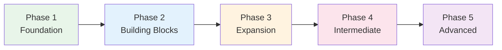

# Phase 4 — Intermediate Mastery

> **Months 6–12 · Goal: Read articles, hold extended conversations, N3 level***

## 🎯 Intuition

**The Core Idea:** Phase 4 targets intermediate mastery — N3-level grammar, nuanced expression, and media consumption.
**Analogy:** Like going from tourist to resident — you handle complex situations and understand native content.
**Why It Matters:** At this level, you can live and work in Japanese with growing independence.

## ⚙️ Core Mechanics

## Audio Support

Before starting Steps 36-48, open [[Phase 4 Authentic Audio Spine]] and [[Phase 4 Audio Coverage Map]].

Use a repeatable native-speed or official-course segment as the model. Use the MP3 clips embedded in the Phase 4 grammar, kanji, vocabulary, keigo, business, culture, and listening pages as short drills.

Phase 4 asks you to produce register-sensitive Japanese, so do not use local TTS as the only authority. Every block should have:

- One exact native-speed segment you repeat across multiple days.
- One local clip set from the page you are studying.
- One pronunciation, rhythm, reading, keigo, or register issue checked through [[Pronunciation and Audio Accuracy]] or [[Pronunciation Correction Log]].
- One shadowing, transcription, summary, or role-play proof.

## Grammar — N3 Level

### Step 36: Formal Expressions
ございます, いたします — the bridge to real-world formal Japanese.
- 📖 [[N3 Grammar — Formal Expressions]]
- 🧩 Chunks: [[chunk-jp-040|N3 Formal Expressions]]

### Step 37: Complex Conjunctions
にもかかわらず, に関して, を通じて — upgrade your sentence connections.
- 📖 [[N3 Grammar — Complex Conjunctions]]
- 🧩 Chunks: [[chunk-jp-041|Complex Conjunctions]]

### Step 38: Nominalization and Quotation
こと vs の, と言う/という/と思う — essential for expressing abstract ideas.
- 📖 [[N3 Grammar — Nominalization and Quotation]]
- 🧩 Chunks: [[chunk-jp-042|こと vs の]], [[chunk-jp-049|Quotation Patterns]]

### Step 39: Grammar Across Levels — See the Big Picture
Understanding how concepts evolve reveals the architecture of Japanese.
- 📖 [[Grammar — Comparison Across Levels]]
- 🧩 Chunks: [[chunk-jp-043|How 'If' Evolves]], [[chunk-jp-044|How 'Because' Evolves]], [[chunk-jp-045|Onion Not Ladder]], [[chunk-jp-050|Expressing Contrast]]

---

## Writing — N3 Kanji (Functional Literacy)

### Step 40: 650 Kanji — Read Everyday Japanese
Signs, menus, simple articles — you can now navigate Japan independently.
- 📖 [[Kanji N3 Essentials]]
- 🧩 Chunks: [[chunk-jp-020|Functional Literacy at 650]], [[chunk-jp-021|Vocabulary Over Characters]]

---

## Vocabulary — Depth and Breadth

### Step 41: Work and Nature Vocabulary
Expanding into adult-life domains.
- 📖 [[Thematic Vocabulary — Work and Office]]
- 📖 [[Thematic Vocabulary — Nature and Weather]]
- 🧩 Chunks: [[chunk-jp-073|Workplace Vocabulary]], [[chunk-jp-075|Weather Vocabulary]], [[chunk-jp-066|Nature & Seasons]]

### Step 42: Vocabulary Learning Strategy Review
Optimize your approach as you scale.
- 🧩 Chunks: [[chunk-jp-069|Anki Card Design]], [[chunk-jp-070|i+1 Principle]], [[chunk-jp-071|Word Family Approach]], [[chunk-jp-072|Daily Targets by Level]]

---

## Culture — Full Keigo and Business

### Step 43: Master the Three Keigo Types
Now it's time to PRODUCE keigo, not just recognize it.
- 📖 [[Keigo — Sonkeigo (Honorific)]]
- 📖 [[Keigo — Kenjōgo (Humble)]]
- 🧩 Chunks: [[chunk-jp-103|Sonkeigo Formation]], [[chunk-jp-104|Kenjōgo Formation]], [[chunk-jp-106|Bikago]], [[chunk-jp-121|Common Keigo Mistakes]]

### Step 45: Cultural Literacy
Seasonal greetings, gift-giving, idioms — the cultural layer of fluency.
- 📖 [[Seasonal Greetings and Cultural Expressions]]
- 📖 [[Idioms and Proverbs — ことわざ]]
- 📖 [[Numbers and Superstitions]]
- 🧩 Chunks: [[chunk-jp-111|New Year]], [[chunk-jp-112|Gift-Giving]], [[chunk-jp-114|Proverbs]], [[chunk-jp-115|四字熟語]], [[chunk-jp-116|Body Idioms]], [[chunk-jp-117|Unlucky Numbers]], [[chunk-jp-118|Lucky Numbers]], [[chunk-jp-119|Chopstick Taboos]]

---

## Listening & Speaking — Intermediate+

### Step 47: Conversation Fluency
Aizuchi, indirectness, discourse markers — sound like a real speaker.
- 🧩 Chunks: [[chunk-jp-083|Japanese Indirectness]], [[chunk-jp-147|Speaking Fluency Building Blocks]], [[chunk-jp-148|Cultural Competence]]

---

## Study Optimization

### Step 48: Beat the Intermediate Plateau
- 📖 [[Study Roadmap — Intermediate to Advanced]]
- 🧩 Chunks: [[chunk-jp-128|Immersion Schedule]], [[chunk-jp-129|Four Skills Balance]], [[chunk-jp-132|JLPT Strategy by Level]], [[chunk-jp-134|Intermediate Routine]], [[chunk-jp-139|Reading Practice Progression]], [[chunk-jp-143|Intermediate Plateau]]

---

## ✅ Phase 4 Checkpoint
- [ ] Can read NHK Easy News articles without dictionary for most words
- [ ] Can hold 15+ minute conversations on daily topics
- [ ] ~650 kanji, ~3,000+ vocabulary
- [ ] Understand and can use basic keigo
- [ ] Following native podcasts at ~70% comprehension
- [ ] Have one stable Phase 4 native-speed audio source in [[Phase 4 Authentic Audio Spine]]
- [ ] Can pair each required Phase 4 page with audio using [[Phase 4 Audio Coverage Map]]
- [ ] Have checked keigo, register, pitch, or reading issues through [[Pronunciation and Audio Accuracy]] when local clips are not enough
- [ ] Ready for N3 test

**Previous:** [[Phase 3 — Expansion]]
**Next:** [[Phase 5 — Advanced]]

---

## 🔬 Deep Dive

### Step 44: Register Shifting and Business Japanese
Navigating formality in the real world.
- 📖 [[Business Japanese — Workplace Communication]]
- 🧩 Chunks: [[chunk-jp-108|Register Shifting Rules]], [[chunk-jp-109|Business Email Template]], [[chunk-jp-110|Business Phrases]], [[chunk-jp-122|Drinking Culture]], [[chunk-jp-123|Meeting Language]]

### Nuances and Exceptions
- Context is king in Japanese — the same expression can have different nuances in different situations.
- Pay attention to how native speakers use these patterns in real conversation.

### Common Mistakes by English Speakers
- Transferring English pronunciation habits to Japanese sounds.
- Missing register differences that are critical in Japanese social contexts.
- Underestimating the importance of non-verbal communication.

## 🏋️ Practice

### Warm-Up — Self-Assessment
1. Can you read all hiragana without hesitation? → (If no, stay in current phase)
2. Can you introduce yourself in Japanese? → (Test with a native speaker or tutor)
3. Do you study Japanese every day, even briefly? → (Consistency > intensity)

### Core Exercises — Application
1. **Set a goal:** Write one SMART goal for this phase (Specific, Measurable, Achievable, Relevant, Time-bound).
2. **Build a routine:** Create a 30-minute daily study plan that covers reading, listening, and review.

### Challenge — Real World
Find one Japanese person to have a 5-minute conversation with (in person, online, or via language exchange app). Use ONLY what you've learned in this phase.

### Step 46: Advanced Listening Resources
Push into faster, more natural content.
- 📖 [[Advanced Listening Resources]]
- 🧩 Chunks: [[chunk-jp-096|NHK as Pronunciation Standard]], [[chunk-jp-099|Listening Schedule by Level]]

## References
- [[Sources Index]]
- [[Phase 4 Authentic Audio Spine]]
- [[Phase 4 Audio Coverage Map]]
- [[Pronunciation and Audio Accuracy]]
