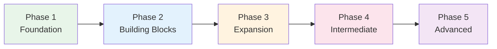

# Phase 5 — Advanced

> **Year 2+ · Goal: Near-native comprehension, professional use, N2→N1***

## 🎯 Intuition

**The Core Idea:** Phase 5 pushes toward advanced proficiency — keigo, specialized vocabulary, and native-level processing.
**Analogy:** Like going from fluent to eloquent — polishing your Japanese to handle any professional or social context.
**Why It Matters:** Advanced learning is about refinement, cultural depth, and eliminating foreigner tells.

## ⚙️ Core Mechanics

## Audio Support

Before starting Steps 49-56, open [[Eleventh Month Japanese Study Plan]], [[Twelfth Month Japanese Study Plan]], [[Thirteenth Month Japanese Study Plan]], [[Fourteenth Month Japanese Study Plan]], [[Fifteenth Month Japanese Study Plan]], [[Phase 5 Authentic Audio Spine]], [[Phase 5 Local Audio Practice]], [[Phase 5 Audio Assignment Ladder]], and [[Phase 5 Audio Coverage Map]].

Use native-speed Japanese as the main source: news, interviews, podcasts, lectures, drama, documentary, workplace audio, tutor recordings, or other human-recorded material with a stable segment you can replay.

Use [[Phase 5 Audio Assignment Ladder]] to choose the current block. Use [[Phase 5 Local Audio Practice]] as the ordered precision-drill ladder for keigo, business phrases, idioms, pitch patterns, discourse markers, media labels, and grammar comparisons. Every Phase 5 block should have:

- One exact native source segment you repeat, mine, shadow, transcribe, summarize, or discuss.
- One local clip set from [[Phase 5 Local Audio Practice]] or the page you are studying when the page has clips.
- One pronunciation, pitch, reading, register, or naturalness issue checked through [[Pronunciation and Audio Accuracy]] or [[Pronunciation Correction Log]].
- One output proof recorded in [[Advanced Output and Register Feedback Log]]: recording, tutor/native feedback, summary, argument, role-play, or conversation attempt.
- One current assignment copied from [[Phase 5 Audio Assignment Ladder]] into [[Authentic Audio Evidence Log#Current Assignment]].

## Grammar — Refinement

## Reading — Native Content

### Step 51: Extensive Reading
Novels, newspapers, manga without furigana — read for pleasure and speed.
- 🧩 Chunks: [[chunk-jp-139|Reading Practice Progression]], [[chunk-jp-144|Kanji Recognition vs Recall]]

---

## Listening — Full Immersion

### Step 52: Native-Speed Content
News, tech podcasts, comedy, drama without subtitles.
- 📖 [[Advanced Listening Resources]]
- 🧩 Chunks: [[chunk-jp-092|Advanced Podcasts]], [[chunk-jp-096|NHK as Pronunciation Standard]], [[chunk-jp-146|Listening Bottlenecks and Solutions]]

---

## Speaking — Professional Level

### Step 53: Full Keigo Production
Seamless register shifting in real situations.
- 📖 [[Keigo — Overview and Register System]]
- 📖 [[Business Japanese — Workplace Communication]]
- 🧩 Chunks: [[chunk-jp-102|Uchi-Soto Principle]], [[chunk-jp-108|Register Shifting]], [[chunk-jp-121|Common Keigo Mistakes]]

## Study — Optimization

### Step 56: N2 and N1 Preparation
- 📖 [[JLPT Overview — N5 to N1]]
- 🧩 Chunks: [[chunk-jp-132|JLPT Strategy by Level]], [[chunk-jp-150|Learning Milestones]]

---

## ✅ Phase 5 Milestones
- [ ] Can read novels/newspapers with minimal dictionary use
- [ ] Can follow native-speed conversations and media
- [ ] Can use appropriate keigo in business settings
- [ ] Can express complex ideas, argue, joke in Japanese
- [ ] 1000+ kanji, 6000+ vocabulary
- [ ] Have one stable Phase 5 native source in [[Phase 5 Authentic Audio Spine]]
- [ ] Can choose the current block from [[Phase 5 Audio Assignment Ladder]]
- [ ] Can use [[Phase 5 Local Audio Practice]] without hunting through page-level clips
- [ ] Can pair each required Phase 5 page with audio using [[Phase 5 Audio Coverage Map]]
- [ ] Have at least one recurring output/register feedback route recorded in [[Advanced Output and Register Feedback Log]]
- [ ] Can complete [[Phase 5 Weekly Review]] without relying on passive listening as evidence
- [ ] N2 passed → working toward N1

**Previous:** [[Phase 4 — Intermediate Mastery]]

---

## 🔬 Deep Dive

### Step 49: Grammar Nuance Mastery
At this level, you're not learning new concepts — you're refining the nuance of expressions you already know.
- 📖 [[Grammar — Comparison Across Levels]]
- 🧩 Chunks: [[chunk-jp-043|How 'If' Evolves]], [[chunk-jp-044|How 'Because' Evolves]], [[chunk-jp-050|Expressing Contrast Across Levels]], [[chunk-jp-145|Grammar Acquisition — Conscious to Unconscious]]

### Step 50: Common Mistake Elimination
Target your persistent errors systematically.
- 🧩 Chunks: [[chunk-jp-141|Common Beginner Mistakes]] (review), [[chunk-jp-142|Common Intermediate Mistakes]]

---

### Step 54: Advanced Cultural Fluency
The invisible layer that separates "speaks Japanese" from "understands Japan."
- 📖 [[Idioms and Proverbs — ことわざ]]
- 📖 [[Numbers and Superstitions]]
- 🧩 Chunks: [[chunk-jp-125|出る杭は打たれる — The Core Value]], [[chunk-jp-148|Cultural Competence Beyond Language]]

---

### Step 55: Advanced Routine
- 📖 [[Study Roadmap — Intermediate to Advanced]]
- 🧩 Chunks: [[chunk-jp-135|Advanced Daily Routine]], [[chunk-jp-140|Output Practice]], [[chunk-jp-149|Resource Management — Less Is More]]

### Formal vs Informal Usage
- Most patterns have both polite (です/ます) and casual (dictionary form) variants.
- Choose formality based on your relationship with the listener and the situation.

## 🏋️ Practice

### Warm-Up — Self-Assessment
1. Can you read all hiragana without hesitation? → (If no, stay in current phase)
2. Can you introduce yourself in Japanese? → (Test with a native speaker or tutor)
3. Do you study Japanese every day, even briefly? → (Consistency > intensity)

### Core Exercises — Application
1. **Set a goal:** Write one SMART goal for this phase (Specific, Measurable, Achievable, Relevant, Time-bound).
2. **Build a routine:** Create a 30-minute daily study plan that covers reading, listening, and review.

### Challenge — Real World
Find one Japanese person to have a 5-minute conversation with (in person, online, or via language exchange app). Use ONLY what you've learned in this phase.

## References
- [[Sources Index]]
- [[Eleventh Month Japanese Study Plan]]
- [[Twelfth Month Japanese Study Plan]]
- [[Thirteenth Month Japanese Study Plan]]
- [[Fourteenth Month Japanese Study Plan]]
- [[Fifteenth Month Japanese Study Plan]]
- [[Phase 5 Authentic Audio Spine]]
- [[Phase 5 Local Audio Practice]]
- [[Phase 5 Audio Assignment Ladder]]
- [[Phase 5 Audio Coverage Map]]
- [[Phase 5 Weekly Review]]
- [[Advanced Output and Register Feedback Log]]
- [[Pronunciation and Audio Accuracy]]
