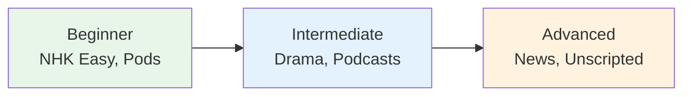

# Advanced Listening Resources

> **Native content with no concessions. The goal: understand everything a native speaker would.**

## 🎯 Intuition

**The Core Idea:** Advanced listening resources for near-native comprehension training.
**Analogy:** Like going from subtitled to unsubtitled foreign films — full-speed, real-world Japanese.
**Why It Matters:** Advanced listening is about handling ambiguity, speed, and unfamiliar topics.

## ⚙️ Core Mechanics

## Podcasts

| Resource | Style | Audio |
|----------|-------|-------|
| Rebuild.fm | Tech podcast, natural conversation |  |
| コテンラジオ | Comedy, rapid casual speech | ![[listen-001-koten-radio.mp3]] |
| バイリンガルNEWS | News in multiple languages | ![[listen-002-bilingual-news.mp3]] |

## Video Content

| Source | Why | Audio |
|--------|-----|-------|
| Japanese variety shows | Fast speech, humor, cultural knowledge |  |
| Japanese dramas | Natural dialogue, emotional range |  |
| Documentaries (NHK Special) | Formal narration, specialized vocabulary |  |
| Japanese stand-up comedy (漫才 manzai) | Rapid-fire dialogue, wordplay | ![[listen-003-manzai.mp3]] |

## Challenges at This Level
- **Dialects** — Kansai-ben, Tohoku-ben sound very different
- **Slang and youth language** — constantly evolving
- **Implied meaning** — what's NOT said is as important as what IS
- **Humor** — puns (dajare), cultural references, timing

## Practice
1. Watch one Japanese show per week without subtitles
2. Listen to news daily (NHK Radio)
3. Try to understand comedy — it's the hardest test of fluency
4. Transcribe 2-3 minutes of native speech weekly

## 🔬 Deep Dive

### Nuances and Exceptions
- Context is king in Japanese — the same expression can have different nuances in different situations.
- Pay attention to how native speakers use these patterns in real conversation.

### Formal vs Informal Usage
- Most patterns have both polite (です/ます) and casual (dictionary form) variants.
- Choose formality based on your relationship with the listener and the situation.

### Common Mistakes by English Speakers
- Transferring English pronunciation habits to Japanese sounds.
- Missing register differences that are critical in Japanese social contexts.
- Underestimating the importance of non-verbal communication.

## 🏋️ Practice

### Warm-Up — Recognition
1. What is shadowing? → (Repeating speech immediately, with ~0.5s delay)
2. Why is NHK Easy News good for beginners? → (Simplified vocabulary, slow speed, furigana)
3. What is the main benefit of listening to podcasts? → (Flexible, high-volume listening practice)

### Core Exercises — Production
1. **Listen and transcribe:** Choose a 30-second clip from NHK Easy and write down every word you hear.
2. **Shadow practice:** Pick a podcast episode and shadow for 5 minutes, recording yourself.

### Challenge — Real World
Watch a 5-minute segment of a Japanese drama WITHOUT subtitles. Write a summary of what happened, then check with subtitles. How much did you catch?

## References
- [[Japanese/Sources/Sources Index|Sources Index]]
