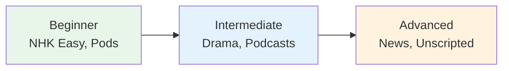

# Anime and Drama — Immersion Listening

> **Anime and drama are popular immersion tools, but use them correctly or they'll teach you bad habits.**

## 🎯 Intuition

**The Core Idea:** Using anime and drama as immersion listening tools — entertainment meets language learning.
**Analogy:** Like learning English from watching Netflix — exposure to natural speech, slang, and emotional expression.
**Why It Matters:** Anime/drama exposure trains your ear for informal speech that textbooks never teach.

## ⚙️ Core Mechanics

## Beginner Anime (Simple Language)

| Title | Why good | Audio |
|-------|----------|-------|
| よつばと! | Slice of life, everyday vocabulary | ![[listen-006-yotsubato.mp3]] |
| しろくま | Simple dialogue, repetitive | ![[listen-007-shirokuma.mp3]] |
| ドラえもん | Children's show, clear speech | ![[listen-008-doraemon.mp3]] |
| チビまる子ちゃん | Family life, everyday Japanese | ![[listen-009-chibi-maruko-chan.mp3]] |

## Intermediate Anime

| Title | Why good | Audio |
|-------|----------|-------|
| 聲の形 | Realistic dialogue, school setting | ![[listen-010-koe-no-katachi.mp3]] |
| 日常 | Varied vocabulary, humor | ![[listen-011-nichijou.mp3]] |
| 僕だけがいない街 | Emotional, natural conversation | ![[listen-012-boku-dake-ga-inai-machi.mp3]] |

## Japanese Dramas (More Natural)
Dramas use more realistic Japanese than anime:

| Title | Setting | Language level | Audio |
|-------|---------|---------------|-------|
| 半沢直樹 | Business | Formal/keigo heavy | ![[listen-013-hanzawa-naoki.mp3]] |
| 逃げるは恥だが役に立つ | Romance/work | Natural casual | ![[listen-014-nigeru-wa-haji-da-ga-yaku-ni-tatsu.mp3]] |
| アンナチュラル | Medical | Mixed registers | ![[listen-015-unnatural.mp3]] |

## How to Watch Effectively

### The 3-Pass Method
1. **First watch:** Japanese audio, Japanese subtitles — enjoy the story
2. **Second watch:** Japanese audio, NO subtitles — test comprehension
3. **Third watch:** Pause and look up key phrases

### Subtitle Strategy

| Level | Approach |
|-------|----------|
| Beginner | English subs (just enjoy) |
| N4 | Japanese subs |
| N3 | Japanese subs, pause less |
| N2+ | No subs |

## 🔬 Deep Dive

### The Warning
- Anime Japanese is NOT real Japanese (exaggerated, gendered, archaic forms)
- Male anime characters use rough speech (俺, だぜ, くれ) rarely used in real life ![[listen-004-ore-daze-kure.mp3]]
- Female anime characters use overly feminine speech (わ, のよ) ![[listen-005-wa-noyo.mp3]]
- Use anime for listening practice, NOT as a model for speaking

### Nuances and Exceptions
- Context is king in Japanese — the same expression can have different nuances in different situations.
- Pay attention to how native speakers use these patterns in real conversation.

### Formal vs Informal Usage
- Most patterns have both polite (です/ます) and casual (dictionary form) variants.
- Choose formality based on your relationship with the listener and the situation.

### Common Mistakes by English Speakers
- Transferring English pronunciation habits to Japanese sounds.
- Missing register differences that are critical in Japanese social contexts.
- Underestimating the importance of non-verbal communication.

## 🏋️ Practice

### Warm-Up — Recognition
1. What is shadowing? → (Repeating speech immediately, with ~0.5s delay)
2. Why is NHK Easy News good for beginners? → (Simplified vocabulary, slow speed, furigana)
3. What is the main benefit of listening to podcasts? → (Flexible, high-volume listening practice)

### Core Exercises — Production
1. **Listen and transcribe:** Choose a 30-second clip from NHK Easy and write down every word you hear.
2. **Shadow practice:** Pick a podcast episode and shadow for 5 minutes, recording yourself.

### Challenge — Real World
Watch a 5-minute segment of a Japanese drama WITHOUT subtitles. Write a summary of what happened, then check with subtitles. How much did you catch?

## References
- [[Sources Index]]
