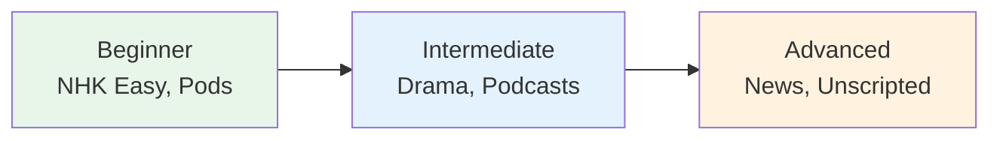

# Beginner Listening Resources

## 🎯 Intuition

**The Core Idea:** Curated beginner-friendly listening resources for building foundational comprehension.
**Analogy:** Like training wheels for your ears — slow, clear speech with familiar vocabulary.
**Why It Matters:** Starting with appropriate-level listening prevents frustration and builds confidence.

## ⚙️ Core Mechanics

## Textbook Audio

| Textbook | Audio Access | Style |
|----------|-------------|-------|
| Genki I | Official OTO Navi audio | Dialogues + vocabulary + drills + workbook listening |
| Irodori A1 | Free streamed/downloadable audio | Can-do based daily-life communication |
| NHK WORLD-JAPAN Easy Japanese | Free online lessons and MP3/podcast access | Short skits + drills + pronunciation practice |
| Minna no Nihongo | Publisher audio/CDs | Pattern drills |
| Japanese from Zero | YouTube | Conversational |

## Authentic Audio Spine

Use [[Phase 1 Authentic Audio Spine]] to choose the native or official-course audio for the first month. It keeps the pronunciation model grounded in human-recorded material while [[Phase 1 Local Audio Practice]] supplies short repeatable drills.

## Local Phase 1 Ladder

During [[Phase 1 — Foundation]], use [[Phase 1 Local Audio Practice]] as the default 5-minute daily audio path. It points to a small set of local clips for kana sounds, particle-reading traps, survival phrases, and the first self-introduction.

Use native course audio whenever your course spine provides it. Use the local ladder for short repeatable pronunciation practice; use the full [[Audio Index]] only when you need to find a specific clip.

## How to Use Beginner Audio

### Phase 1: Understand
1. Listen WITHOUT looking at text
2. Try to catch ANY words you know
3. Read the transcript
4. Listen again — notice what you missed

### Phase 2: Internalize
1. Shadow the audio (repeat along)
2. Pause and predict the next word
3. Try to summarize what you heard

### Phase 3: Automate
1. Listen to the SAME audio multiple times
2. Goal: understand without translating to English
3. Speed up gradually

## Daily Routine

| Time | Activity | Duration |
|------|----------|----------|
| Daily minimum | [[Phase 1 Local Audio Practice]] | 5 min |
| Course session | [[Phase 1 Authentic Audio Spine|Course-native or NHK beginner audio]] | 5-15 min |
| Later review | NHK Easy, JapanesePod101, Teppei, or Comprehensible Japanese | 10-15 min |

## 🔬 Deep Dive

### Nuances and Exceptions
- Context is king in Japanese — the same expression can have different nuances in different situations.
- Pay attention to how native speakers use these patterns in real conversation.

### Formal vs Informal Usage
- Most patterns have both polite (です/ます) and casual (dictionary form) variants.
- Choose formality based on your relationship with the listener and the situation.

### Common Mistakes by English Speakers
- Transferring English pronunciation habits to Japanese sounds.
- Missing register differences that are critical in Japanese social contexts.
- Underestimating the importance of non-verbal communication.

## 🏋️ Practice

### Warm-Up — Recognition
1. What is shadowing? → (Repeating speech immediately, with ~0.5s delay)
2. Why is NHK Easy News good for beginners? → (Simplified vocabulary, slow speed, furigana)
3. What is the main benefit of listening to podcasts? → (Flexible, high-volume listening practice)

### Core Exercises — Production
1. **Listen and transcribe:** Choose a 30-second clip from NHK Easy and write down every word you hear.
2. **Shadow practice:** Pick a podcast episode and shadow for 5 minutes, recording yourself.

### Challenge — Real World
Watch a 5-minute segment of a Japanese drama WITHOUT subtitles. Write a summary of what happened, then check with subtitles. How much did you catch?

## Online Resources (Free)

| Resource | Type | Speed | Notes |
|----------|------|-------|-------|
| NHK WORLD-JAPAN Easy Japanese | Lessons | Very slow | 48 beginner lessons with skits, drills, and pronunciation practice |
| NHK News Web Easy | News | Slow | Simplified news with furigana |
| JapanesePod101 | Podcast | Adjustable | Free basic lessons |
| Nihongo con Teppei Beginner | Podcast | Slow | Simple monologues |
| Comprehensible Japanese | YouTube | Graduated | Uses visual context |

## References
- [[Sources Index]]
- [[Phase 1 Authentic Audio Spine]]
