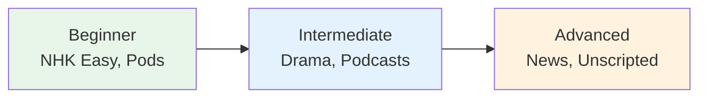

# Intermediate Listening Resources

> **For N3-N2 level listeners. You can follow slow Japanese; now it's time for natural speed.**

## 🎯 Intuition

**The Core Idea:** Intermediate listening resources that bridge the gap between textbook and real-world Japanese.
**Analogy:** Like moving from language tapes to actual radio — real speech at a manageable pace.
**Why It Matters:** This is where your listening transitions from 'study activity' to 'genuine comprehension'.

## ⚙️ Core Mechanics

## Podcasts

| Resource | Style | Why | Audio |
|----------|-------|-----|-------|
| Nihongo con Teppei (Original) | Natural monologue | 1000+ episodes, varied topics |  |
| Sakura Tips | Culture/daily life | Natural but clear |  |
| ゆる言語学ラジオ | Linguistics | Fascinating content about language | ![[listen-016-yuru-gengogaku-radio.mp3]] |
| 4989 American Life | Life in America, in Japanese | Relatable topics |  |

## YouTube

| Channel | Style | Why | Audio |
|---------|-------|-----|-------|
| 日本語の森 | Grammar deep dives | Detailed explanations in Japanese | ![[listen-017-nihongo-no-mori.mp3]] |
| Nakata University (中田敦彦) | Educational entertainment | Fast-paced, engaging | ![[listen-018-nakata-atsuhiko.mp3]] |
| Matt vs Japan | Immersion method | Strategy + motivation |  |

## News
- **NHK News Web** — Full-speed news with text
- **TBS News** — Video news segments
- **NHK Radio** — Live radio streaming

## Strategies at This Level
1. **Reduce transcripts** — listen first, check transcript after
2. **Increase speed tolerance** — use YouTube 1.25x on easy content
3. **Note unknown words** — but don't stop for every one
4. **Shadow daily** — 15-20 min with intermediate content
5. **Background immersion** — Japanese audio while doing chores

## 🔬 Deep Dive

### Nuances and Exceptions
- Context is king in Japanese — the same expression can have different nuances in different situations.
- Pay attention to how native speakers use these patterns in real conversation.

### Formal vs Informal Usage
- Most patterns have both polite (です/ます) and casual (dictionary form) variants.
- Choose formality based on your relationship with the listener and the situation.

### Common Mistakes by English Speakers
- Transferring English pronunciation habits to Japanese sounds.
- Missing register differences that are critical in Japanese social contexts.
- Underestimating the importance of non-verbal communication.

## 🏋️ Practice

### Warm-Up — Recognition
1. What is shadowing? → (Repeating speech immediately, with ~0.5s delay)
2. Why is NHK Easy News good for beginners? → (Simplified vocabulary, slow speed, furigana)
3. What is the main benefit of listening to podcasts? → (Flexible, high-volume listening practice)

### Core Exercises — Production
1. **Listen and transcribe:** Choose a 30-second clip from NHK Easy and write down every word you hear.
2. **Shadow practice:** Pick a podcast episode and shadow for 5 minutes, recording yourself.

### Challenge — Real World
Watch a 5-minute segment of a Japanese drama WITHOUT subtitles. Write a summary of what happened, then check with subtitles. How much did you catch?

## References
- [[Japanese/Sources/Sources Index|Sources Index]]
