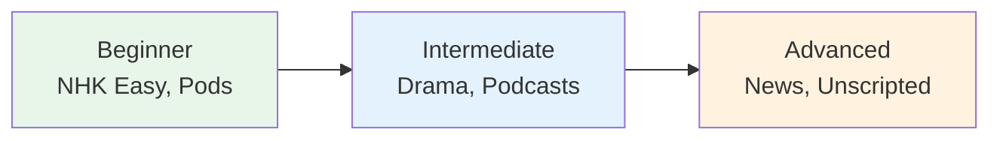

# Music — Learning Through Japanese Songs

> **Music is a powerful language learning tool — melodies help with memorization, and lyrics expose you to natural phrasing.**

## 🎯 Intuition

**The Core Idea:** Learning Japanese through songs — melody aids memory and exposes natural language.
**Analogy:** Like how you memorized English song lyrics effortlessly — music bypasses rote memorization.
**Why It Matters:** Songs teach natural rhythm, intonation, and vocabulary in a way that sticks.

## ⚙️ Core Mechanics

## Why Music Works
- Melody aids memory (you'll remember lyrics long after textbook sentences fade)
- Exposes you to poetic/casual language
- Pronunciation practice through singing
- Cultural connection

## Beginner-Friendly Songs

| Song | Artist | Why | Audio |
|------|--------|-----|-------|
| きらきら星 | Children's song | Simple vocabulary, repetitive | ![[listen-022-kirakira-boshi.mp3]] |
| さくら | Forest (森山直太朗) | Beautiful, slow, clear | ![[listen-023-sakura.mp3]] |
| 海の声 | Urashima Taro | Children's folk song | ![[listen-024-umi-no-koe.mp3]] |
| 世界に一つだけの花 | SMAP | Clear, emotional, famous | ![[listen-025-sekai-ni-hitotsu-dake-no-hana.mp3]] |

## Intermediate Songs

| Song | Artist | Genre | Audio |
|------|--------|-------|-------|
| Lemon | 米津玄師 | J-Pop | ![[listen-026-lemon.mp3]] |
| 前前前世 | RADWIMPS | Rock | ![[listen-027-zenzenzense.mp3]] |
| すずめ | Aimer | Ballad | ![[listen-028-suzume.mp3]] |
| ドラえもんのうた | Various | Theme song | ![[listen-029-doraemon-no-uta.mp3]] |

## How to Use Music for Learning
1. **Find lyrics** — search "[song name] 歌詞" (kashi = lyrics) ![[listen-030-kashi.mp3]]
2. **Read through** — look up unknown words
3. **Listen + read** — follow along with lyrics
4. **Sing along** — great pronunciation practice
5. **Memorize** — sing without looking at lyrics

## Useful Sites
- **Uta-Net** (uta-net.com) — Japanese lyrics database
- **Lyrical Nonsense** — Japanese lyrics with translations
- **Spotify** — search for J-Pop, J-Rock, Anime OST playlists

## 🔬 Deep Dive

### Caution
- Song lyrics often use poetic/archaic grammar
- Pronunciation in singing differs from speech
- Don't use songs as your ONLY listening source

### Nuances and Exceptions
- Context is king in Japanese — the same expression can have different nuances in different situations.
- Pay attention to how native speakers use these patterns in real conversation.

### Formal vs Informal Usage
- Most patterns have both polite (です/ます) and casual (dictionary form) variants.
- Choose formality based on your relationship with the listener and the situation.

### Common Mistakes by English Speakers
- Transferring English pronunciation habits to Japanese sounds.
- Missing register differences that are critical in Japanese social contexts.
- Underestimating the importance of non-verbal communication.

## 🏋️ Practice

### Warm-Up — Recognition
1. What is shadowing? → (Repeating speech immediately, with ~0.5s delay)
2. Why is NHK Easy News good for beginners? → (Simplified vocabulary, slow speed, furigana)
3. What is the main benefit of listening to podcasts? → (Flexible, high-volume listening practice)

### Core Exercises — Production
1. **Listen and transcribe:** Choose a 30-second clip from NHK Easy and write down every word you hear.
2. **Shadow practice:** Pick a podcast episode and shadow for 5 minutes, recording yourself.

### Challenge — Real World
Watch a 5-minute segment of a Japanese drama WITHOUT subtitles. Write a summary of what happened, then check with subtitles. How much did you catch?

## References
- [[Sources Index]]
