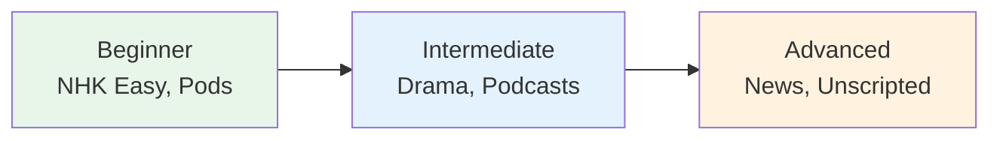

# NHK World — News Listening Practice

> **NHK (Japan Broadcasting Corporation) offers the best free resources for Japanese listening practice.**

## 🎯 Intuition

**The Core Idea:** NHK World provides structured news listening from easy to full-speed broadcasts.
**Analogy:** Like CNN with training modes — NHK Easy = simplified news, NHK regular = authentic broadcast Japanese.
**Why It Matters:** News listening builds vocabulary for current events and formal language patterns.

## ⚙️ Core Mechanics

## NHK Easy News (やさしい日本語ニュース) ![[listen-031-yasashii-nihongo-news.mp3]]
- **Level:** N4-N3
- **URL:** www3.nhk.or.jp/news/easy/
- **Features:**
  - Simplified vocabulary and grammar
  - Furigana on all kanji
  - Audio for every article
  - New articles daily
- **How to use:** Read + listen daily. Try listening first, then read to check.

## NHK News Web
- **Level:** N2-N1
- **URL:** www3.nhk.or.jp/news/
- **Features:** Full-speed news, video clips
- **How to use:** Start with headlines, work up to full articles

## NHK World-Japan
- **Level:** Intermediate+ (content is in English and Japanese)
- **URL:** www3.nhk.or.jp/nhkworld/
- **Features:** Programs about Japan in multiple languages

## NHK Radio
- **Level:** N2-N1
- **Live streaming:** Available via NHK Radio app
- **Good for:** Background immersion, news comprehension

## Daily NHK Routine

| Time | Activity | Level |
|------|----------|-------|
| 5 min | Read 1 NHK Easy article + listen | N4-N3 |
| 5 min | Shadow the same article | All |
| 10 min | Listen to NHK Radio news | N2+ |

## 🔬 Deep Dive

### Nuances and Exceptions
- Context is king in Japanese — the same expression can have different nuances in different situations.
- Pay attention to how native speakers use these patterns in real conversation.

### Formal vs Informal Usage
- Most patterns have both polite (です/ます) and casual (dictionary form) variants.
- Choose formality based on your relationship with the listener and the situation.

### Common Mistakes by English Speakers
- Transferring English pronunciation habits to Japanese sounds.
- Missing register differences that are critical in Japanese social contexts.
- Underestimating the importance of non-verbal communication.

## 🏋️ Practice

### Warm-Up — Recognition
1. What is shadowing? → (Repeating speech immediately, with ~0.5s delay)
2. Why is NHK Easy News good for beginners? → (Simplified vocabulary, slow speed, furigana)
3. What is the main benefit of listening to podcasts? → (Flexible, high-volume listening practice)

### Core Exercises — Production
1. **Listen and transcribe:** Choose a 30-second clip from NHK Easy and write down every word you hear.
2. **Shadow practice:** Pick a podcast episode and shadow for 5 minutes, recording yourself.

### Challenge — Real World
Watch a 5-minute segment of a Japanese drama WITHOUT subtitles. Write a summary of what happened, then check with subtitles. How much did you catch?

## References
- [[Japanese/Sources/Sources Index|Sources Index]]
