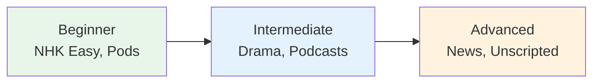

# Podcast Guide — Japanese Learning Podcasts

## 🎯 Intuition

**The Core Idea:** Japanese learning podcasts organized by level and learning style.
**Analogy:** Like having a tutor in your pocket — podcasts fit into commutes, walks, and downtime.
**Why It Matters:** Regular podcast listening is the easiest way to dramatically increase your listening hours.

## ⚙️ Core Mechanics

## Beginner

| Resource | Style | Free? |
|----------|-------|-------|
| JapanesePod101 | Structured lessons | Partial |
| Nihongo con Teppei for Beginners | Simple monologues | Yes |
| Learn Japanese with Noriko | Slow, clear topics | Yes |

## Intermediate

| Resource | Style | Audio |
|----------|-------|-------|
| Nihongo con Teppei (Original) | Natural speed, 1000+ episodes |  |
| Sakura Tips | Culture and daily life |  |
| ゆる言語学ラジオ | Linguistics discussions | ![[listen-016-yuru-gengogaku-radio.mp3]] |

## Listening Strategy

| Frequency | Activity |
|-----------|----------|
| Daily | 10 min shadowing with beginner podcast |
| 3x/week | 20 min extensive listening (intermediate) |
| Weekend | 30 min immersion (advanced content) |

## 🔬 Deep Dive

### Advanced

| Resource | Style | Audio |
|----------|-------|-------|
| NHK Radio News | Standard formal Japanese |  |
| Rebuild.fm | Tech podcast |  |
| コテンラジオ | Comedy radio | ![[listen-001-koten-radio.mp3]] |

### Nuances and Exceptions
- Context is king in Japanese — the same expression can have different nuances in different situations.
- Pay attention to how native speakers use these patterns in real conversation.

### Formal vs Informal Usage
- Most patterns have both polite (です/ます) and casual (dictionary form) variants.
- Choose formality based on your relationship with the listener and the situation.

### Common Mistakes by English Speakers
- Transferring English pronunciation habits to Japanese sounds.
- Missing register differences that are critical in Japanese social contexts.
- Underestimating the importance of non-verbal communication.

## 🏋️ Practice

### Warm-Up — Recognition
1. What is shadowing? → (Repeating speech immediately, with ~0.5s delay)
2. Why is NHK Easy News good for beginners? → (Simplified vocabulary, slow speed, furigana)
3. What is the main benefit of listening to podcasts? → (Flexible, high-volume listening practice)

### Core Exercises — Production
1. **Listen and transcribe:** Choose a 30-second clip from NHK Easy and write down every word you hear.
2. **Shadow practice:** Pick a podcast episode and shadow for 5 minutes, recording yourself.

### Challenge — Real World
Watch a 5-minute segment of a Japanese drama WITHOUT subtitles. Write a summary of what happened, then check with subtitles. How much did you catch?

## References
- [[Sources Index]]
