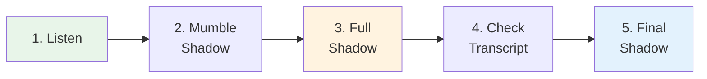

# Shadowing — Technique and Practice Guide

> **Shadowing is the #1 technique for improving both listening AND speaking. Used by professional interpreters.**

## 🎯 Intuition

**The Core Idea:** Shadowing is the #1 technique for simultaneous listening and speaking improvement — used by professional interpreters.
**Analogy:** Like singing along to a song — but for speech. You echo what you hear with a 0.5-second delay.
**Why It Matters:** This single technique improves pronunciation, rhythm, listening comprehension, and processing speed.

## ⚙️ Core Mechanics

## What Is Shadowing?
Repeat what you hear IMMEDIATELY (within 0.5 seconds) — while it's still being spoken. Like an echo.

## The Five Levels
1. **Mumble Shadowing** — Match rhythm and intonation, don't worry about words
2. **Prosody Shadowing** — Focus on pitch accent and natural rhythm
3. **Content Shadowing** — Process meaning AND reproduce sound simultaneously
4. **Selective Shadowing** — Only shadow specific elements (new vocab, grammar)
5. **Delayed Shadowing** — Wait 2-3 seconds before repeating (advanced)

## Session Structure (15 min)
1. Listen once without shadowing (1 min)
2. Mumble shadow the same passage (2 min)
3. Full shadow 3-5 times (5 min)
4. Check transcript for missed parts (2 min)
5. Final shadow with understanding (5 min)

## 🔬 Deep Dive

### Common Mistakes
1. Waiting until sentence ends (that's repetition, not shadowing)
2. Reading transcript while shadowing
3. Choosing audio that's too difficult
4. Not doing it daily

### Nuances and Exceptions
- Context is king in Japanese — the same expression can have different nuances in different situations.
- Pay attention to how native speakers use these patterns in real conversation.

### Formal vs Informal Usage
- Most patterns have both polite (です/ます) and casual (dictionary form) variants.
- Choose formality based on your relationship with the listener and the situation.

## 🏋️ Practice

### Warm-Up — Recognition
1. What is shadowing? → (Repeating speech immediately, with ~0.5s delay)
2. Why is NHK Easy News good for beginners? → (Simplified vocabulary, slow speed, furigana)
3. What is the main benefit of listening to podcasts? → (Flexible, high-volume listening practice)

### Core Exercises — Production
1. **Listen and transcribe:** Choose a 30-second clip from NHK Easy and write down every word you hear.
2. **Shadow practice:** Pick a podcast episode and shadow for 5 minutes, recording yourself.

### Challenge — Real World
Watch a 5-minute segment of a Japanese drama WITHOUT subtitles. Write a summary of what happened, then check with subtitles. How much did you catch?

## Recommended Sources by Level

| Level | Source |
|-------|--------|
| Beginner | JapanesePod101 dialogues, NHK Easy News |
| Intermediate | Nihongo con Teppei |
| Advanced | NHK News, drama, anime |

## References
- [[Japanese/Sources/Sources Index|Sources Index]]
