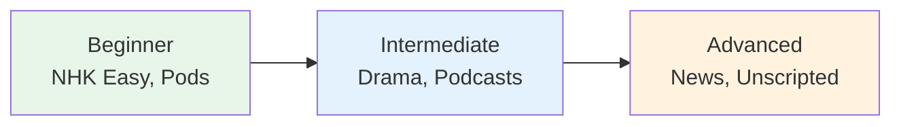

# YouTube Channels for Japanese Learners

> **Curated channels organized by level and focus.**

## 🎯 Intuition

**The Core Idea:** YouTube channels curated for Japanese learners at every level.
**Analogy:** Like having free video tutors available 24/7 — visual + audio learning for any topic.
**Why It Matters:** YouTube fills the gap between textbooks and real-life with engaging, visual content.

## ⚙️ Core Mechanics

## Beginner-Friendly

| Channel | Focus | Language |
|---------|-------|----------|
| Comprehensible Japanese | Graded input | Japanese only |
| Japanese Ammo with Misa | Grammar | Japanese + English |
| Onomappu | Vocabulary/culture | Japanese + visuals |
| JapanesePod101 | Structured lessons | English + Japanese |

## Intermediate

| Channel | Focus | Language |
|---------|-------|----------|
| Dogen | Phonetics/pitch accent | English + Japanese |
| Cure Dolly | Grammar theory | English |
| Yudai Sensei | Grammar/conversation | Mostly Japanese |
| Sambon Juku | JLPT prep | Japanese |

## How to Use YouTube for Learning
1. **Beginner:** Watch learning channels with subtitles ON
2. **Intermediate:** Watch native content with Japanese subtitles
3. **Advanced:** Watch native content, subtitles OFF
4. **All levels:** Use the 10ten browser extension for quick lookups

## Useful Settings
- Playback speed: 0.75x for difficult content, 1.25x for easy
- Auto-generated Japanese subtitles are surprisingly good
- Use "Language Reactor" extension for dual subtitles

## 🔬 Deep Dive

### Native Content (Advanced)

| Channel | Focus | Genre | Audio |
|---------|-------|-------|-------|
| 中田敦彦 | Education | Fast-paced lectures | ![[listen-018-nakata-atsuhiko.mp3]] |
| ヒカキン | Entertainment | Variety/comedy | ![[listen-032-hikakin.mp3]] |
| フェルミ研究所 | Science | Explained clearly | ![[listen-033-fermi-kenkyuujo.mp3]] |
| 山田五郎 | Wilderness survival | Visual + narration | ![[listen-034-yamada-gorou.mp3]] |
| 予備校のノリ | Education | Lecture style | ![[listen-035-yobikou-no-nori.mp3]] |

### Nuances and Exceptions
- Context is king in Japanese — the same expression can have different nuances in different situations.
- Pay attention to how native speakers use these patterns in real conversation.

### Formal vs Informal Usage
- Most patterns have both polite (です/ます) and casual (dictionary form) variants.
- Choose formality based on your relationship with the listener and the situation.

### Common Mistakes by English Speakers
- Transferring English pronunciation habits to Japanese sounds.
- Missing register differences that are critical in Japanese social contexts.
- Underestimating the importance of non-verbal communication.

## 🏋️ Practice

### Warm-Up — Recognition
1. What is shadowing? → (Repeating speech immediately, with ~0.5s delay)
2. Why is NHK Easy News good for beginners? → (Simplified vocabulary, slow speed, furigana)
3. What is the main benefit of listening to podcasts? → (Flexible, high-volume listening practice)

### Core Exercises — Production
1. **Listen and transcribe:** Choose a 30-second clip from NHK Easy and write down every word you hear.
2. **Shadow practice:** Pick a podcast episode and shadow for 5 minutes, recording yourself.

### Challenge — Real World
Watch a 5-minute segment of a Japanese drama WITHOUT subtitles. Write a summary of what happened, then check with subtitles. How much did you catch?

## References
- [[Sources Index]]
