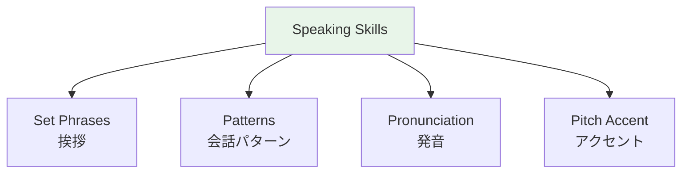

# Common Filler Words and Discourse Markers

> **These make you sound natural.**

## 🎯 Intuition

**The Core Idea:** Filler words and discourse markers keep Japanese conversation flowing naturally.
**Analogy:** Like 'um', 'well', 'you know', 'so' in English — every language needs these conversational glue words.
**Why It Matters:** Using appropriate fillers makes you sound fluent even when your grammar isn't perfect.

## ⚙️ Core Mechanics

## Fillers

| Japanese | Function | English equivalent | Audio |
|----------|----------|-------------------|-------|
| えーと | Thinking | "Um, let's see" | ![[filler-001-eeto.mp3]] |
| あのー | Hesitation | "Uh..." | ![[filler-002-anoo.mp3]] |
| まあ | Hedging | "Well, kind of" | ![[filler-003-maa.mp3]] |
| ちょっと | Softening | "A bit" | ![[filler-004-chotto.mp3]] |
| やっぱり | Confirmation | "As I thought" | ![[filler-005-yappari.mp3]] |
| 一応 | Tentative | "For now" | ![[filler-006-ichiou.mp3]] |
| とりあえず | Quick decision | "For starters" | ![[filler-007-toriaezu.mp3]] |
| なるほど | Realizing | "I see" | ![[filler-008-naruhodo.mp3]] |
| そうですね | Agreeing / stalling | "Well, that's true" | ![[filler-009-sou-desu-ne.mp3]] |
| へえ | Surprise | "Oh really?" | ![[filler-010-hee.mp3]] |
| 本当に | Emphasis | "Really" | ![[filler-011-hontou-ni.mp3]] |
| すごいですね | Reaction | "That's amazing" | ![[filler-012-sugoi-desu-ne.mp3]] |

## Sentence-End Particles

| Particle | Function | Example | Audio |
|----------|----------|---------|-------|
| ね | Seeking agreement | いい天気ですね (Nice weather, right?) | ![[filler2-001-ne.mp3]] |
| よ | Asserting | 行くよ (I'm going, you know) | ![[filler2-002-yo.mp3]] |
| なあ | Wishing | 旅行したいなあ (I want to travel...) | ![[filler2-003-naa.mp3]] |
| かな | Wondering | 雨かな (Wonder if it'll rain) | ![[filler2-004-kana.mp3]] |
| けど | Trailing "but" | 行きたいけど... (I want to go, but...) | ![[filler2-005-kedo.mp3]] |

## Discourse Markers

| Japanese | Function | Audio |
|----------|----------|-------|
| ところで | Changing topic ("By the way") | ![[filler-013-tokoro-de.mp3]] |
| それで | Continuing ("And so") | ![[filler2-006-sorede.mp3]] |
| でも | Contrasting ("But") | ![[filler2-007-demo.mp3]] |
| だから | Concluding ("That's why") | ![[filler2-008-dakara.mp3]] |
| つまり | Summarizing ("In other words") | ![[filler-014-tsumari.mp3]] |

## 🔬 Deep Dive

### Nuances and Exceptions
- Context is king in Japanese — the same expression can have different nuances in different situations.
- Pay attention to how native speakers use these patterns in real conversation.

### Formal vs Informal Usage
- Most patterns have both polite (です/ます) and casual (dictionary form) variants.
- Choose formality based on your relationship with the listener and the situation.

### Common Mistakes by English Speakers
- Transferring English pronunciation habits to Japanese sounds.
- Missing register differences that are critical in Japanese social contexts.
- Underestimating the importance of non-verbal communication.

## 🏋️ Practice

### Warm-Up — Recognition
1. What is 相槌 (aizuchi)? → (Back-channel responses like うん, そうですか)
2. When do you say いただきます? → (Before eating)
3. What's the difference between おはよう and おはようございます? → (Casual vs polite)

### Core Exercises — Production
1. **Respond appropriately:** Someone says お先に失礼します → (お疲れ様でした)
2. **Give a self-introduction:** Include name, country, job, and hobby in polite form.

### Challenge — Real World
Role-play arriving at a Japanese office for the first time. Include: greeting the receptionist, introducing yourself to your new team, and responding to their questions with appropriate aizuchi.

## References
- [[Japanese/Sources/Sources Index|Sources Index]]
