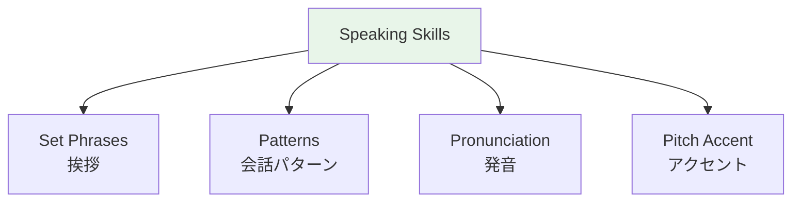

# Conversation Patterns — Daily Interactions

## 🎯 Intuition

**The Core Idea:** Conversation patterns for everyday interactions — the practical phrases you'll use most often.
**Analogy:** Like having a phrasebook internalized — ready-made patterns for common daily scenarios.
**Why It Matters:** These patterns let you function in Japan from day one.

## ⚙️ Core Mechanics

## At a Store

| Japanese    | English                    | Audio                                     |
| ----------- | -------------------------- | ----------------------------------------- |
| いらっしゃいませ    | Welcome! (staff says this) | ![[daily-001-irasshaimase.mp3]]           |
| これをください     | This one, please           | ![[daily-002-kore-wo-kudasai.mp3]]        |
| いくらですか      | How much?                  | ![[daily-003-ikura-desu-ka.mp3]]          |
| カードでおねがいします | Card, please               | ![[daily-004-kaado-de-onegaishimasu.mp3]] |
| 大丈夫です       | No, I'm fine               | ![[gap-080-phrase.mp3]]                   |

## At a Restaurant

| Japanese | English | Audio |
|----------|---------|-------|
| 二人です | Table for two | ![[daily-005-futari-desu.mp3]] |
| おすすめは何ですか | What do you recommend? | ![[daily-006-osusume-wa-nan-desu-ka.mp3]] |
| おかいけいおねがいします | Check, please | ![[daily-007-okaikei-onegaishimasu.mp3]] |
| いただきます | (Before eating) | ![[gap-081-phrase.mp3]] |
| ごちそうさまでした | (After eating) | ![[gap-082-phrase.mp3]] |

## Asking for Help

| Japanese | English | Audio |
|----------|---------|-------|
| すみません | Excuse me | ![[daily-008-sumimasen2.mp3]] |
| 写真を撮ってもらえますか | Could you take a photo? | ![[gap-083-phrase.mp3]] |
| もう一度おねがいします | One more time, please | ![[daily-009-mou-ichido-onegaishimasu.mp3]] |
| ゆっくりおねがいします | Slowly, please | ![[daily-010-yukkuri-onegaishimasu.mp3]] |

## Transportation

| Japanese | English | Audio |
|----------|---------|-------|
| この電車は東京に行きますか | Does this train go to Tokyo? | ![[daily-016-kono-densha-wa-toukyou.mp3]] |
| 次の駅はどこですか | Where is the next station? | ![[daily-017-tsugi-no-eki-wa-doko.mp3]] |

## Expressing Opinions

| Japanese | English | Audio |
| ---------- | --------- | --- |
| 私は…と思います | I think... | ![[gap-084-phrase.mp3]] |
| そう思います | I think so too | ![[gap-085-phrase.mp3]] |
| ちょっと違うと思います | I think it's a bit different | ![[gap-086-phrase.mp3]] |

## 🔬 Deep Dive

### Nuances and Exceptions
- Context is king in Japanese — the same expression can have different nuances in different situations.
- Pay attention to how native speakers use these patterns in real conversation.

### Formal vs Informal Usage
- Most patterns have both polite (です/ます) and casual (dictionary form) variants.
- Choose formality based on your relationship with the listener and the situation.

### Common Mistakes by English Speakers
- Transferring English pronunciation habits to Japanese sounds.
- Missing register differences that are critical in Japanese social contexts.
- Underestimating the importance of non-verbal communication.

## 🏋️ Practice

### Warm-Up — Recognition
1. What is 相槌 (aizuchi)? → (Back-channel responses like うん, そうですか)
2. When do you say いただきます? → (Before eating)
3. What's the difference between おはよう and おはようございます? → (Casual vs polite)

### Core Exercises — Production
1. **Respond appropriately:** Someone says お先に失礼します → (お疲れ様でした)
2. **Give a self-introduction:** Include name, country, job, and hobby in polite form.

### Challenge — Real World
Role-play arriving at a Japanese office for the first time. Include: greeting the receptionist, introducing yourself to your new team, and responding to their questions with appropriate aizuchi.

## References
- [[Sources Index]]
