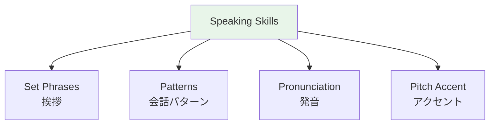

# Conversation Patterns — Greetings and Introductions

## 🎯 Intuition

**The Core Idea:** Japanese greetings are social contracts — specific phrases for specific situations, not optional niceties.
**Analogy:** Like saying 'bless you' after a sneeze, but more — Japanese has set phrases for entering, leaving, eating, etc.
**Why It Matters:** Knowing the right greeting for each situation is the #1 way to show cultural competence.

## ⚙️ Core Mechanics

## Daily Greetings

| Time | Polite | Casual | Audio |
|------|--------|--------|-------|
| Morning | おはようございます | おはよう | ![[greet-001-ohayou-gozaimasu.mp3]] ![[greetings-002-ohayou-gozaimasu.mp3]] ![[greet2-001-ohayou.mp3]] |
| Daytime | こんにちは | — | ![[greet-002-konnichiwa.mp3]] ![[greetings-001-konnichiwa.mp3]] |
| Evening | こんばんは | — | ![[greet-003-konbanwa.mp3]] |
| Goodnight | おやすみなさい | おやすみ | ![[greet-004-oyasuminasai.mp3]] ![[greet2-002-oyasumi.mp3]] |

## Everyday Essentials

| Japanese | Meaning | Audio |
|----------|---------|-------|
| ありがとうございます | Thank you very much | ![[greetings-003-arigatou-gozaimasu.mp3]] |
| すみません | Excuse me / Sorry | ![[greetings-004-sumimasen.mp3]] |

## Meeting and Parting

| Japanese | Meaning | Audio |
|----------|---------|-------|
| はじめまして | Nice to meet you | ![[greet-005-hajimemashite.mp3]] |
| よろしくおねがいします | Please treat me well | ![[greet-006-yoroshiku-onegaishimasu.mp3]] |
| お久しぶりです | Long time no see | ![[greet-007-ohisashiburi-desu.mp3]] |
| さようなら | Goodbye | ![[greet-008-sayounara.mp3]] |
| またね | See you again | ![[greet-009-matane.mp3]] |
| お先に失礼します | Excuse me for leaving first | ![[greet-010-osaki-ni-shitsurei-shimasu.mp3]] |
| いってきます | I'm leaving / See you later | ![[greet-011-ittekimasu.mp3]] |
| いってらっしゃい | Take care / See you later | ![[greet-012-itterasshai.mp3]] |
| ただいま | I'm home | ![[greet-013-tadaima.mp3]] |
| おかえりなさい | Welcome home | ![[greet-014-okaerinasai.mp3]] |

## Self-Introduction (自己紹介)
> はじめまして。[Name]と申します。[Country]から来ました。[Job]です。[Hobby]が好きです。どうぞよろしくおねがいします。
> ![[greet2-003-self-intro.mp3]]

## Aizuchi (相槌) — Back-channel Responses
ESSENTIAL in Japanese conversation — silence feels awkward!

| Japanese | Meaning | Audio |
|----------|---------|-------|
| うん | Uh-huh | ![[aizuchi-001-un.mp3]] |
| ええ | Yes / Indeed | ![[aizuchi-002-ee.mp3]] |
| そうですか | Is that so? | ![[aizuchi-003-sou-desu-ka.mp3]] |
| なるほど | I see | ![[aizuchi-004-naruhodo2.mp3]] |
| へえ | Oh really? | ![[aizuchi-005-hee2.mp3]] |
| 本当ですか | Really? | ![[aizuchi-006-hontou-desu-ka.mp3]] |
| すごい | Amazing | ![[aizuchi-007-sugoi.mp3]] |

## 🔬 Deep Dive

### Nuances and Exceptions
- Context is king in Japanese — the same expression can have different nuances in different situations.
- Pay attention to how native speakers use these patterns in real conversation.

### Formal vs Informal Usage
- Most patterns have both polite (です/ます) and casual (dictionary form) variants.
- Choose formality based on your relationship with the listener and the situation.

### Common Mistakes by English Speakers
- Transferring English pronunciation habits to Japanese sounds.
- Missing register differences that are critical in Japanese social contexts.
- Underestimating the importance of non-verbal communication.

## 🏋️ Practice

### Warm-Up — Recognition
1. What is 相槌 (aizuchi)? → (Back-channel responses like うん, そうですか)
2. When do you say いただきます? → (Before eating)
3. What's the difference between おはよう and おはようございます? → (Casual vs polite)

### Core Exercises — Production
1. **Respond appropriately:** Someone says お先に失礼します → (お疲れ様でした)
2. **Give a self-introduction:** Include name, country, job, and hobby in polite form.

### Challenge — Real World
Role-play arriving at a Japanese office for the first time. Include: greeting the receptionist, introducing yourself to your new team, and responding to their questions with appropriate aizuchi.

## References
- [[Sources Index]]
