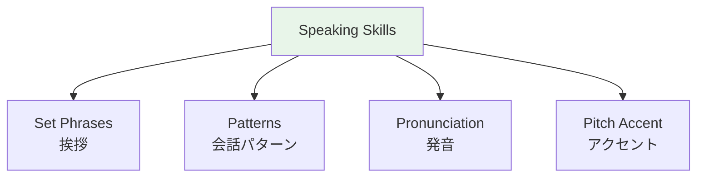

# Conversation Patterns — Shopping and Restaurants

## 🎯 Intuition

**The Core Idea:** Essential patterns for shopping, ordering food, and navigating service situations.
**Analogy:** Like having a cheat sheet for every shop and restaurant — fixed patterns that always work.
**Why It Matters:** These are the most immediately practical conversation patterns for anyone visiting Japan.

## ⚙️ Core Mechanics

## Convenience Store Script
> Staff: いらっしゃいませ。 ![[shop-001-irasshaimase.mp3]]
> Staff: ポイントカードはお持ちですか。 (Point card?) ![[daily-011-pointo-kaado.mp3]]
> You: ないです。 (No) ![[shop-002-nai-desu.mp3]]
> Staff: お箸はおつけしますか。 (Chopsticks?) ![[daily-013-ohashi-wa-otsukeshimasu-ka.mp3]]
> You: おねがいします / 大丈夫です ![[shop-003-onegaishimasu.mp3]] ![[shop-004-daijoubu-desu.mp3]]
> Staff: あたためますか。 (Heat it up?) ![[daily-012-atatamemasu-ka.mp3]]
> You: おねがいします。 ![[shop-003-onegaishimasu.mp3]]

## Restaurant Ordering

| Japanese | English | Audio |
|----------|---------|-------|
| 予約しているんですが | I have a reservation | ![[shop-005-yoyaku-shiteirun-desu-ga.mp3]] |
| アレルギーがあるんですが | I have an allergy | ![[shop-006-allergy-ga-arun-desu-ga.mp3]] |
| 辛さ控えめでおねがいします | Less spicy, please | ![[shop-007-karasa-hikaeme-de-onegaishimasu.mp3]] |
| 大盛りでおねがいします | Large portion, please | ![[shop-008-oomori-de-onegaishimasu.mp3]] |
| お水おねがいします | Water, please | ![[shop-009-omizu-onegaishimasu.mp3]] |

## Clothing Store

| Japanese | English | Audio |
|----------|---------|-------|
| 試着してもいいですか | May I try this on? | ![[daily-014-shichaku-shitemo-ii-desu-ka.mp3]] |
| 他の色はありますか | Other colors? | ![[daily-015-hoka-no-iro-wa-arimasu-ka.mp3]] |
| これにします | I'll take this one | ![[shop-010-kore-ni-shimasu.mp3]] |

## 🔬 Deep Dive

### Nuances and Exceptions
- Context is king in Japanese — the same expression can have different nuances in different situations.
- Pay attention to how native speakers use these patterns in real conversation.

### Formal vs Informal Usage
- Most patterns have both polite (です/ます) and casual (dictionary form) variants.
- Choose formality based on your relationship with the listener and the situation.

### Common Mistakes by English Speakers
- Transferring English pronunciation habits to Japanese sounds.
- Missing register differences that are critical in Japanese social contexts.
- Underestimating the importance of non-verbal communication.

## 🏋️ Practice

### Warm-Up — Recognition
1. What is 相槌 (aizuchi)? → (Back-channel responses like うん, そうですか)
2. When do you say いただきます? → (Before eating)
3. What's the difference between おはよう and おはようございます? → (Casual vs polite)

### Core Exercises — Production
1. **Respond appropriately:** Someone says お先に失礼します → (お疲れ様でした)
2. **Give a self-introduction:** Include name, country, job, and hobby in polite form.

### Challenge — Real World
Role-play arriving at a Japanese office for the first time. Include: greeting the receptionist, introducing yourself to your new team, and responding to their questions with appropriate aizuchi.

## References
- [[Sources Index]]
