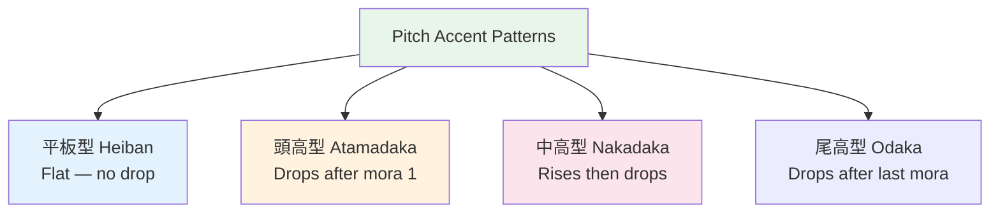

# Pitch Accent — Common Patterns

> **Practical pitch patterns for common words.**

## 🎯 Intuition

**The Core Idea:** Common pitch accent patterns and the rules governing where pitch rises and falls.
**Analogy:** Like musical notes — each word has a melody pattern, and learning the common ones covers most words.
**Why It Matters:** Mastering these patterns makes your Japanese sound dramatically more natural.

## ⚙️ Core Mechanics

## Heiban (Flat) — Most Common ~55%
No drop. First mora low, rest high.

| Word | Reading | Meaning | Audio |
|------|---------|---------|-------|
| 元気 | genki | Energetic | ![[pitch2-001-genki.mp3]] |
| 先生 | sensei | Teacher | ![[pitch2-002-sensei.mp3]] |
| 友達 | tomodachi | Friend | ![[pitch2-003-tomodachi.mp3]] |
| 日本 | nihon | Japan | ![[pitch2-004-nihon.mp3]] |
| 電車 | densha | Train | ![[pitch2-005-densha.mp3]] |

## Atamadaka (Head-high) — ~5%

| Word | Reading | Meaning | Audio |
|------|---------|---------|-------|
| カレー | karē | Curry | ![[pitch2-006-karee.mp3]] |
| テレビ | terebi | TV | ![[pitch2-007-terebi.mp3]] |

## Nakadaka (Middle-high) — ~35%

| Word | Reading | Meaning | Audio |
|------|---------|---------|-------|
| 映画 | eiga | Movie | ![[pitch2-008-eiga.mp3]] |
| おはよう | ohayō | Good morning | ![[pitch2-009-ohayou.mp3]] |

## Minimal Pair Audio Practice
- **花** (はな) — flower ![[pitch-005-hana-flower.mp3]]
- **鼻** (はな) — nose ![[pitch-006-hana-nose.mp3]]
- **酒** (さけ) — alcohol ![[pitch-007-sake-alcohol.mp3]]
- **鮭** (さけ) — salmon ![[pitch-008-sake-salmon.mp3]]

## Practice Method
1. Use [[Phase 3 Pitch Accent Practice Path]] for the source-check order and weekly proof.
2. Look up up to 5 new words per day in [OJAD](https://www.gavo.t.u-tokyo.ac.jp/ojad/)
3. Mark pitch patterns in your Anki cards only after checking a reference source
4. Shadow native audio focusing on pitch
5. Use [[Pronunciation and Audio Accuracy]] when a local clip and a dictionary/native source disagree

## 🔬 Deep Dive

### Nuances and Exceptions
- Context is king in Japanese — the same expression can have different nuances in different situations.
- Pay attention to how native speakers use these patterns in real conversation.

### Formal vs Informal Usage
- Most patterns have both polite (です/ます) and casual (dictionary form) variants.
- Choose formality based on your relationship with the listener and the situation.

### Common Mistakes by English Speakers
- Transferring English pronunciation habits to Japanese sounds.
- Missing register differences that are critical in Japanese social contexts.
- Underestimating the importance of non-verbal communication.

## 🏋️ Practice

### Warm-Up — Recognition
1. What is 相槌 (aizuchi)? → (Back-channel responses like うん, そうですか)
2. When do you say いただきます? → (Before eating)
3. What's the difference between おはよう and おはようございます? → (Casual vs polite)

### Core Exercises — Production
1. **Respond appropriately:** Someone says お先に失礼します → (お疲れ様でした)
2. **Give a self-introduction:** Include name, country, job, and hobby in polite form.

### Challenge — Real World
Role-play arriving at a Japanese office for the first time. Include: greeting the receptionist, introducing yourself to your new team, and responding to their questions with appropriate aizuchi.

## References
- [[Sources Index]]
- [[Pronunciation and Audio Accuracy]]
- [[Phase 3 Pitch Accent Practice Path]]
