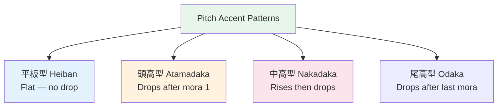

# Pitch Accent — Introduction

> **Japanese is NOT a stress language like English. It uses PITCH (high vs low) to distinguish words.**

## 🎯 Intuition

**The Core Idea:** Japanese is a pitch-accent language — the same syllables with different pitch = different meaning.
**Analogy:** Like how 'record' (noun) and 'record' (verb) have different stress in English — but more systematic.
**Why It Matters:** Wrong pitch accent marks you as a foreigner more than any other pronunciation issue.

## ⚙️ Core Mechanics

Use [[Pronunciation and Audio Accuracy]] for source priority. Local pitch clips are awareness drills; for pitch decisions, check an accent dictionary, native course audio, or tutor feedback. During Phase 3, use [[Phase 3 Pitch Accent Practice Path]] to turn these examples into a weekly source-checked routine.

## Minimal Pairs

| Word | Pitch | Meaning | Audio |
|------|-------|---------|-------|
| 箸 hashi | HAshi | Chopsticks (high-low) | ![[pitch-001-hashi-chopsticks.mp3]] |
| 橋 hashi | haSHI | Bridge (low-high) | ![[pitch-002-hashi-bridge.mp3]] |
| 雨 ame | Ame | Rain (high-low) | ![[pitch-003-ame-rain.mp3]] |
| 飴 ame | aME | Candy (low-high) | ![[pitch-004-ame-candy.mp3]] |

## The Four Pitch Patterns

### 1. Atamadaka (頭高) — Head-high ![[pitch2-010-atamadaka.mp3]]
First mora high, rest drops: ●○○...

### 2. Nakadaka (中高) — Middle-high ![[pitch2-011-nakadaka.mp3]]
Starts low, goes high, drops at specific point: ○●●○...

### 3. Odaka (尾高) — Tail-high ![[pitch2-012-odaka.mp3]]
Low start, rises, stays high, drops on particle: ○●●... (drops on particle)

### 4. Heiban (平板) — Flat (~55% of words) ![[pitch2-013-heiban.mp3]]
Low first mora, rises, stays high. NO drop: ○●●●...

## The Key Rule
**After the first drop, pitch never rises again within the same word.**

## 🔬 Deep Dive

### Nuances and Exceptions
- Context is king in Japanese — the same expression can have different nuances in different situations.
- Pay attention to how native speakers use these patterns in real conversation.

### Formal vs Informal Usage
- Most patterns have both polite (です/ます) and casual (dictionary form) variants.
- Choose formality based on your relationship with the listener and the situation.

### Common Mistakes by English Speakers
- Transferring English pronunciation habits to Japanese sounds.
- Missing register differences that are critical in Japanese social contexts.
- Underestimating the importance of non-verbal communication.

## 🏋️ Practice

### Warm-Up — Recognition
1. What is 相槌 (aizuchi)? → (Back-channel responses like うん, そうですか)
2. When do you say いただきます? → (Before eating)
3. What's the difference between おはよう and おはようございます? → (Casual vs polite)

### Core Exercises — Production
1. **Respond appropriately:** Someone says お先に失礼します → (お疲れ様でした)
2. **Give a self-introduction:** Include name, country, job, and hobby in polite form.

### Challenge — Real World
Role-play arriving at a Japanese office for the first time. Include: greeting the receptionist, introducing yourself to your new team, and responding to their questions with appropriate aizuchi.

## Resources
- [OJAD](https://www.gavo.t.u-tokyo.ac.jp/ojad/) — online Japanese accent dictionary for learners and teachers
- NHK Japanese Pronunciation Accent Dictionary — standard reference for broadcast-style pronunciation and accent
- Dogen's Japanese Phonetics (YouTube/Patreon)

## References
- [[Japanese/Sources/Sources Index|Sources Index]]
- [[Pronunciation and Audio Accuracy]]
- [[Phase 3 Pitch Accent Practice Path]]
