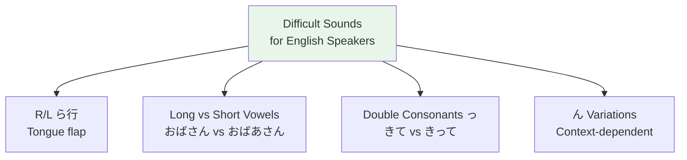

# Pronunciation — Difficult Sounds for English Speakers

## 🎯 Intuition

**The Core Idea:** Specific Japanese sounds that English speakers consistently struggle with.
**Analogy:** Your English mouth habits create predictable errors — like pronouncing Japanese 'r' as an English 'r' or 'l'.
**Why It Matters:** Fixing these sounds early prevents fossilized errors that become harder to correct later.

## ⚙️ Core Mechanics

## The R-Sound (らりるれろ)
- NOT English R and NOT English L
- Tongue tip taps the ridge behind upper teeth (like a quick "d")
- Similar to Spanish single-R or American "butter"

> らりるれろ (ra ri ru re ro)
> ![[pronun-001-ra-ri-ru-re-ro.mp3]]

### Individual Kana Audio

| Kana | Audio |
|------|-------|
| ら | ![[pronun2-001-ra.mp3]] |
| り | ![[pronun2-002-ri.mp3]] |
| る | ![[pronun2-003-ru.mp3]] |
| れ | ![[pronun2-004-re.mp3]] |
| ろ | ![[pronun2-005-ro.mp3]] |

## Long vs Short Vowels
Length changes meaning!

| Short | Long | Difference | Audio |
| ------- | ------ | ----------- | --- |
| おばさん (obasan) | おばあさん (obāsan) | Aunt vs Grandmother | ![[gap-076-(obasan).mp3]] |
| ここ (koko) | 高校 (kōkō) | Here vs High school | ![[gap-077-(koko).mp3]] |

> おばさん (obasan) — aunt
> ![[pronun-002-obasan-aunt.mp3]]

> おばあさん (obaasan) — grandmother
> ![[pronun-003-obaasan-grandmother.mp3]]

> ビル (biru) — building
> ![[pronun-004-biru-building.mp3]]

> ビール (biiru) — beer
> ![[pronun-005-biiru-beer.mp3]]

### Additional Contrast Drill Audio

| Japanese | Meaning | Audio |
|----------|---------|-------|
| おばさん | aunt | ![[pronun2-006-obasan.mp3]] |
| おばあさん | grandmother | ![[pronun2-007-obaasan.mp3]] |
| ここ | here | ![[pronun2-008-koko.mp3]] |
| 高校 | high school | ![[pronun2-009-koukou.mp3]] |
| ビル | building | ![[pronun2-010-biru.mp3]] |
| ビール | beer | ![[pronun2-011-biiru.mp3]] |

## Double Consonants (っ)
Small っ creates a brief pause:
- きて (kite, come) vs きって (kitte, stamp)
![[nontbl-022-kite-come.mp3]]
![[nontbl-023-kitte-stamp.mp3]]

> きて (kite, come)
> ![[pronun-006-kite-come.mp3]]

> きって (kitte, stamp)
> ![[pronun-007-kitte-stamp.mp3]]

### Double Consonant Drill Audio

| Item | Audio |
|------|-------|
| っ | ![[pronun2-012-small-tsu.mp3]] |
| きて | ![[pronun2-013-kite.mp3]] |
| きって | ![[pronun2-014-kitte.mp3]] |

## The N-Sound (ん)
Changes pronunciation based on what follows:

| Before | Sound | Example | Audio |
| -------- | ------- | --------- | --- |
| b, p, m | "m" | さんぽ (sampo) | ![[gap-078-(sampo).mp3]] |
| k, g | "ng" | きんがく (kingaku) | ![[gap-079-(kingaku).mp3]] |

> がっこう (gakkō / gakkou) — school
> ![[pronun-008-gakkou.mp3]]

> さんぽ (sanpo) — walk
> ![[pronun-009-sanpo.mp3]]

### N-Sound Drill Audio

| Item | Audio |
|------|-------|
| ん | ![[pronun2-015-n.mp3]] |
| さんぽ | ![[pronun2-016-sanpo.mp3]] |
| きんがく | ![[pronun2-017-kingaku.mp3]] |
| がっこう | ![[pronun2-018-gakkou.mp3]] |

## Vowel Devoicing
In Tokyo dialect, い and う become whispered between voiceless consonants:
- です (desu) sounds like "des"
![[nontbl-024-desu-whispered.mp3]]
- した (shita) sounds like "sh'ta"
![[nontbl-025-shita-whispered.mp3]]

> です (desu → des)
> ![[pronun-010-desu-whispered.mp3]]

### Vowel Devoicing Drill Audio

| Item | Audio |
|------|-------|
| い | ![[pronun2-019-i.mp3]] |
| う | ![[pronun2-020-u.mp3]] |
| です | ![[pronun2-021-desu.mp3]] |
| した | ![[pronun2-022-shita.mp3]] |

## 🔬 Deep Dive

### Nuances and Exceptions
- Context is king in Japanese — the same expression can have different nuances in different situations.
- Pay attention to how native speakers use these patterns in real conversation.

### Formal vs Informal Usage
- Most patterns have both polite (です/ます) and casual (dictionary form) variants.
- Choose formality based on your relationship with the listener and the situation.

### Common Mistakes by English Speakers
- Transferring English pronunciation habits to Japanese sounds.
- Missing register differences that are critical in Japanese social contexts.
- Underestimating the importance of non-verbal communication.

## 🏋️ Practice

### Warm-Up — Recognition
1. What is 相槌 (aizuchi)? → (Back-channel responses like うん, そうですか)
2. When do you say いただきます? → (Before eating)
3. What's the difference between おはよう and おはようございます? → (Casual vs polite)

### Core Exercises — Production
1. **Respond appropriately:** Someone says お先に失礼します → (お疲れ様でした)
2. **Give a self-introduction:** Include name, country, job, and hobby in polite form.

### Challenge — Real World
Role-play arriving at a Japanese office for the first time. Include: greeting the receptionist, introducing yourself to your new team, and responding to their questions with appropriate aizuchi.

## References
- [[Sources Index]]
