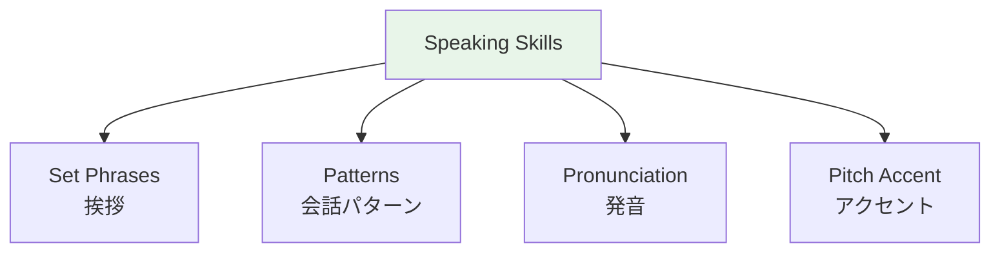

# Self-Introduction Template

> **The 自己紹介 (jiko shōkai) is the MOST practiced speaking exercise.**



## 🎯 Intuition

**The Core Idea:** The Japanese self-introduction follows a fixed template that every learner needs to master.
**Analogy:** Like having a rehearsed elevator pitch — Japanese culture expects a structured 自己紹介 in specific situations.
**Why It Matters:** You'll use this template at every first meeting, class, job interview, and social gathering.

## ⚙️ Core Mechanics

The 自己紹介 (jiko shōkai) is the MOST practiced speaking exercise.
![[nontbl-045-jiko-shoukai.mp3]]

- Key term: ![[selfintro2-001-jiko-shoukai.mp3]]

## Basic Template
```
はじめまして。
![[nontbl-001-hajimemashite.mp3]]
[Name]です。
![[nontbl-002-desu.mp3]]
[Country]から来ました。
![[nontbl-003-kara-kimashita.mp3]]
[Job/Status]をしています。
趣味は[hobby]です。
![[nontbl-004-shumi-wa-desu.mp3]]
よろしくおねがいします。
![[nontbl-005-yoroshiku-onegaishimasu.mp3]]
```
![[selfintro-001-selfintro-casual.mp3]]


### Basic Template — Line-by-Line Sample Audio

| Template line | Sample audio |
|---------------|--------------|
| はじめまして。 | ![[selfintro2-002-hajimemashite-basic.mp3]] |
| [Name]です。 | ![[selfintro2-003-tanaka-desu.mp3]] *(sample: 田中です。)* |
| [Country]から来ました。 | ![[selfintro2-004-america-kara-kimashita.mp3]] *(sample: アメリカから来ました。)* |
| [Job/Status]をしています。 | ![[selfintro2-005-engineer-wo-shiteimasu.mp3]] *(sample: エンジニアをしています。)* |
| 趣味は[hobby]です。 | ![[selfintro2-006-shumi-wa-ongaku-desu.mp3]] *(sample: 趣味は音楽です。)* |
| よろしくおねがいします。 | ![[selfintro2-007-yoroshiku-onegaishimasu.mp3]] |


## Extended (Formal/Business)
```
はじめまして。
[Name]と申します。
![[nontbl-006-to-moushimasu.mp3]]
[Company]の[Department]で働いております。
![[nontbl-007-hataraiteorimasu.mp3]]
日本語はまだ勉強中ですが、がんばります。
![[nontbl-008-nihongo-benkyouchuu.mp3]]
どうぞよろしくおねがいいたします。
![[nontbl-009-douzo-yoroshiku.mp3]]
```
![[selfintro-002-selfintro-formal.mp3]]


### Extended Template — Line-by-Line Sample Audio

| Template line | Sample audio |
|---------------|--------------|
| はじめまして。 | ![[selfintro2-008-hajimemashite-formal.mp3]] |
| [Name]と申します。 | ![[selfintro2-009-tanaka-to-moushimasu.mp3]] *(sample: 田中と申します。)* |
| [Company]の[Department]で働いております。 | ![[selfintro2-010-kaisha-de-hataraitemasu.mp3]] *(sample: ABC株式会社の営業部で働いております。)* |
| 日本語はまだ勉強中ですが、がんばります。 | ![[selfintro2-011-nihongo-benkyouchuu.mp3]] |
| どうぞよろしくおねがいいたします。 | ![[selfintro2-012-douzo-yoroshiku.mp3]] |


## Useful Additions

| Topic | Japanese | Sample audio |
|-------|----------|--------------|
| Where you live | [Place]に住んでいます | ![[selfintro2-013-toukyou-ni-sundeimasu.mp3]] *(sample: 東京に住んでいます。)* |
| Study duration | [期間]日本語を勉強しています | ![[selfintro2-014-ichinen-nihongo.mp3]] *(sample: 一年日本語を勉強しています。)* |
| Why learning | 日本の[thing]が好きです | ![[selfintro2-015-nihon-no-bunka.mp3]] *(sample: 日本の文化が好きです。)* |


## 🔬 Deep Dive

### Nuances and Exceptions
- Context is king in Japanese — the same expression can have different nuances in different situations.
- Pay attention to how native speakers use these patterns in real conversation.

### Formal vs Informal Usage
- Most patterns have both polite (です/ます) and casual (dictionary form) variants.
- Choose formality based on your relationship with the listener and the situation.

### Common Mistakes by English Speakers
- Transferring English pronunciation habits to Japanese sounds.
- Missing register differences that are critical in Japanese social contexts.
- Underestimating the importance of non-verbal communication.

## 🏋️ Practice

### Warm-Up — Recognition
1. What is 相槌 (aizuchi)? → (Back-channel responses like うん, そうですか)
2. When do you say いただきます? → (Before eating)
3. What's the difference between おはよう and おはようございます? → (Casual vs polite)

### Core Exercises — Production
1. **Respond appropriately:** Someone says お先に失礼します → (お疲れ様でした)
2. **Give a self-introduction:** Include name, country, job, and hobby in polite form.

### Challenge — Real World
Role-play arriving at a Japanese office for the first time. Include: greeting the receptionist, introducing yourself to your new team, and responding to their questions with appropriate aizuchi.

## 🔊 Audio
- Opening phrase: ![[conversation-001-hajimemashite.mp3]]
- Practice until you can deliver smoothly without thinking


## References
- [[Sources Index]]
