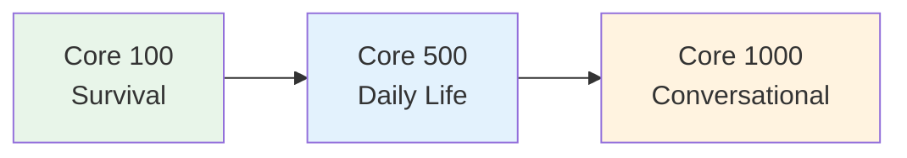

# Core 100 — Survival Japanese

> **The absolute essentials. With these 100 words, you can survive basic situations in Japan.**

## 🎯 Intuition

**The Core Idea:** These words are the first survival layer: greetings, question words, basic verbs, basic adjectives, and everyday nouns.
**Analogy:** Like learning 'hello', 'please', 'where', 'how much' before traveling — the absolute survival minimum.
**Why It Matters:** High-frequency function words and basic verbs give structure to almost every beginner sentence.

## How To Study This List

Do not memorize the page top to bottom. Study it in layers:

1. Greetings and request phrases.
2. Question words.
3. Core verbs in dictionary and ます form.
4. Nouns you can use in real requests.
5. Ko-so-a-do words: これ, それ, あれ, どれ; ここ, そこ, あそこ, どこ.

Make cards from short phrases, not isolated English prompts. Prefer これをください over "this one, please."

## ⚙️ Core Mechanics

## Greetings and Basics

| Japanese | Reading | English | Notes | Audio |
| ---------- | --------- | --------- | ------- | ----- |
| こんにちは | konnichiwa | Hello | Daytime greeting | ![[gap-120-phrase.mp3]] |
| おはようございます | ohayō gozaimasu | Good morning | Polite | ![[gap-121-phrase.mp3]] |
| こんばんは | konbanwa | Good evening |  | ![[gap-122-phrase.mp3]] |
| さようなら | sayōnara | Goodbye |  | ![[gap-123-phrase.mp3]] |
| ありがとうございます | arigatō gozaimasu | Thank you | Polite | ![[core100-016-arigatou.mp3]] |
| すみません | sumimasen | Excuse me / Sorry | Multi-purpose | ![[gap-124-phrase.mp3]] |
| おねがいします | onegai shimasu | Please | When requesting | ![[core100-015-onegaishimasu.mp3]] |
| はい | hai | Yes |  | ![[core100-013-hai.mp3]] |
| いいえ | iie | No |  | ![[core100-014-iie.mp3]] |
| だいじょうぶ | daijōbu | It's OK / Are you OK? | Very versatile | ![[core100-018-daijoubu.mp3]] |

## Pronouns and People

| Japanese | Reading | English | Audio |
| ---------- | --------- | --------- | ----- |
| 私 | watashi | I | ![[core100-001-watashi.mp3]] |
| あなた | anata | You (careful — rarely used) | ![[core100-002-anata.mp3]] |
| 彼 / 彼女 | kare / kanojo | He / She | ![[gap-125-.mp3]] |
| この人 | kono hito | This person | ![[gap-126-phrase.mp3]] |
| 友達 | tomodachi | Friend | ![[core100-045-tomodachi.mp3]] |
| 家族 | kazoku | Family | ![[core100-046-kazoku.mp3]] |
| 先生 | sensei | Teacher | ![[core100-047-sensei.mp3]] |
| 子供 | kodomo | Child/Children | ![[core100-049-kodomo.mp3]] |

## Question Words

| Japanese | Reading | English | Audio |
| ---------- | --------- | --------- | ----- |
| 何 / なに | nani / nani | What | ![[core100-008-nani.mp3]] |
| 誰 | dare | Who | ![[core100-009-dare.mp3]] |
| どこ | doko | Where | ![[core100-010-doko.mp3]] |
| いつ | itsu | When | ![[core100-011-itsu.mp3]] |
| なぜ | naze | Why | ![[core100-012-naze.mp3]] |
| どう | dō | How | ![[gap-127-phrase.mp3]] |
| いくら | ikura | How much (price) | ![[gap-128-phrase.mp3]] |
| どれ | dore | Which one | ![[gap-129-phrase.mp3]] |

## Essential Verbs

| Japanese | Reading | English | ます-form | Audio |
| ---------- | --------- | --------- | --------- | ----- |
| 食べる | taberu | Eat | 食べます | ![[core100-020-taberu.mp3]] |
| 飲む | nomu | Drink | 飲みます | ![[core100-021-nomu.mp3]] |
| 行く | iku | Go | 行きます | ![[core100-022-iku.mp3]] |
| 来る | kuru | Come | 来ます | ![[core100-023-kuru.mp3]] |
| 見る | miru | See/Look | 見ます | ![[core100-024-miru.mp3]] |
| 聞く | kiku | Hear/Ask | 聞きます | ![[core100-025-kiku.mp3]] |
| 話す | hanasu | Speak | 話します | ![[core100-026-hanasu.mp3]] |
| 読む | yomu | Read | 読みます | ![[core100-027-yomu.mp3]] |
| 書く | kaku | Write | 書きます | ![[core100-028-kaku.mp3]] |
| する | suru | Do | します | ![[core100-030-suru.mp3]] |
| ある | aru | Exist (things) | あります | ![[core100-031-aru.mp3]] |
| いる | iru | Exist (people) | います | ![[core100-032-iru.mp3]] |
| 買う | kau | Buy | 買います | ![[core100-029-kau.mp3]] |
| 分かる | wakaru | Understand | 分かります | ![[gap-130-phrase.mp3]] |

## Essential Adjectives

| Japanese | Reading | English | Audio |
| ---------- | --------- | --------- | ----- |
| いい/よい | ii/yoi | Good | ![[core100-040-yoi.mp3]] |
| 悪い | warui | Bad | ![[core100-041-warui.mp3]] |
| 大きい | ōkii | Big | ![[core100-036-ookii.mp3]] |
| 小さい | chiisai | Small | ![[core100-037-chiisai.mp3]] |
| 新しい | atarashii | New | ![[core100-038-atarashii.mp3]] |
| 古い | furui | Old | ![[core100-039-furui.mp3]] |
| 高い | takai | Expensive / Tall | ![[core100-042-takai.mp3]] |
| 安い | yasui | Cheap | ![[core100-043-yasui.mp3]] |
| おいしい | oishii | Delicious | ![[gap-131-phrase.mp3]] |
| 楽しい | tanoshii | Fun | ![[gap-132-phrase.mp3]] |

## Essential Nouns

| Japanese | Reading | English | Audio |
| ---------- | --------- | --------- | ----- |
| 水 | mizu | Water | ![[core100-050-mizu.mp3]] |
| お茶 | ocha | Tea | ![[core100-052-ocha.mp3]] |
| ごはん | gohan | Rice / Meal | ![[core100-051-gohan.mp3]] |
| お金 | okane | Money | ![[core100-053-okane.mp3]] |
| 電車 | densha | Train | ![[core100-064-densha.mp3]] |
| 駅 | eki | Station | ![[core100-061-eki.mp3]] |
| トイレ | toire | Toilet | ![[gap-133-phrase.mp3]] |
| 病院 | byōin | Hospital | ![[core100-063-byouin.mp3]] |
| 学校 | gakkō | School | ![[core100-062-gakkou.mp3]] |
| 会社 | kaisha | Company | ![[gap-134-phrase.mp3]] |
| 家 | ie/uchi | House/Home | ![[core100-060-ie.mp3]] |
| 今日 | kyō | Today | ![[core100-055-kyou.mp3]] |
| 明日 | ashita | Tomorrow | ![[core100-056-ashita.mp3]] |
| 昨日 | kinō | Yesterday | ![[core100-057-kinou.mp3]] |

## Survival Phrases

| Japanese | Meaning | Audio |
| ---------- | --------- | ----- |
| これをください | This one, please | ![[gap-135-phrase.mp3]] |
| いくらですか | How much is it? | ![[gap-136-phrase.mp3]] |
| トイレはどこですか | Where is the toilet? | ![[gap-137-phrase.mp3]] |
| 英語を話せますか | Do you speak English? | ![[gap-138-phrase.mp3]] |
| もう一度おねがいします | One more time, please | ![[gap-139-phrase.mp3]] |
| 分かりません | I don't understand | ![[gap-140-phrase.mp3]] |
| 助けて | Help! | ![[gap-141-phrase.mp3]] |

## First Sentence Combos

Use the vocabulary with [[N5 Grammar — Sentence Patterns]].

| Goal | Pattern | Example |
| --- | --- | --- |
| Identify yourself | XはYです | 私は学生です。 |
| Ask location | Xはどこですか | トイレはどこですか。 |
| Ask price | いくらですか | これはいくらですか。 |
| Request an item | Xをください | 水をください。 |
| Say you do not understand | Xが分かりません | 日本語が分かりません。 |

## Practice

### Recognition

1. What does だいじょうぶ mean? → (It's OK / Are you OK?)
2. How do you say "excuse me" to get someone's attention? → (すみません)
3. What's the difference between いる and ある? → (いる = living things; ある = non-living things)

### Production

1. **Translate:** "Where is the station?" → 駅はどこですか？
2. **Request:** "Water, please." → 水をください。
3. **Ask price:** "How much is this?" → これはいくらですか。

### Checkpoint

You are ready to move on when you can produce five practical sentences from this page without reading the answer column.

## 🔊 Audio
- Practice these with TTS — pronunciation of these basics must be perfect
- Link: [Forvo - Japanese](https://forvo.com/languages/ja/)

## References
- [[Sources Index]]
- [[chunk-jp-051]]
- [[chunk-jp-052]]
