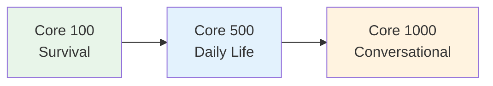

# Core 1000 — Conversational Fluency

> **At 1,000 words, you understand ~85% of spoken Japanese. This page covers the 500 words beyond Core 500 that unlock real conversation.**

## 🎯 Intuition

**The Core Idea:** The 100 most essential Japanese words — with these alone, you can survive basic situations in Japan.
**Analogy:** Like learning 'hello', 'please', 'where', 'how much' before traveling — the absolute survival minimum.
**Why It Matters:** These words cover ~50% of daily Japanese text and speech.

## ⚙️ Core Mechanics

## Abstract Concepts

| Japanese | Reading | English | Audio |
| ---------- | --------- | --------- | --- |
| 意見 | iken | Opinion | ![[gap-142-phrase.mp3]] |
| 理由 | riyū | Reason | ![[gap-143-phrase.mp3]] |
| 目的 | mokuteki | Purpose | ![[gap-144-phrase.mp3]] |
| 結果 | kekka | Result | ![[gap-145-phrase.mp3]] |
| 問題 | mondai | Problem | ![[gap-146-phrase.mp3]] |
| 答え | kotae | Answer | ![[gap-147-phrase.mp3]] |
| 質問 | shitsumon | Question | ![[gap-148-phrase.mp3]] |
| 説明 | setsumei | Explanation | ![[gap-149-phrase.mp3]] |
| 経験 | keiken | Experience | ![[gap-150-phrase.mp3]] |
| 関係 | kankei | Relationship | ![[gap-151-phrase.mp3]] |
| 影響 | eikyō | Influence | ![[gap-152-phrase.mp3]] |
| 条件 | jōken | Condition | ![[gap-153-phrase.mp3]] |
| 内容 | naiyō | Content | ![[gap-154-phrase.mp3]] |
| 情報 | jōhō | Information | ![[gap-155-phrase.mp3]] |
| 機会 | kikai | Opportunity | ![[gap-156-phrase.mp3]] |

## Emotions and States

| Japanese | Reading | English | Audio |
| ---------- | --------- | --------- | --- |
| 嬉しい | ureshii | Happy | ![[gap-157-phrase.mp3]] |
| 悲しい | kanashii | Sad | ![[gap-158-phrase.mp3]] |
| 怖い | kowai | Scary | ![[gap-159-phrase.mp3]] |
| 寂しい | sabishii | Lonely | ![[gap-160-phrase.mp3]] |
| 怒る | okoru | Get angry | ![[gap-161-phrase.mp3]] |
| 驚く | odoroku | Be surprised | ![[gap-162-phrase.mp3]] |
| 困る | komaru | Be troubled | ![[gap-163-phrase.mp3]] |
| 疑う | utagau | Doubt | ![[gap-164-phrase.mp3]] |
| 信じる | shinjiru | Believe | ![[gap-165-phrase.mp3]] |
| 期待する | kitai suru | Expect | ![[gap-166-phrase.mp3]] |
| 心配する | shinpai suru | Worry | ![[gap-167-phrase.mp3]] |
| 安心する | anshin suru | Feel relieved | ![[gap-168-phrase.mp3]] |

## Actions and Verbs (Intermediate)

| Japanese | Reading | English | Audio |
| ---------- | --------- | --------- | --- |
| 調べる | shiraberu | Investigate | ![[gap-169-phrase.mp3]] |
| 比べる | kuraberu | Compare | ![[gap-170-phrase.mp3]] |
| 選ぶ | erabu | Choose | ![[gap-171-phrase.mp3]] |
| 決める | kimeru | Decide | ![[gap-172-phrase.mp3]] |
| 変える | kaeru | Change (tr.) | ![[gap-173-phrase.mp3]] |
| 変わる | kawaru | Change (intr.) | ![[gap-174-phrase.mp3]] |
| 続ける | tsuzukeru | Continue | ![[gap-175-phrase.mp3]] |
| 止める | tomeru | Stop (tr.) | ![[gap-176-phrase.mp3]] |
| 始める | hajimeru | Begin (tr.) | ![[gap-177-phrase.mp3]] |
| 終わる | owaru | End (intr.) | ![[gap-178-phrase.mp3]] |
| 集める | atsumeru | Gather (tr.) | ![[gap-179-phrase.mp3]] |
| 集まる | atsumaru | Gather (intr.) | ![[gap-180-phrase.mp3]] |
| 準備する | junbi suru | Prepare | ![[gap-181-phrase.mp3]] |
| 参加する | sanka suru | Participate | ![[gap-182-phrase.mp3]] |
| 紹介する | shōkai suru | Introduce | ![[gap-183-phrase.mp3]] |

## Transitive/Intransitive Pairs
A critical pattern in Japanese — many verbs come in pairs:

| Transitive (someone does) | Intransitive (happens by itself) | Audio |
| --------------------------- | ---------------------------------- | --- |
| 開ける (akeru) open | 開く (aku) open | ![[gap-184-(akeru)-open.mp3]] |
| 閉める (shimeru) close | 閉まる (shimaru) close | ![[gap-185-(shimeru)-close.mp3]] |
| 入れる (ireru) put in | 入る (hairu) enter | ![[gap-186-(ireru)-put-in.mp3]] |
| 出す (dasu) put out | 出る (deru) go out | ![[gap-187-(dasu)-put-out.mp3]] |
| 消す (kesu) turn off | 消える (kieru) go out | ![[gap-188-(kesu)-turn-off.mp3]] |
| 上げる (ageru) raise | 上がる (agaru) rise | ![[gap-189-(ageru)-raise.mp3]] |
| 下げる (sageru) lower | 下がる (sagaru) go down | ![[gap-190-(sageru)-lower.mp3]] |
| 壊す (kowasu) break | 壊れる (kowareru) be broken | ![[gap-191-(kowasu)-break.mp3]] |
| 汚す (yogosu) make dirty | 汚れる (yogoreru) get dirty | ![[gap-192-(yogosu)-make-dirty.mp3]] |

## Frequency Insight
With 1,000 words you cover:
- ~85% of spoken Japanese
- ~75% of written Japanese (formal writing uses more kango)
- Nearly all daily conversation topics

The next 1,000 words (1,000-2,000) only add ~10% more coverage — diminishing returns begin, but the words become more interesting and nuanced.

## Study Strategy
- At this level, start learning from context (native content) rather than pure lists
- Read NHK Easy News — most articles use top-1,000 vocabulary
- Keep Anki going but focus on words you encounter naturally

## 🔬 Deep Dive

### Nuances and Exceptions
- Many words have subtle differences that dictionaries don't capture — context and collocations matter.
- Some words change meaning with different kanji or different pitch accent.

### Formal vs Informal Usage
- Most patterns have both polite (です/ます) and casual (dictionary form) variants.
- Choose formality based on your relationship with the listener and the situation.

### Common Mistakes by English Speakers
- False friends — words borrowed from English that changed meaning (マンション ≠ mansion).
- Using the wrong counter or no counter when counting objects.
- Directly translating English idioms instead of learning Japanese equivalents.

## 🏋️ Practice

### Warm-Up — Recognition
1. What does だいじょうぶ mean? → (It's OK / Are you OK?)
2. How do you say "excuse me" to get someone's attention? → (すみません)
3. What's the difference between いる and ある? → (いる = living things; ある = non-living things)

### Core Exercises — Production
1. **Translate:** "Where is the station?" → 駅はどこですか？
2. **Fill in:** ＿を＿ください。(I'll have water, please) → (水 / 一つ)

### Challenge — Real World
You're lost in Tokyo. Using only vocabulary from this list, ask a stranger for directions to the nearest train station, thank them, and say goodbye.

## References
- [[Sources Index]]
