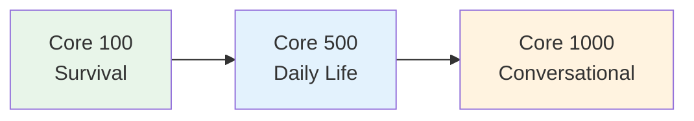

# Core 500 — Daily Life Vocabulary

> **Building from the Core 100 to functional daily communication. At 500 words, you can handle most routine situations.**

## 🎯 Intuition

**The Core Idea:** 500 words for daily life — enough to handle common situations independently.
**Analogy:** Like going from tourist phrasebook to actually living in a country — these words cover routine life.
**Why It Matters:** With 500 words, you can read simple texts and handle basic conversations.

## ⚙️ Core Mechanics

## Daily Routine

| Japanese | Reading | English | Audio |
| ---------- | --------- | --------- | ----- |
| 起きる | okiru | Wake up | ![[gap-193-phrase.mp3]] |
| 寝る | neru | Sleep | ![[gap-194-phrase.mp3]] |
| 洗う | arau | Wash | ![[gap-195-phrase.mp3]] |
| 着る | kiru | Wear | ![[gap-196-phrase.mp3]] |
| 脱ぐ | nugu | Take off (clothes) | ![[gap-197-phrase.mp3]] |
| 出かける | dekakeru | Go out | ![[gap-198-phrase.mp3]] |
| 帰る | kaeru | Return home | ![[core500-065-kaeru.mp3]] |
| 休む | yasumu | Rest | ![[gap-199-phrase.mp3]] |
| 働く | hataraku | Work | ![[gap-200-phrase.mp3]] |
| 遊ぶ | asobu | Play / hang out | ![[gap-201-phrase.mp3]] |
| 歩く | aruku | Walk | ![[core500-047-aruku.mp3]] |
| 走る | hashiru | Run | ![[core500-046-hashiru.mp3]] |
| 座る | suwaru | Sit | ![[core500-048-suwaru.mp3]] |
| 立つ | tatsu | Stand | ![[core500-049-tatsu.mp3]] |
| 待つ | matsu | Wait | ![[gap-202-phrase.mp3]] |

## Food and Drink

| Japanese | Reading | English | Audio |
| ---------- | --------- | --------- | ----- |
| 肉 | niku | Meat | ![[gap-203-phrase.mp3]] |
| 魚 | sakana | Fish | ![[gap-204-phrase.mp3]] |
| 野菜 | yasai | Vegetables | ![[gap-205-phrase.mp3]] |
| 果物 | kudamono | Fruit | ![[gap-206-phrase.mp3]] |
| パン | pan | Bread | ![[gap-207-phrase.mp3]] |
| 卵 | tamago | Egg | ![[gap-208-phrase.mp3]] |
| 牛乳 | gyūnyū | Milk | ![[gap-209-phrase.mp3]] |
| 砂糖 | satō | Sugar | ![[gap-210-phrase.mp3]] |
| 塩 | shio | Salt | ![[gap-211-phrase.mp3]] |
| 醤油 | shōyu | Soy sauce | ![[gap-212-phrase.mp3]] |
| 朝ごはん | asagohan | Breakfast | ![[gap-213-phrase.mp3]] |
| 昼ごはん | hirugohan | Lunch | ![[gap-214-phrase.mp3]] |
| 晩ごはん | bangohan | Dinner | ![[gap-215-phrase.mp3]] |
| お茶 | ocha | Green tea | ![[gap-216-phrase.mp3]] |
| コーヒー | kōhī | Coffee | ![[gap-217-phrase.mp3]] |
| ビール | bīru | Beer | ![[gap-218-phrase.mp3]] |

## Places

| Japanese | Reading | English | Audio |
| ---------- | --------- | --------- | ----- |
| コンビニ | konbini | Convenience store | ![[gap-219-phrase.mp3]] |
| スーパー | sūpā | Supermarket | ![[gap-220-phrase.mp3]] |
| デパート | depāto | Department store | ![[gap-221-phrase.mp3]] |
| 郵便局 | yūbinkyoku | Post office | ![[gap-222-phrase.mp3]] |
| 銀行 | ginkō | Bank | ![[gap-223-phrase.mp3]] |
| 図書館 | toshokan | Library | ![[gap-224-phrase.mp3]] |
| 公園 | kōen | Park | ![[gap-225-phrase.mp3]] |
| 空港 | kūkō | Airport | ![[gap-226-phrase.mp3]] |
| ホテル | hoteru | Hotel | ![[gap-227-phrase.mp3]] |
| レストラン | resutoran | Restaurant | ![[gap-228-phrase.mp3]] |
| 救急車 | kyūkyūsha | Ambulance | ![[gap-229-phrase.mp3]] |
| 交番 | kōban | Police box | ![[gap-230-phrase.mp3]] |

## Transportation

| Japanese | Reading | English | Audio |
| ---------- | --------- | --------- | ----- |
| 電車 | densha | Train | ![[gap-231-phrase.mp3]] |
| バス | basu | Bus | ![[gap-232-phrase.mp3]] |
| タクシー | takushī | Taxi | ![[gap-233-phrase.mp3]] |
| 自転車 | jitensha | Bicycle | ![[gap-234-phrase.mp3]] |
| 車 | kuruma | Car | ![[gap-235-phrase.mp3]] |
| 飛行機 | hikōki | Airplane | ![[gap-236-phrase.mp3]] |
| 切符 | kippu | Ticket | ![[gap-237-phrase.mp3]] |
| 乗り換え | norikae | Transfer | ![[gap-238-phrase.mp3]] |
| 出口 | deguchi | Exit | ![[gap-239-phrase.mp3]] |
| 入口 | iriguchi | Entrance | ![[gap-240-phrase.mp3]] |

## Body

| Japanese | Reading | English | Audio |
| ---------- | --------- | --------- | ----- |
| 頭 | atama | Head | ![[gap-241-phrase.mp3]] |
| 目 | me | Eye | ![[gap-242-phrase.mp3]] |
| 耳 | mimi | Ear | ![[gap-243-phrase.mp3]] |
| 口 | kuchi | Mouth | ![[gap-244-phrase.mp3]] |
| 鼻 | hana | Nose | ![[gap-245-phrase.mp3]] |
| 手 | te | Hand | ![[gap-246-phrase.mp3]] |
| 足 | ashi | Foot/Leg | ![[gap-247-phrase.mp3]] |
| お腹 | onaka | Stomach | ![[gap-248-phrase.mp3]] |
| 背中 | senaka | Back | ![[gap-249-phrase.mp3]] |

## Weather

| Japanese | Reading | English | Audio |
| ---------- | --------- | --------- | ----- |
| 天気 | tenki | Weather | ![[core500-005-tenki.mp3]] |
| 晴れ | hare | Sunny | ![[gap-250-phrase.mp3]] |
| 曇り | kumori | Cloudy | ![[gap-251-phrase.mp3]] |
| 雨 | ame | Rain | ![[gap-252-phrase.mp3]] |
| 雪 | yuki | Snow | ![[gap-253-phrase.mp3]] |
| 風 | kaze | Wind | ![[gap-254-phrase.mp3]] |
| 暑い | atsui | Hot | ![[gap-255-phrase.mp3]] |
| 寒い | samui | Cold | ![[gap-256-phrase.mp3]] |
| 涼しい | suzushii | Cool | ![[gap-257-phrase.mp3]] |
| 暖かい | atatakai | Warm | ![[gap-258-phrase.mp3]] |

## Study Strategy
- Learn 10-15 new words per day
- Always learn in context (example sentences, not just word lists)
- Use Anki Core 2K deck for SRS
- Group related words together

## Additional Vocabulary with Audio

Audio clips available in `_audio` that do not yet have matching vocabulary rows on this page:

### Nouns

| Romaji | Audio |
| ------ | ----- |
| mainichi | ![[core500-001-mainichi.mp3]] |
| shigoto | ![[core500-002-shigoto.mp3]] |
| denwa | ![[core500-003-denwa.mp3]] |
| shashin | ![[core500-004-shashin.mp3]] |
| genki | ![[core500-006-genki.mp3]] |
| mondai | ![[core500-007-mondai.mp3]] |
| shitsumon | ![[core500-008-shitsumon.mp3]] |
| kotae | ![[core500-009-kotae.mp3]] |
| imi | ![[core500-010-imi.mp3]] |
| renshuu | ![[core500-011-renshuu.mp3]] |
| benkyou | ![[core500-012-benkyou.mp3]] |
| sanpo | ![[core500-013-sanpo.mp3]] |
| ryokou | ![[core500-014-ryokou.mp3]] |
| ryouri | ![[core500-015-ryouri.mp3]] |
| ongaku | ![[core500-016-ongaku.mp3]] |
| eiga | ![[core500-017-eiga.mp3]] |
| shinbun | ![[core500-018-shinbun.mp3]] |
| zasshi | ![[core500-019-zasshi.mp3]] |
| tegami | ![[core500-020-tegami.mp3]] |
| nimotsu | ![[core500-021-nimotsu.mp3]] |
| yakusoku | ![[core500-022-yakusoku.mp3]] |
| junbi | ![[core500-023-junbi.mp3]] |
| keiken | ![[core500-024-keiken.mp3]] |
| shumi | ![[core500-025-shumi.mp3]] |
| shourai | ![[core500-026-shourai.mp3]] |
| shakai | ![[core500-027-shakai.mp3]] |
| bunka | ![[core500-028-bunka.mp3]] |
| rekishi | ![[core500-029-rekishi.mp3]] |
| shizen | ![[core500-030-shizen.mp3]] |

### Safety / Quality

| Romaji | Audio |
| ------ | ----- |
| kiken | ![[core500-031-kiken.mp3]] |
| anzen | ![[core500-032-anzen.mp3]] |
| hitsuyou | ![[core500-033-hitsuyou.mp3]] |
| tokubetsu | ![[core500-034-tokubetsu.mp3]] |
| futsuu | ![[core500-035-futsuu.mp3]] |
| kantan | ![[core500-036-kantan.mp3]] |

### Adjectives

| Romaji | Audio |
| ------ | ----- |
| muzukashii | ![[core500-037-muzukashii.mp3]] |
| isogashii | ![[core500-038-isogashii.mp3]] |
| ureshii | ![[core500-039-ureshii.mp3]] |
| kanashii | ![[core500-040-kanashii.mp3]] |
| tanoshii | ![[core500-041-tanoshii.mp3]] |
| utsukushii | ![[core500-042-utsukushii.mp3]] |
| yasashii | ![[core500-043-yasashii.mp3]] |
| kibishii | ![[core500-044-kibishii.mp3]] |
| mezurashii | ![[core500-045-mezurashii.mp3]] |

### Verbs

| Romaji | Audio |
| ------ | ----- |
| akeru | ![[core500-050-akeru.mp3]] |
| shimeru | ![[core500-051-shimeru.mp3]] |
| hajimaru | ![[core500-052-hajimaru.mp3]] |
| owaru | ![[core500-053-owaru.mp3]] |
| todokeru | ![[core500-054-todokeru.mp3]] |
| todoku | ![[core500-055-todoku.mp3]] |
| okuru | ![[core500-056-okuru.mp3]] |
| ukeru | ![[core500-057-ukeru.mp3]] |
| motsu | ![[core500-058-motsu.mp3]] |
| tsukau | ![[core500-059-tsukau.mp3]] |
| tsukuru | ![[core500-060-tsukuru.mp3]] |
| shiru | ![[core500-061-shiru.mp3]] |
| kangaeru | ![[core500-062-kangaeru.mp3]] |
| kimeru | ![[core500-063-kimeru.mp3]] |
| kawaru | ![[core500-064-kawaru.mp3]] |

## 🔬 Deep Dive

### Nuances and Exceptions
- Many words have subtle differences that dictionaries don't capture — context and collocations matter.
- Some words change meaning with different kanji or different pitch accent.

### Formal vs Informal Usage
- Most patterns have both polite (です/ます) and casual (dictionary form) variants.
- Choose formality based on your relationship with the listener and the situation.

### Common Mistakes by English Speakers
- False friends — words borrowed from English that changed meaning (マンション ≠ mansion).
- Using the wrong counter or no counter when counting objects.
- Directly translating English idioms instead of learning Japanese equivalents.

## 🏋️ Practice

### Warm-Up — Recognition
1. What does だいじょうぶ mean? → (It's OK / Are you OK?)
2. How do you say "excuse me" to get someone's attention? → (すみません)
3. What's the difference between いる and ある? → (いる = living things; ある = non-living things)

### Core Exercises — Production
1. **Translate:** "Where is the station?" → 駅はどこですか？
2. **Fill in:** ＿を＿ください。(I'll have water, please) → (水 / 一つ)

### Challenge — Real World
You're lost in Tokyo. Using only vocabulary from this list, ask a stranger for directions to the nearest train station, thank them, and say goodbye.

## 🔊 Audio
- Use Forvo for pronunciation of each word
- Practice reading the tables aloud

## References
- [[Japanese/Sources/Sources Index|Sources Index]]
