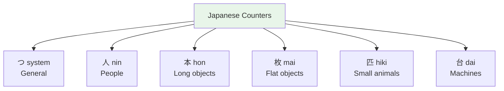

# Counters — The Japanese Counting System

> **Japanese doesn't just have numbers — it has counter words (助数詞 josushi) that change based on WHAT you're counting. Think of it like English "two sheets of paper" vs "two head of cattle."**

## 🎯 Intuition

**The Core Idea:** Japanese uses specific counter words when counting things — different counters for different object shapes.
**Analogy:** Like English 'a sheet of paper' or 'a head of cattle' — but Japanese requires counters for EVERYTHING.
**Why It Matters:** You'll use counters every time you count, order food, or talk about quantities.

## ⚙️ Core Mechanics

Japanese doesn't just have numbers — it has counter words (助数詞 josushi) that change based on WHAT you're counting. Think of it like English "two sheets of paper" vs "two head of cattle."
![[nontbl-044-josuushi.mp3]]

## Universal Counter: つ (tsu)
Works for almost anything (but sounds childish for large numbers):

| Number | Japanese | Reading | Audio |
| -------- | ---------- | --------- | ----- |
| 1 | 一つ | hitotsu | ![[counter-001-hitotsu.mp3]] |
| 2 | 二つ | futatsu | ![[counter-002-futatsu.mp3]] |
| 3 | 三つ | mittsu | ![[counter-003-mittsu.mp3]] |
| 4 | 四つ | yottsu | ![[counter-004-yottsu.mp3]] |
| 5 | 五つ | itsutsu | ![[counter-005-itsutsu.mp3]] |
| 6 | 六つ | muttsu | ![[counter-006-muttsu.mp3]] |
| 7 | 七つ | nanatsu | ![[counter-007-nanatsu.mp3]] |
| 8 | 八つ | yattsu | ![[counter-008-yattsu.mp3]] |
| 9 | 九つ | kokonotsu | ![[counter-009-kokonotsu.mp3]] |
| 10 | 十 | tō | ![[gap-087-phrase.mp3]] |

## Essential Counters (must know)

### 人 (nin) — People

| # | Japanese | Reading | Note | Audio |
| --- | ---------- | --------- | ------ | ----- |
| 1 | 一人 | **hitori** | Irregular | ![[counter-010-hitori.mp3]] |
| 2 | 二人 | **futari** | Irregular | ![[counter-011-futari.mp3]] |
| 3 | 三人 | sannin | Regular from here | ![[counter-012-sannin.mp3]] |
| 4 | 四人 | **yonin** | Not shinin | ![[gap-088-phrase.mp3]] |

### 本 (hon) — Long/cylindrical objects
Bottles, pens, trees, roads, movies, phone calls:

| # | Reading | # | Reading | Audio |
| --- | --------- | --- | --------- | ----- |
| 1 | ip**pon** | 6 | rop**pon** | ![[counter-016-roppon.mp3]] ![[counter-013-ippon.mp3]] |
| 2 | nihon | 7 | nanahon | ![[counter-014-nihon.mp3]] |
| 3 | san**bon** | 8 | hap**pon** | ![[counter-017-happon.mp3]] ![[counter-015-sanbon.mp3]] |
| 4 | yonhon | 9 | kyūhon |  |
| 5 | gohon | 10 | jup**pon** | ![[counter-018-juppon.mp3]] |

### 枚 (mai) — Flat objects
Paper, plates, shirts, tickets, photos: No sound changes! Just number + mai.

### 個 (ko) — Small objects
Apples, eggs, balls, general small things:

| # | Reading | # | Reading | Audio |
| --- | --------- | --- | --------- | ----- |
| 1 | ik**ko** | 6 | rok**ko** | ![[counter-026-ikko.mp3]] |
| 3 | san**ko** | 8 | hak**ko** |  |
| 10 | juk**ko** |  |  |  |

### 杯 (hai) — Cups/glasses/bowls of liquid

| # | Reading | # | Reading | Audio |
| --- | --------- | --- | --------- | ----- |
| 1 | ip**pai** | 3 | san**bai** | ![[counter-020-ippai.mp3]] ![[counter-021-sanbai.mp3]] |
| 6 | rop**pai** | 8 | hap**pai** |  |
| 10 | jup**pai** |  |  |  |

## Other Useful Counters

| Counter | For | Example | Audio |
| --------- | ----- | --------- | ----- |
| 台 (dai) | Machines, vehicles | 車一台 (one car) | ![[counter-025-ichidai.mp3]] |
| 匹 (hiki) | Small animals | 猫三匹 (three cats) | ![[counter-024-sanbiki.mp3]] |
| 羽 (wa) | Birds, rabbits | 鳥二羽 (two birds) | ![[gap-089-(wa).mp3]] |
| 冊 (satsu) | Books, volumes | 本五冊 (five books) | ![[counter-022-issatsu.mp3]] |
| 枚 (mai) | Flat things | 写真三枚 (three photos) | ![[counter-019-ichimai.mp3]] |
| 階 (kai) | Floors | 三階 (3rd floor) | ![[gap-090-(kai).mp3]] |
| 回 (kai) | Times | 二回 (twice) | ![[gap-091-(kai).mp3]] |
| 番 (ban) | Order/number | 一番 (number one, first) | ![[gap-092-(ban).mp3]] |
| 足 (soku) | Pairs of footwear | 靴一足 (one pair of shoes) | ![[gap-093-(soku).mp3]] |
| 着 (chaku) | Clothes | 服一着 (one outfit) | ![[gap-094-(chaku).mp3]] |

## Sound Change Pattern
Counters starting with h/f change predictably:
- After 1, 6, 8, 10: h → pp (ippai, roppai, happai, juppai)
- After 3: h → b (sanbai)

## Usage Pattern
Number + Counter comes AFTER the noun or with の:
- ビールを二杯ください。 (Two beers, please.)
![[nontbl-016-biiru-nihai.mp3]]
- 三人の学生 (three students)
![[nontbl-017-sannin-no-gakusei.mp3]]

## 🔬 Deep Dive

### Nuances and Exceptions
- Many words have subtle differences that dictionaries don't capture — context and collocations matter.
- Some words change meaning with different kanji or different pitch accent.

### Formal vs Informal Usage
- Most patterns have both polite (です/ます) and casual (dictionary form) variants.
- Choose formality based on your relationship with the listener and the situation.

### Common Mistakes by English Speakers
- False friends — words borrowed from English that changed meaning (マンション ≠ mansion).
- Using the wrong counter or no counter when counting objects.
- Directly translating English idioms instead of learning Japanese equivalents.

## 🏋️ Practice

### Warm-Up — Recognition
1. What does だいじょうぶ mean? → (It's OK / Are you OK?)
2. How do you say "excuse me" to get someone's attention? → (すみません)
3. What's the difference between いる and ある? → (いる = living things; ある = non-living things)

### Core Exercises — Production
1. **Translate:** "Where is the station?" → 駅はどこですか？
2. **Fill in:** ＿を＿ください。(I'll have water, please) → (水 / 一つ)

### Challenge — Real World
You're lost in Tokyo. Using only vocabulary from this list, ask a stranger for directions to the nearest train station, thank them, and say goodbye.

## References
- [[Japanese/Sources/Sources Index|Sources Index]]
