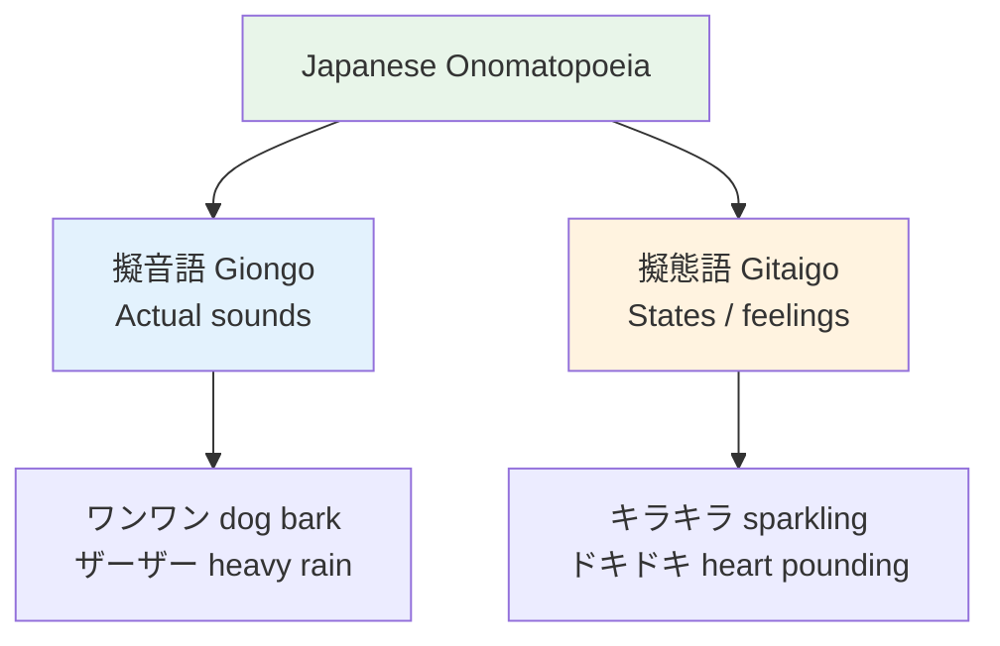

# Onomatopoeia — Sound and State Words

> **Japanese has one of the richest onomatopoeia systems in the world. These words are used CONSTANTLY in daily speech, manga, and writing.**

## 🎯 Intuition

**The Core Idea:** Japanese has an incredibly rich system of sound and state words used constantly in daily speech.
**Analogy:** Imagine if English had dedicated words for 'the sound of gentle rain' or 'the feeling of being refreshed'.
**Why It Matters:** Onomatopoeia makes your Japanese vivid and natural — textbooks often skip them, but natives use them constantly.

## ⚙️ Core Mechanics

## Four Types

### 1. Giongo (擬音語) — Actual sounds

| Japanese | Sound | English equivalent | Audio |
|----------|-------|-------------------|-------|
| ワンワン | wanwan | Dog barking (woof) | ![[gap-095-phrase.mp3]] |
| ニャーニャー | nyānyā | Cat meowing (meow) | ![[gap-096-phrase.mp3]] |
| ドンドン | dondon | Banging, knocking | ![[gap-097-phrase.mp3]] |
| バタン | batan | Door slamming | ![[gap-098-phrase.mp3]] |
| ザーザー | zāzā | Heavy rain | ![[onomat-009-zaazaa.mp3]] |
| ゴロゴロ | gorogoro | Thunder, rolling | ![[gap-099-phrase.mp3]] |
| ピンポン | pinpon | Doorbell | ![[gap-100-phrase.mp3]] |
| ガチャン | gachan | Crash, clatter | ![[gap-101-phrase.mp3]] |

### 2. Gitaigo (擬態語) — States and conditions

| Japanese | Reading | Meaning | Audio |
|----------|---------|---------|-------|
| ピカピカ | pikapika | Shiny, sparkling | ![[onomat-005-pikapika.mp3]] |
| フワフワ | fuwafuwa | Fluffy, soft | ![[onomat-004-fuwafuwa.mp3]] |
| ヌルヌル | nurunuru | Slimy, slippery | ![[gap-102-phrase.mp3]] |
| サラサラ | sarasara | Smooth, flowing | ![[gap-103-phrase.mp3]] |
| ベタベタ | betabeta | Sticky | ![[gap-104-phrase.mp3]] |
| ツルツル | tsurutsuru | Smooth, slippery | ![[gap-105-phrase.mp3]] |
| ボロボロ | boroboro | Worn out, tattered | ![[gap-106-phrase.mp3]] |
| ピッタリ | pittari | Perfect fit | ![[gap-107-phrase.mp3]] |

### 3. Gijōgo (擬情語) — Emotions and feelings

| Japanese | Reading | Meaning | Audio |
|----------|---------|---------|-------|
| ワクワク | wakuwaku | Excited, thrilled | ![[onomat-002-wakuwaku.mp3]] |
| ドキドキ | dokidoki | Heart pounding (nervous/excited) | ![[onomat-001-dokidoki.mp3]] |
| イライラ | iraira | Irritated, annoyed | ![[onomat-006-iraira.mp3]] |
| ソワソワ | sowasowa | Restless, fidgety | ![[gap-108-phrase.mp3]] |
| ニコニコ | nikoniko | Smiling happily | ![[onomat-007-nikoniko.mp3]] |
| ビクビク | bikubiku | Scared, nervous | ![[gap-109-phrase.mp3]] |
| ホッと | hotto | Relieved | ![[gap-110-phrase.mp3]] |
| ウキウキ | ukiuki | Cheerful, buoyant | ![[gap-111-phrase.mp3]] |

### 4. Giyōgo (擬容語) — Manner of action

| Japanese | Reading | Meaning | Audio |
| ---------- | --------- | --------- | --- |
| ノロノロ | noronoro | Sluggishly, slowly | ![[gap-112-phrase.mp3]] |
| テキパキ | tekipaki | Efficiently, briskly | ![[gap-113-phrase.mp3]] |
| ブラブラ | burabura | Aimlessly wandering | ![[gap-114-phrase.mp3]] |
| ペラペラ | perapera | Fluently (speaking) | ![[gap-115-phrase.mp3]] |
| ボンヤリ | bonyari | Absent-mindedly | ![[gap-116-phrase.mp3]] |
| コツコツ | kotsukotsu | Steadily, diligently | ![[gap-117-phrase.mp3]] |
| バタバタ | batabata | Rushing around | ![[gap-118-phrase.mp3]] |
| ダラダラ | daradara | Lazily | ![[gap-119-phrase.mp3]] |

## Grammar Patterns
1. **と + verb:** 雨がザーザーと降っている (Rain is pouring heavily)
![[nontbl-018-ame-ga-zaazaa.mp3]]
2. **な + noun:** ピカピカな星 (sparkling stars)
![[nontbl-019-pikapika-na-hoshi.mp3]]
3. **に + verb:** ニコニコに笑う (smile happily)
![[nontbl-020-nikoniko-warau.mp3]]
4. **する:** ドキドキする (to feel heart-pounding)
![[nontbl-021-dokidoki-suru.mp3]]

## Why They Matter
- Manga is FULL of onomatopoeia — you can't read manga without them
- Native speakers use these constantly in daily conversation
- They add vividness that regular adjectives/adverbs can't match
- Many have no direct English translation

## �� Audio
- **キラキラ** (kirakira) — sparkling ![[onomat-003-kirakira.mp3]]
- **ガタガタ** (gatagata) — rattling, clattering ![[onomat-008-gatagata.mp3]]
- **のんびり** (nonbiri) — leisurely ![[onomat-010-nonbiri.mp3]]
- **ゆっくり** (yukkuri) — slowly ![[onomat-011-yukkuri.mp3]]

> ドキッとした。 (dokitto shita)
> ![[onomat-012-dokitto-shita.mp3]]

- These words are inherently sound-based — hearing them is essential
- Pay attention to the doubled patterns and how they feel rhythmic

## 🔬 Deep Dive

### Nuances and Exceptions
- Many words have subtle differences that dictionaries don't capture — context and collocations matter.
- Some words change meaning with different kanji or different pitch accent.

### Formal vs Informal Usage
- Most patterns have both polite (です/ます) and casual (dictionary form) variants.
- Choose formality based on your relationship with the listener and the situation.

### Common Mistakes by English Speakers
- False friends — words borrowed from English that changed meaning (マンション ≠ mansion).
- Using the wrong counter or no counter when counting objects.
- Directly translating English idioms instead of learning Japanese equivalents.

## 🏋️ Practice

### Warm-Up — Recognition
1. What does だいじょうぶ mean? → (It's OK / Are you OK?)
2. How do you say "excuse me" to get someone's attention? → (すみません)
3. What's the difference between いる and ある? → (いる = living things; ある = non-living things)

### Core Exercises — Production
1. **Translate:** "Where is the station?" → 駅はどこですか？
2. **Fill in:** ＿を＿ください。(I'll have water, please) → (水 / 一つ)

### Challenge — Real World
You're lost in Tokyo. Using only vocabulary from this list, ask a stranger for directions to the nearest train station, thank them, and say goodbye.

## References
- [[Sources Index]]
