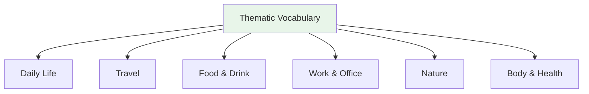

# Thematic Vocabulary — Body and Health

## 🎯 Intuition

**The Core Idea:** Understanding Thematic Vocabulary — Body and Health is fundamental to Japanese language mastery.
**Analogy:** Each concept in Japanese has parallels in English, but with its own unique twist.
**Why It Matters:** You'll encounter this in everyday Japanese reading, writing, and conversation.

## ⚙️ Core Mechanics

## Body Parts (体の部分)

| Japanese | Reading | English | Audio |
| ---------- | --------- | --------- | ----- |
| 頭 | atama | Head | ![[body-001-atama.mp3]] |
| 顔 | kao | Face | ![[body-002-kao.mp3]] |
| 目 | me | Eye | ![[body-003-me.mp3]] |
| 耳 | mimi | Ear | ![[body-004-mimi.mp3]] |
| 口 | kuchi | Mouth | ![[body-005-kuchi.mp3]] |
| 鼻 | hana | Nose | ![[body-006-hana.mp3]] |
| 手 | te | Hand | ![[body-007-te.mp3]] |
| 足 | ashi | Foot/Leg | ![[body-008-ashi.mp3]] |
| お腹 | onaka | Stomach | ![[body-009-onaka.mp3]] |
| 背中 | senaka | Back | ![[body-010-senaka.mp3]] |

## At the Doctor

| Japanese | English | Audio |
| ---------- | --------- | ----- |
| 頭が痛いです | I have a headache | ![[body-011-atama-ga-itai-desu.mp3]] |
| 熱があります | I have a fever | ![[body-012-netsu-ga-arimasu.mp3]] |
| 風邪をひきました | I caught a cold | ![[body-013-kaze-wo-hikimashita.mp3]] |
| 薬をください | Medicine, please | ![[body-014-kusuri-wo-kudasai.mp3]] |
| アレルギーがあります | I have allergies | ![[gap-259-phrase.mp3]] |
| 病院 (byōin) | Hospital | ![[body-015-byouin2.mp3]] |
| 薬局 (yakkyoku) | Pharmacy | ![[body-016-yakkyoku.mp3]] |

## Common Symptoms

| Japanese | Reading | English | Audio |
| ---------- | --------- | --------- | ----- |
| 咳 | seki | Cough | ![[gap-260-phrase.mp3]] |
| 鼻水 | hanamizu | Runny nose | ![[gap-261-phrase.mp3]] |
| めまい | memai | Dizziness | ![[gap-262-phrase.mp3]] |
| 吐き気 | hakike | Nausea | ![[gap-263-phrase.mp3]] |

## 🔬 Deep Dive

### Nuances and Exceptions
- Many words have subtle differences that dictionaries don't capture — context and collocations matter.
- Some words change meaning with different kanji or different pitch accent.

### Formal vs Informal Usage
- Most patterns have both polite (です/ます) and casual (dictionary form) variants.
- Choose formality based on your relationship with the listener and the situation.

### Common Mistakes by English Speakers
- False friends — words borrowed from English that changed meaning (マンション ≠ mansion).
- Using the wrong counter or no counter when counting objects.
- Directly translating English idioms instead of learning Japanese equivalents.

## 🏋️ Practice

### Warm-Up — Recognition
1. What does だいじょうぶ mean? → (It's OK / Are you OK?)
2. How do you say "excuse me" to get someone's attention? → (すみません)
3. What's the difference between いる and ある? → (いる = living things; ある = non-living things)

### Core Exercises — Production
1. **Translate:** "Where is the station?" → 駅はどこですか？
2. **Fill in:** ＿を＿ください。(I'll have water, please) → (水 / 一つ)

### Challenge — Real World
You're lost in Tokyo. Using only vocabulary from this list, ask a stranger for directions to the nearest train station, thank them, and say goodbye.

## References
- [[Sources Index]]
