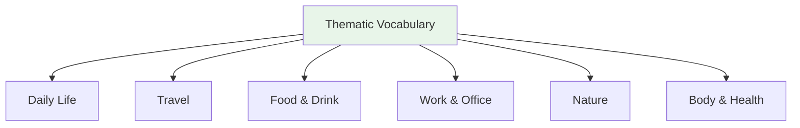

# Thematic Vocabulary — Food and Drink

## 🎯 Intuition

**The Core Idea:** Understanding Thematic Vocabulary — Food and Drink is fundamental to Japanese language mastery.
**Analogy:** Each concept in Japanese has parallels in English, but with its own unique twist.
**Why It Matters:** You'll encounter this in everyday Japanese reading, writing, and conversation.

## ⚙️ Core Mechanics

## Meals (食事)

| Japanese | Reading | English | Audio |
| ---------- | --------- | --------- | ----- |
| 朝ごはん | asagohan | Breakfast | ![[food-001-asagohan.mp3]] |
| 昼ごはん | hirugohan | Lunch | ![[food-002-hirugohan.mp3]] |
| 晩ごはん | bangohan | Dinner | ![[food-003-bangohan.mp3]] |
| おやつ | oyatsu | Snack | ![[gap-264-phrase.mp3]] |

## Common Foods

| Japanese | Reading | English | Audio |
| ---------- | --------- | --------- | ----- |
| ご飯 | gohan | Rice (cooked) | ![[gap-265-phrase.mp3]] |
| パン | pan | Bread | ![[food-008-pan.mp3]] |
| 肉 | niku | Meat | ![[food-004-niku.mp3]] |
| 魚 | sakana | Fish | ![[food-005-sakana.mp3]] |
| 野菜 | yasai | Vegetables | ![[food-006-yasai.mp3]] |
| 卵 | tamago | Egg | ![[food-007-tamago.mp3]] |
| 豆腐 | tōfu | Tofu | ![[food-009-toufu.mp3]] |

## Drinks

| Japanese | Reading | English | Audio |
| ---------- | --------- | --------- | ----- |
| 水 | mizu | Water | ![[gap-266-phrase.mp3]] |
| お茶 | ocha | Tea | ![[gap-267-phrase.mp3]] |
| コーヒー | kōhī | Coffee | ![[food-011-koohii.mp3]] |
| ビール | bīru | Beer | ![[food-012-biiru.mp3]] |
| 牛乳 | gyūnyū | Milk | ![[food-010-gyuunyuu.mp3]] |
| ジュース | jūsu | Juice | ![[food-013-juusu.mp3]] |

## Tastes (味)

| Japanese | Reading | English | Audio |
| ---------- | --------- | --------- | ----- |
| 甘い | amai | Sweet | ![[food-014-amai.mp3]] |
| 辛い | karai | Spicy | ![[food-015-karai.mp3]] |
| しょっぱい | shoppai | Salty | ![[food-016-shoppai.mp3]] |
| 苦い | nigai | Bitter | ![[food-017-nigai.mp3]] |
| 酸っぱい | suppai | Sour | ![[food-018-suppai.mp3]] |
| おいしい | oishii | Delicious | ![[food-019-oishii.mp3]] |
| まずい | mazui | Bad-tasting | ![[gap-268-phrase.mp3]] |

## Useful Phrases
- おなかがすいた — I'm hungry
![[nontbl-013-onaka-ga-suita.mp3]]
- のどがかわいた — I'm thirsty
![[nontbl-014-nodo-ga-kawaita.mp3]]
- おかわり — Refill / seconds
![[nontbl-015-okawari.mp3]]

## 🔬 Deep Dive

### Nuances and Exceptions
- Many words have subtle differences that dictionaries don't capture — context and collocations matter.
- Some words change meaning with different kanji or different pitch accent.

### Formal vs Informal Usage
- Most patterns have both polite (です/ます) and casual (dictionary form) variants.
- Choose formality based on your relationship with the listener and the situation.

### Common Mistakes by English Speakers
- False friends — words borrowed from English that changed meaning (マンション ≠ mansion).
- Using the wrong counter or no counter when counting objects.
- Directly translating English idioms instead of learning Japanese equivalents.

## 🏋️ Practice

### Warm-Up — Recognition
1. What does だいじょうぶ mean? → (It's OK / Are you OK?)
2. How do you say "excuse me" to get someone's attention? → (すみません)
3. What's the difference between いる and ある? → (いる = living things; ある = non-living things)

### Core Exercises — Production
1. **Translate:** "Where is the station?" → 駅はどこですか？
2. **Fill in:** ＿を＿ください。(I'll have water, please) → (水 / 一つ)

### Challenge — Real World
You're lost in Tokyo. Using only vocabulary from this list, ask a stranger for directions to the nearest train station, thank them, and say goodbye.

## References
- [[Sources Index]]
