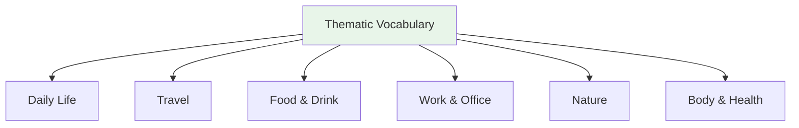

# Thematic Vocabulary — Home and Daily Life

> **One-line summary:** Home and daily-life vocabulary gives you the rooms, objects, chores, and routine verbs needed to describe ordinary life in Japanese.

## 🎯 Intuition

**The Core Idea:** Use home vocabulary to attach objects to locations and routines: where something is, what you do there, and who uses it.
**Analogy:** Think of the house as a map for particles: に marks locations, で marks actions, and を marks the object being used.
**Why It Matters:** Daily-life words make self-introductions, schedules, family talk, errands, and beginner reading feel concrete.

## ⚙️ Core Mechanics

## Rooms (部屋)

| Japanese | Reading | English | Audio |
| ---------- | --------- | --------- | ----- |
| 台所/キッチン | daidokoro | Kitchen | ![[home-001-daidokoro.mp3]] |
| 居間/リビング | ima | Living room | ![[home-002-ima.mp3]] |
| 寝室 | shinshitsu | Bedroom | ![[home-003-shinshitsu.mp3]] |
| お風呂 | ofuro | Bath | ![[home-004-ofuro.mp3]] |
| トイレ | toire | Toilet | ![[home-005-toire.mp3]] |
| 玄関 | genkan | Entrance | ![[home-006-genkan.mp3]] |

## Furniture & Items

| Japanese | Reading | English | Audio |
| ---------- | --------- | --------- | ----- |
| テーブル | tēburu | Table | ![[gap-269-phrase.mp3]] |
| 椅子 | isu | Chair | ![[gap-270-phrase.mp3]] |
| 布団 | futon | Futon | ![[gap-271-phrase.mp3]] |
| ベッド | beddo | Bed | ![[gap-272-phrase.mp3]] |
| 冷蔵庫 | reizōko | Refrigerator | ![[home-007-reizouko.mp3]] |
| 洗濯機 | sentakuki | Washing machine | ![[home-008-sentakuki.mp3]] |

## Daily Routine Verbs

| Japanese | Reading | English | Audio |
| ---------- | --------- | --------- | ----- |
| 起きる | okiru | Wake up | ![[home-009-okiru.mp3]] |
| 寝る | neru | Sleep | ![[home-010-neru.mp3]] |
| 食べる | taberu | Eat | ![[gap-273-phrase.mp3]] |
| 飲む | nomu | Drink | ![[gap-274-phrase.mp3]] |
| シャワーを浴びる | shawā o abiru | Take a shower | ![[home-011-shawaa-wo-abiru.mp3]] |
| 着替える | kigaeru | Change clothes | ![[home-012-kigaeru.mp3]] |
| 出かける | dekakeru | Go out | ![[home-013-dekakeru.mp3]] |

## 🔬 Deep Dive

### Nuances and Exceptions
- Many words have subtle differences that dictionaries don't capture — context and collocations matter.
- Some words change meaning with different kanji or different pitch accent.

### Formal vs Informal Usage
- Most patterns have both polite (です/ます) and casual (dictionary form) variants.
- Choose formality based on your relationship with the listener and the situation.

### Common Mistakes by English Speakers
- False friends — words borrowed from English that changed meaning (マンション ≠ mansion).
- Using the wrong counter or no counter when counting objects.
- Directly translating English idioms instead of learning Japanese equivalents.

## 🏋️ Practice

### Warm-Up — Recognition
1. What does だいじょうぶ mean? → (It's OK / Are you OK?)
2. How do you say "excuse me" to get someone's attention? → (すみません)
3. What's the difference between いる and ある? → (いる = living things; ある = non-living things)

### Core Exercises — Production
1. **Translate:** "Where is the station?" → 駅はどこですか？
2. **Fill in:** ＿を＿ください。(I'll have water, please) → (水 / 一つ)

### Challenge — Real World
You're lost in Tokyo. Using only vocabulary from this list, ask a stranger for directions to the nearest train station, thank them, and say goodbye.

## References
- [[Japanese/Sources/Sources Index|Sources Index]]
