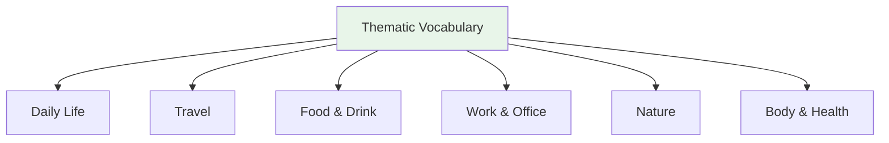

# Thematic Vocabulary — Nature and Weather

## 🎯 Intuition

**The Core Idea:** Understanding Thematic Vocabulary — Nature and Weather is fundamental to Japanese language mastery.
**Analogy:** Each concept in Japanese has parallels in English, but with its own unique twist.
**Why It Matters:** You'll encounter this in everyday Japanese reading, writing, and conversation.

## ⚙️ Core Mechanics

## Weather (天気)

| Japanese | Reading | English | Audio |
| ---------- | --------- | --------- | ----- |
| 晴れ | hare | Sunny | ![[nature-001-hare.mp3]] |
| 曇り | kumori | Cloudy | ![[nature-002-kumori.mp3]] |
| 雨 | ame | Rain | ![[nature-003-ame.mp3]] |
| 雪 | yuki | Snow | ![[nature-004-yuki.mp3]] |
| 風 | kaze | Wind | ![[nature-005-kaze.mp3]] |
| 台風 | taifū | Typhoon | ![[nature-006-taifuu.mp3]] |
| 蒸し暑い | mushiatsui | Humid/muggy | ![[nature-007-mushiatsui.mp3]] |

## Seasons (季節)

| Japanese | Reading | English | Association | Audio |
| ---------- | --------- | --------- | ------------- | ----- |
| 春 | haru | Spring | 桜 (cherry blossoms) | ![[nature-008-haru.mp3]] |
| 夏 | natsu | Summer | 花火 (fireworks) | ![[nature-009-natsu.mp3]] |
| 秋 | aki | Autumn | 紅葉 (autumn leaves) | ![[nature-010-aki.mp3]] |
| 冬 | fuyu | Winter | 雪 (snow) | ![[nature-011-fuyu.mp3]] |

## Nature

| Japanese | Reading | English | Audio |
| ---------- | --------- | --------- | ----- |
| 山 | yama | Mountain | ![[nature-012-yama.mp3]] |
| 川 | kawa | River | ![[nature-013-kawa.mp3]] |
| 海 | umi | Sea | ![[nature-014-umi.mp3]] |
| 森 | mori | Forest | ![[nature-015-mori.mp3]] |
| 花 | hana | Flower | ![[nature-016-hana2.mp3]] |
| 木 | ki | Tree | ![[nature-017-ki.mp3]] |
| 空 | sora | Sky | ![[nature-018-sora.mp3]] |

## 🔬 Deep Dive

### Nuances and Exceptions
- Many words have subtle differences that dictionaries don't capture — context and collocations matter.
- Some words change meaning with different kanji or different pitch accent.

### Formal vs Informal Usage
- Most patterns have both polite (です/ます) and casual (dictionary form) variants.
- Choose formality based on your relationship with the listener and the situation.

### Common Mistakes by English Speakers
- False friends — words borrowed from English that changed meaning (マンション ≠ mansion).
- Using the wrong counter or no counter when counting objects.
- Directly translating English idioms instead of learning Japanese equivalents.

## 🏋️ Practice

### Warm-Up — Recognition
1. What does だいじょうぶ mean? → (It's OK / Are you OK?)
2. How do you say "excuse me" to get someone's attention? → (すみません)
3. What's the difference between いる and ある? → (いる = living things; ある = non-living things)

### Core Exercises — Production
1. **Translate:** "Where is the station?" → 駅はどこですか？
2. **Fill in:** ＿を＿ください。(I'll have water, please) → (水 / 一つ)

### Challenge — Real World
You're lost in Tokyo. Using only vocabulary from this list, ask a stranger for directions to the nearest train station, thank them, and say goodbye.

## References
- [[Sources Index]]
