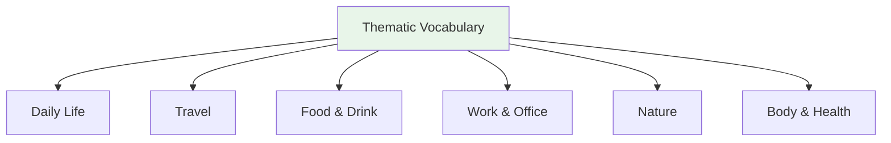

# Thematic Vocabulary — Numbers, Time, and Dates

> **One-line summary:** Numbers, time, and dates are the counting system behind schedules, prices, ages, quantities, and calendar plans.

## 🎯 Intuition

**The Core Idea:** Japanese numbers become useful only when paired with readings, counters, time expressions, and the many irregular date forms.
**Analogy:** Treat this as measurement grammar: the number is not complete until the language knows what kind of thing is being counted.
**Why It Matters:** Prices, appointments, birthdays, train times, ages, and quantities all break down if the number system is shaky.

## ⚙️ Core Mechanics

## Numbers 1-100

| Number | On reading | Kun reading | Audio |
| -------- | ----------- | ------------- | ----- |
| 1 | いち (ichi) | ひとつ (hitotsu) | ![[number-001-ichi.mp3]] |
| 2 | に (ni) | ふたつ (futatsu) | ![[number-002-ni.mp3]] |
| 3 | さん (san) | みっつ (mittsu) | ![[number-003-san.mp3]] |
| 4 | し/よん | よっつ (yottsu) | ![[number-004-yon.mp3]] |
| 5 | ご (go) | いつつ (itsutsu) | ![[number-005-go.mp3]] |
| 6 | ろく (roku) | むっつ (muttsu) | ![[number-006-roku.mp3]] |
| 7 | しち/なな | ななつ (nanatsu) | ![[number-007-nana.mp3]] |
| 8 | はち (hachi) | やっつ (yattsu) | ![[number-008-hachi.mp3]] |
| 9 | く/きゅう | ここのつ (kokonotsu) | ![[number-009-kyuu.mp3]] |
| 10 | じゅう (jū) | とお (tō) | ![[number-010-juu.mp3]] |

## Large Numbers

| Number | Japanese | Reading | Audio |
| -------- | ---------- | --------- | ----- |
| 100 | 百 | hyaku | ![[number-011-hyaku.mp3]] |
| 1,000 | 千 | sen | ![[number-012-sen.mp3]] |
| 10,000 | 万 | man | ![[number-013-man.mp3]] |
| 100,000 | 十万 | jūman | ![[gap-275-phrase.mp3]] |
| 1,000,000 | 百万 | hyakuman | ![[gap-276-phrase.mp3]] |
| 100,000,000 | 一億 | ichioku | ![[gap-277-phrase.mp3]] |

## Days of the Week

| Japanese | Reading | English | Audio |
| ---------- | --------- | --------- | ----- |
| 月曜日 | getsuyōbi | Monday | ![[number-021-getsuyoubi.mp3]] |
| 火曜日 | kayōbi | Tuesday | ![[number-022-kayoubi.mp3]] |
| 水曜日 | suiyōbi | Wednesday | ![[number-023-suiyoubi.mp3]] |
| 木曜日 | mokuyōbi | Thursday | ![[number-024-mokuyoubi.mp3]] |
| 金曜日 | kinyōbi | Friday | ![[number-025-kinyoubi.mp3]] |
| 土曜日 | doyōbi | Saturday | ![[number-026-doyoubi.mp3]] |
| 日曜日 | nichiyōbi | Sunday | ![[number-027-nichiyoubi.mp3]] |

## Months

| Month | Japanese | Month | Japanese | Audio |
| ------- | ---------- | ------- | ---------- | ----- |
| Jan | 一月 | Jul | 七月 | ![[number-028-ichigatsu.mp3]] |
| Feb | 二月 | Aug | 八月 | ![[gap-278-phrase.mp3]] |
| Mar | 三月 | Sep | 九月 | ![[gap-279-phrase.mp3]] |
| Apr | 四月 | Oct | 十月 | ![[gap-280-phrase.mp3]] |
| May | 五月 | Nov | 十一月 | ![[gap-281-phrase.mp3]] |
| Jun | 六月 | Dec | 十二月 | ![[gap-282-phrase.mp3]] |

## Time Expressions

| Japanese | English | Audio |
| ---------- | --------- | ----- |
| 今日 (kyō) | Today | ![[gap-283-(ky).mp3]] |
| 昨日 (kinō) | Yesterday | ![[gap-284-(kin).mp3]] |
| 明日 (ashita) | Tomorrow | ![[gap-285-(ashita).mp3]] |
| 今 (ima) | Now | ![[gap-286-(ima).mp3]] |
| 先週 (senshū) | Last week | ![[gap-287-(sensh).mp3]] |
| 来月 (raigetsu) | Next month | ![[gap-288-(raigetsu).mp3]] |

## 🔬 Deep Dive

### Nuances and Exceptions
- Many words have subtle differences that dictionaries don't capture — context and collocations matter.
- Some words change meaning with different kanji or different pitch accent.

### Formal vs Informal Usage
- Most patterns have both polite (です/ます) and casual (dictionary form) variants.
- Choose formality based on your relationship with the listener and the situation.

### Common Mistakes by English Speakers
- False friends — words borrowed from English that changed meaning (マンション ≠ mansion).
- Using the wrong counter or no counter when counting objects.
- Directly translating English idioms instead of learning Japanese equivalents.

## 🏋️ Practice

### Warm-Up — Recognition
1. What does だいじょうぶ mean? → (It's OK / Are you OK?)
2. How do you say "excuse me" to get someone's attention? → (すみません)
3. What's the difference between いる and ある? → (いる = living things; ある = non-living things)

### Core Exercises — Production
1. **Translate:** "Where is the station?" → 駅はどこですか？
2. **Fill in:** ＿を＿ください。(I'll have water, please) → (水 / 一つ)

### Challenge — Real World
You're lost in Tokyo. Using only vocabulary from this list, ask a stranger for directions to the nearest train station, thank them, and say goodbye.

## References
- [[Japanese/Sources/Sources Index|Sources Index]]
