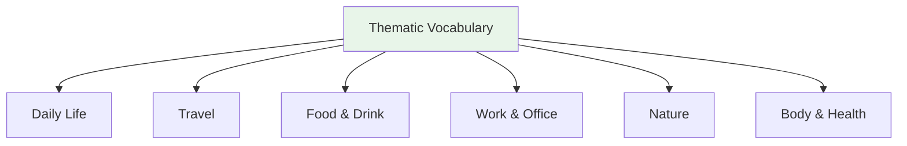

# Thematic Vocabulary — Travel and Transportation

> **One-line summary:** Travel and transportation vocabulary covers vehicles, stations, places, directions, tickets, and movement verbs for getting around.

## 🎯 Intuition

**The Core Idea:** Combine place nouns with movement verbs and particles: place + に/へ行く, vehicle + で行く, and destination + まで.
**Analogy:** Travel vocabulary is a route plan: each word tells you where you are, where you are going, and how you get there.
**Why It Matters:** Stations, tickets, directions, delays, and hotel check-ins are common moments where passive vocabulary is not enough.

## ⚙️ Core Mechanics

## Transportation (交通)

| Japanese | Reading | English | Audio |
| ---------- | --------- | --------- | ----- |
| 電車 | densha | Train | ![[gap-289-phrase.mp3]] |
| 地下鉄 | chikatetsu | Subway | ![[travel-009-chikatetsu.mp3]] |
| バス | basu | Bus | ![[travel-011-basu.mp3]] |
| タクシー | takushī | Taxi | ![[travel-010-takushii.mp3]] |
| 飛行機 | hikōki | Airplane | ![[gap-290-phrase.mp3]] |
| 新幹線 | shinkansen | Bullet train | ![[travel-008-shinkansen.mp3]] |
| 自転車 | jitensha | Bicycle | ![[travel-012-jitensha.mp3]] |

## Places

| Japanese | Reading | English | Audio |
| ---------- | --------- | --------- | ----- |
| 駅 | eki | Station | ![[gap-291-phrase.mp3]] |
| 空港 | kūkō | Airport | ![[travel-007-kuukou.mp3]] |
| ホテル | hoteru | Hotel | ![[travel-014-hoteru.mp3]] |
| 旅館 | ryokan | Japanese inn | ![[travel-015-ryokan.mp3]] |
| 観光地 | kankōchi | Tourist spot | ![[gap-292-phrase.mp3]] |

## Travel Phrases

| Japanese | English | Audio |
| ---------- | --------- | ----- |
| 切符をください | A ticket, please | ![[travel-001-kippu.mp3]] |
| 片道/往復 | One-way / Round-trip | ![[travel-002-katamichi.mp3]] ![[travel-003-oufuku.mp3]] |
| 乗り換え | Transfer | ![[travel-004-norikae.mp3]] |
| この電車は東京に行きますか | Does this train go to Tokyo? | ![[gap-293-phrase.mp3]] |
| 次の駅はどこですか | What is the next station? | ![[gap-294-phrase.mp3]] |

## 🔬 Deep Dive

### Nuances and Exceptions
- Many words have subtle differences that dictionaries don't capture — context and collocations matter.
- Some words change meaning with different kanji or different pitch accent.

### Formal vs Informal Usage
- Most patterns have both polite (です/ます) and casual (dictionary form) variants.
- Choose formality based on your relationship with the listener and the situation.

### Common Mistakes by English Speakers
- False friends — words borrowed from English that changed meaning (マンション ≠ mansion).
- Using the wrong counter or no counter when counting objects.
- Directly translating English idioms instead of learning Japanese equivalents.

## 🏋️ Practice

### Warm-Up — Recognition
1. What does だいじょうぶ mean? → (It's OK / Are you OK?)
2. How do you say "excuse me" to get someone's attention? → (すみません)
3. What's the difference between いる and ある? → (いる = living things; ある = non-living things)

### Core Exercises — Production
1. **Translate:** "Where is the station?" → 駅はどこですか？
2. **Fill in:** ＿を＿ください。(I'll have water, please) → (水 / 一つ)

### Challenge — Real World
You're lost in Tokyo. Using only vocabulary from this list, ask a stranger for directions to the nearest train station, thank them, and say goodbye.

## References
- [[Japanese/Sources/Sources Index|Sources Index]]
