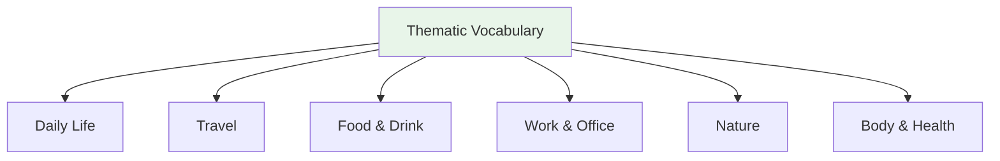

# Thematic Vocabulary — Work and Office

> **One-line summary:** Work and office vocabulary ties job titles, workplace relationships, meetings, tools, and polite requests to professional Japanese.

## 🎯 Intuition

**The Core Idea:** Learn office words with hierarchy attached: who is speaking, who is being addressed, and how polite the phrase must be.
**Analogy:** Workplace vocabulary is an org chart plus a tool cabinet: nouns name roles and objects, while register decides how safe the sentence is.
**Why It Matters:** Meetings, introductions, email, scheduling, and workplace small talk all depend on accurate role and register choices.

## ⚙️ Core Mechanics

## Workplace (職場)

| Japanese | Reading | English | Audio |
| ---------- | --------- | --------- | ----- |
| 会社 | kaisha | Company | ![[work-001-kaisha.mp3]] |
| 事務所 | jimusho | Office | ![[work-002-jimusho.mp3]] |
| 会議室 | kaigishitsu | Meeting room | ![[work-003-kaigishitsu.mp3]] |
| 上司 | jōshi | Boss | ![[work-004-joushi.mp3]] |
| 同僚 | dōryō | Colleague | ![[work-005-douryou.mp3]] |
| 部下 | buka | Subordinate | ![[work-006-buka.mp3]] |

## Job Titles

| Japanese | Reading | English | Audio |
| ---------- | --------- | --------- | ----- |
| 社長 | shachō | President/CEO | ![[work-007-shachou.mp3]] |
| 部長 | buchō | Department head | ![[work-008-buchou.mp3]] |
| 課長 | kachō | Section chief | ![[work-009-kachou.mp3]] |
| 社員 | shain | Employee | ![[gap-295-phrase.mp3]] |

## Work Actions

| Japanese | Reading | English | Audio |
| ---------- | --------- | --------- | ----- |
| 働く | hataraku | To work | ![[work-010-hataraku.mp3]] |
| 出勤する | shukkin suru | To go to work | ![[work-011-shukkin-suru.mp3]] |
| 退勤する | taikin suru | To leave work | ![[gap-296-phrase.mp3]] |
| 残業する | zangyō suru | To work overtime | ![[work-012-zangyou-suru.mp3]] |
| 休む | yasumu | To take a day off | ![[work-013-yasumu.mp3]] |
| 転職する | tenshoku suru | To change jobs | ![[work-014-tenshoku-suru.mp3]] |

## 🔬 Deep Dive

### Nuances and Exceptions
- Many words have subtle differences that dictionaries don't capture — context and collocations matter.
- Some words change meaning with different kanji or different pitch accent.

### Formal vs Informal Usage
- Most patterns have both polite (です/ます) and casual (dictionary form) variants.
- Choose formality based on your relationship with the listener and the situation.

### Common Mistakes by English Speakers
- False friends — words borrowed from English that changed meaning (マンション ≠ mansion).
- Using the wrong counter or no counter when counting objects.
- Directly translating English idioms instead of learning Japanese equivalents.

## 🏋️ Practice

### Warm-Up — Recognition
1. What does だいじょうぶ mean? → (It's OK / Are you OK?)
2. How do you say "excuse me" to get someone's attention? → (すみません)
3. What's the difference between いる and ある? → (いる = living things; ある = non-living things)

### Core Exercises — Production
1. **Translate:** "Where is the station?" → 駅はどこですか？
2. **Fill in:** ＿を＿ください。(I'll have water, please) → (水 / 一つ)

### Challenge — Real World
You're lost in Tokyo. Using only vocabulary from this list, ask a stranger for directions to the nearest train station, thank them, and say goodbye.

## References
- [[Japanese/Sources/Sources Index|Sources Index]]
