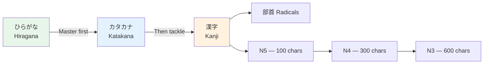

# Hiragana Complete Guide

> **Hiragana ひらがな  is the foundation of Japanese writing. Master this first — everything else builds on it.**

## 🎯 Intuition

**The Core Idea:** Hiragana is the phonetic alphabet for native Japanese words — the first writing system every learner masters.
**Analogy:** Think of hiragana as the Japanese ABCs — each character = one syllable sound.
**Why It Matters:** You need hiragana to read anything in Japanese — textbooks, signs, and all other scripts build on it.

## How To Use This Page

This is a drill page, not an article to read once. Use it in four passes:

1. Read each row aloud while looking at romaji.
2. Cover the romaji and read the kana only.
3. Mix rows together so recognition is not tied to chart order.
4. Read short real words: さくら, すし, せんせい, がっこう.

Do not wait for handwriting to be beautiful before moving on. Reading recognition is the blocker for Phase 1.

## ⚙️ Core Mechanics

Hiragana (ひらがな ![[hira-001-hiragana.mp3]]) is the foundation of Japanese writing. Master this first — everything else builds on it.

## The 46 Base Characters

### Vowels (5)

| Kana                  | Romaji | Sound                          |
| --------------------- | ------ | ------------------------------ |
| あ ![[hira-002-a.mp3]] | a      | "ah" as in father              |
| い ![[hira-003-i.mp3]] | i      | "ee" as in feet                |
| う ![[hira-004-u.mp3]] | u      | "oo" as in food (less rounded) |
| え ![[hira-005-e.mp3]] | e      | "eh" as in pet                 |
| お ![[hira-006-o.mp3]] | o      | "oh" as in go                  |

### K-row

| Base | Romaji | Dakuten | Romaji |
|------|--------|---------|--------|
| か ![[hira-007-ka.mp3]] | ka | が ![[hira-008-ga.mp3]] | ga |
| き ![[hira-009-ki.mp3]] | ki | ぎ ![[hira-010-gi.mp3]] | gi |
| く ![[hira-011-ku.mp3]] | ku | ぐ ![[hira-012-gu.mp3]] | gu |
| け ![[hira-013-ke.mp3]] | ke | げ ![[hira-014-ge.mp3]] | ge |
| こ ![[hira-015-ko.mp3]] | ko | ご ![[hira-016-go.mp3]] | go |

### S-row

| Base | Romaji | Dakuten | Romaji |
|------|--------|---------|--------|
| さ ![[hira-017-sa.mp3]] | sa | ざ ![[hira-018-za.mp3]] | za |
| し ![[hira-019-shi.mp3]] | shi | じ ![[hira-020-ji.mp3]] | ji |
| す ![[hira-021-su.mp3]] | su | ず ![[hira-022-zu.mp3]] | zu |
| せ ![[hira-023-se.mp3]] | se | ぜ ![[hira-024-ze.mp3]] | ze |
| そ ![[hira-025-so.mp3]] | so | ぞ ![[hira-026-zo.mp3]] | zo |

### T-row

| Base | Romaji | Dakuten | Romaji |
|------|--------|---------|--------|
| た ![[hira-027-ta.mp3]] | ta | だ ![[hira-028-da.mp3]] | da |
| ち ![[hira-029-chi.mp3]] | chi | ぢ ![[hira-030-di.mp3]] | di/ji |
| つ ![[hira-031-tsu.mp3]] | tsu | づ ![[hira-032-du.mp3]] | du/zu |
| て ![[hira-033-te.mp3]] | te | で ![[hira-034-de.mp3]] | de |
| と ![[hira-035-to.mp3]] | to | ど ![[hira-036-do.mp3]] | do |

### N-row

| Kana | Romaji |
|------|--------|
| な ![[hira-037-na.mp3]] | na |
| に ![[hira-038-ni.mp3]] | ni |
| ぬ ![[hira-039-nu.mp3]] | nu |
| ね ![[hira-040-ne.mp3]] | ne |
| の ![[hira-041-no.mp3]] | no |

### H-row (with dakuten AND handakuten)

| Base | Romaji | Dakuten | Romaji | Handakuten | Romaji |
|------|--------|---------|--------|------------|--------|
| は ![[hira-042-ha.mp3]] | ha | ば ![[hira-043-ba.mp3]] | ba | ぱ ![[hira-044-pa.mp3]] | pa |
| ひ ![[hira-045-hi.mp3]] | hi | び ![[hira-046-bi.mp3]] | bi | ぴ ![[hira-047-pi.mp3]] | pi |
| ふ ![[hira-048-fu.mp3]] | fu | ぶ ![[hira-049-bu.mp3]] | bu | ぷ ![[hira-050-pu.mp3]] | pu |
| へ ![[hira-051-he.mp3]] | he | べ ![[hira-052-be.mp3]] | be | ぺ ![[hira-053-pe.mp3]] | pe |
| ほ ![[hira-054-ho.mp3]] | ho | ぼ ![[hira-055-bo.mp3]] | bo | ぽ ![[hira-056-po.mp3]] | po |

### M-row

| Kana | Romaji |
|------|--------|
| ま ![[hira-057-ma.mp3]] | ma |
| み ![[hira-058-mi.mp3]] | mi |
| む ![[hira-059-mu.mp3]] | mu |
| め ![[hira-060-me.mp3]] | me |
| も ![[hira-061-mo.mp3]] | mo |

### Y-row

| Kana | Romaji |
|------|--------|
| や ![[hira-062-ya.mp3]] | ya |
| ゆ ![[hira-063-yu.mp3]] | yu |
| よ ![[hira-064-yo.mp3]] | yo |

### R-row

| Kana | Romaji |
|------|--------|
| ら ![[hira-065-ra.mp3]] | ra |
| り ![[hira-066-ri.mp3]] | ri |
| る ![[hira-067-ru.mp3]] | ru |
| れ ![[hira-068-re.mp3]] | re |
| ろ ![[hira-069-ro.mp3]] | ro |

### W-row + N

| Kana | Romaji |
|------|--------|
| わ ![[hira-070-wa.mp3]] | wa |
| を ![[hira-071-wo.mp3]] | wo (particle only) |
| ん ![[hira-072-n.mp3]] | n |

## Combination Kana (拗音 ![[hira-073-youon.mp3]])
Small ゃ ![[hira-074-small-ya.mp3]] / ゅ ![[hira-075-small-yu.mp3]] / ょ ![[hira-076-small-yo.mp3]] combine with i-column kana:

| + ya | + yu | + yo |
|------|------|------|
| きゃ ![[hira-077-kya.mp3]] kya | きゅ ![[hira-078-kyu.mp3]] kyu | きょ ![[hira-079-kyo.mp3]] kyo |
| しゃ ![[hira-080-sha.mp3]] sha | しゅ ![[hira-081-shu.mp3]] shu | しょ ![[hira-082-sho.mp3]] sho |
| ちゃ ![[hira-083-cha.mp3]] cha | ちゅ ![[hira-084-chu.mp3]] chu | ちょ ![[hira-085-cho.mp3]] cho |
| にゃ ![[hira-086-nya.mp3]] nya | にゅ ![[hira-087-nyu.mp3]] nyu | にょ ![[hira-088-nyo.mp3]] nyo |
| ひゃ ![[hira-089-hya.mp3]] hya | ひゅ ![[hira-090-hyu.mp3]] hyu | ひょ ![[hira-091-hyo.mp3]] hyo |
| みゃ ![[hira-092-mya.mp3]] mya | みゅ ![[hira-093-myu.mp3]] myu | みょ ![[hira-094-myo.mp3]] myo |
| りゃ ![[hira-095-rya.mp3]] rya | りゅ ![[hira-096-ryu.mp3]] ryu | りょ ![[hira-097-ryo.mp3]] ryo |

## Special Rules
1. **Long vowels:** Double the vowel sound (おかあさん ![[hira-098-okaasan.mp3]] = okaasan)
2. **Double consonants:** Small っ ![[hira-099-small-tsu.mp3]] (tsu) before a consonant (がっこう ![[hira-100-gakkou.mp3]] = gakkou)
3. **Particle は ![[hira-101-particle-wa.mp3]]:** Pronounced "wa" when used as topic particle
4. **Particle へ ![[hira-102-particle-e.mp3]]:** Pronounced "e" when used as direction particle

## 🔊 Audio
- Practice with TTS files for each row
- Use Forvo.com for native pronunciation of each character

## Practice Tips
1. Write each character 10 times while saying it aloud
2. Use mnemonics: あ looks like an "a"pple on its side
3. Practice reading children's books written entirely in hiragana
4. Test yourself: cover romaji, read only kana

## Practice Ladder

### Recognition

1. Read the vowel row: あ い う え お.
2. Read one consonant row without romaji.
3. Shuffle rows and read 20 random kana.
4. Read dakuten pairs: か/が, さ/ざ, た/だ, は/ば/ぱ.

### Production

Write these in hiragana:

| Romaji | Hiragana |
| --- | --- |
| sakura | さくら |
| sushi | すし |
| sensei | せんせい |
| gakkou | がっこう |
| okaasan | おかあさん |

### Checkpoint

You are ready to move to katakana when you can read a mixed hiragana row without saying the English letter names in your head.

## Common Traps

- は is pronounced "wa" only when it marks the topic.
- へ is pronounced "e" only when it marks direction.
- Small っ doubles the next consonant: がっこう.
- Long vowels matter. おばさん and おばあさん are different words.

## References
- [[Japanese/Sources/Sources Index|Sources Index]]
- [[chunk-jp-001]]
- [[chunk-jp-002]]
- [[chunk-jp-003]]
- [[chunk-jp-004]]
