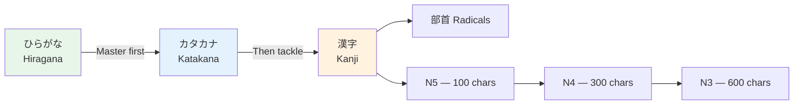

# Kanji Learning Strategies

> **There's no single best method — but some approaches are dramatically more effective than others.**

## 🎯 Intuition

**The Core Idea:** Strategic approaches to learning kanji — working smarter, not just harder.
**Analogy:** Instead of brute-force memorization, treat kanji like LEGO — learn the building blocks (radicals) first.
**Why It Matters:** With 2,136 jōyō kanji to learn, strategy is the difference between burnout and steady progress.

## ⚙️ Core Mechanics

## Approach Comparison

### 1. Heisig Method (Remembering the Kanji)
- **How:** Learn meanings first via mnemonic stories, readings later
- **Pros:** Fast initial recognition, creative, systematic
- **Cons:** Doesn't teach readings, requires separate vocab study
- **Time:** ~3 months for 2,000 kanji meanings

### 2. WaniKani / Radical-First SRS
- **How:** Radicals → kanji → vocabulary, all via SRS
- **Pros:** Systematic, teaches readings with context, gamified
- **Cons:** Locked pace, subscription cost, ~1-2 years for full course

### 3. Vocabulary-First (Context Method)
- **How:** Learn kanji as part of words you encounter in reading
- **Pros:** Immediately useful, contextual, natural
- **Cons:** Unsystematic, gaps in knowledge

### 4. Hybrid (Recommended)
- **Phase 1:** Learn 50 core radicals ([[Radicals — The Building Blocks]])
- **Phase 2:** Use WaniKani or Anki RTK deck for systematic kanji
- **Phase 3:** Supplement with vocabulary-in-context from reading
- **Phase 4:** Review and reinforce with native content

## Key Principles

### Learn Kanji in Words, Not Isolation
BAD: 食 ![[kanjistrategy-001-shoku.mp3]] = food, eat (various readings)
GOOD: Learn 食べる ![[kanjistrategy-002-tabe-ru-shokuji-washoku.mp3]] (taberu, to eat), 食事 (shokuji, meal), 和食 (washoku, Japanese food)

### Prioritize High-Frequency Kanji
- Top 100 kanji appear in 50% of text
- Top 500 kanji appear in 80% of text
- Top 1,000 kanji appear in 95% of text

### Use Spaced Repetition
- Anki or WaniKani for systematic review
- Don't cram — spaced repetition is proven more effective
- 10-15 new kanji per week is sustainable long-term

## Tools

| Tool | Method | Cost |
|------|--------|------|
| WaniKani | Radical-first SRS | $9/mo |
| Anki + RTK deck | Heisig + SRS | Free |
| Kanji Study (app) | Writing practice | $12 one-time |
| Skritter | Writing SRS | $15/mo |

## 🔬 Deep Dive

### Nuances and Exceptions
- Some characters have variant forms or readings that appear in names or classical texts.
- Context determines the correct reading — especially for kanji with multiple readings.

### Formal vs Informal Usage
- Most patterns have both polite (です/ます) and casual (dictionary form) variants.
- Choose formality based on your relationship with the listener and the situation.

### Common Mistakes by English Speakers
- Transferring English pronunciation habits to Japanese sounds.
- Missing register differences that are critical in Japanese social contexts.
- Underestimating the importance of non-verbal communication.

## 🏋️ Practice

### Warm-Up — Recognition
1. How many basic hiragana characters are there? → (46)
2. What are dakuten? → (Two dots that voice consonants: か→が)
3. Which writing system is used for foreign words? → (Katakana)

### Core Exercises — Production
1. **Write in hiragana:** sakura → さくら | tokyo → とうきょう
2. **Write in katakana:** coffee → コーヒー | America → アメリカ

### Challenge — Real World
Write a short self-introduction using all three scripts: your name in katakana, a greeting in hiragana, and at least one common kanji (人, 大, 日).

## References
- [[Japanese/Sources/Sources Index|Sources Index]]
