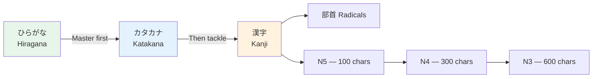

# Kanji N3 Essentials

> **~350 additional kanji for JLPT N3 (cumulative ~650). This is the tipping point — at 650 kanji, you can read most everyday Japanese.**

## 🎯 Intuition

**The Core Idea:** The ~370 additional kanji for JLPT N3 — reaching intermediate literacy.
**Analogy:** Like moving from children's books to young-adult novels — these kanji cover abstract and specialized topics.
**Why It Matters:** N3 kanji are the gateway to reading real Japanese media — news, novels, and websites.

## ⚙️ Core Mechanics

## Why N3 Is the Breakthrough Level
- **Newspaper headlines** become readable
- **Menu items** at restaurants are no longer mysteries
- **Signs and notices** in daily life are mostly understood
- **Kanji compounds** start to feel predictable (semantic radical + phonetic component)

## High-Frequency N3 Categories

### Communication and Thought

| Kanji | Meaning | Key Words |
|-------|---------|-----------|
| 話 ![[kanjin3-001-hanashi.mp3]] | conversation | 会話 (kaiwa), 電話 (denwa) |
| 説 ![[kanjin3-002-setsu.mp3]] | explain | 説明 (setsumei, explanation) |
| 議 ![[kanjin3-003-gi.mp3]] | discuss | 会議 (kaigi, meeting) |
| 視 ![[kanjin3-004-shi.mp3]] | view | テレビ = 視的 (shiteki, viewpoint) |
| 研 ![[kanjin3-005-ken.mp3]] | grind/research | 研究 (kenkyū, research) |
| 究 ![[kanjin3-006-kyuu.mp3]] | investigate | 研究室 (kenkyūshitsu, lab) |
| 求 ![[kanjin3-007-kyuu.mp3]] | seek | 要求 (yōkyū, demand) |
| 判 ![[kanjin3-008-han.mp3]] | judge | 判断 (handan, judgment) |
| 決 ![[kanjin3-009-ketsu.mp3]] | decide | 決定 (kettei, decision) |
| 選 ![[kanjin3-010-sen.mp3]] | choose | 選ぶ (erabu, to choose) |

### Society and Organization

| Kanji | Meaning | Key Words |
|-------|---------|-----------|
| 政 ![[kanjin3-011-matsurigoto.mp3]] | politics | 政治 (seiji, politics) |
| 法 ![[kanjin3-012-hou.mp3]] | law | 法律 (hōritsu, law) |
| 経 ![[kanjin3-013-kei.mp3]] | passage/sutra | 経済 (keizai, economy) |
| 済 ![[kanjin3-014-sumi.mp3]] | finish/save | 経済的 (keizaiteki, economic) |
| 際 ![[kanjin3-015-kiwa.mp3]] | occasion | 国際 (kokusai, international) |
| 民 ![[kanjin3-016-tami.mp3]] | people | 国民 (kokumin, citizens) |
| 代 ![[kanjin3-017-dai.mp3]] | generation/fee | 時代 (jidai, era) |
| 制 ![[kanjin3-018-sei.mp3]] | system/control | 制度 (seido, system) |
| 管 ![[kanjin3-019-kan.mp3]] | pipe/manage | 管理 (kanri, management) |
| 報 ![[kanjin3-020-hou.mp3]] | report | 報告 (hōkoku, report) |

### Feelings and Character

| Kanji | Meaning | Key Words |
|-------|---------|-----------|
| 感 ![[kanjin3-021-kan.mp3]] | feel | 感じる (kanjiru), 感謝 (kansha, gratitude) |
| 情 ![[kanjin3-022-jou.mp3]] | emotion | 情報 (jōhō, information) |
| 性 ![[kanjin3-023-sei.mp3]] | nature | 性格 (seikaku, personality) |
| 心 ![[kanjin3-024-kokoro.mp3]] | heart/mind | 安心 (anshin, relief) |
| 望 ![[kanjin3-025-bou.mp3]] | hope | 希望 (kibō, hope) |
| 信 ![[kanjin3-026-shin.mp3]] | believe | 信じる (shinjiru, to believe) |
| 必 ![[kanjin3-027-hitsu.mp3]] | must | 必要 (hitsu yō, necessary) |
| 不 ![[kanjin3-028-fu.mp3]] | not/un- | 不便 (fuben, inconvenient) |
| 無 ![[kanjin3-029-mu.mp3]] | nothing | 無理 (muri, impossible) |
| 非 ![[kanjin3-030-hi.mp3]] | non-/fault | 非常 (hijō, very/emergency) |

### The Physical World

| Kanji | Meaning | Key Words |
|-------|---------|-----------|
| 地 ![[kanjin3-031-chi.mp3]] | ground | 地図 (chizu, map) |
| 物 ![[kanjin3-032-mono.mp3]] | thing | 買い物 (kaimono, shopping) |
| 場 ![[kanjin3-033-ba.mp3]] | place | 駐車場 (chūshajō, parking) |
| 建 ![[kanjin3-034-ken.mp3]] | build | 建物 (tatemono, building) |
| 質 ![[kanjin3-035-shitsu.mp3]] | quality | 品質 (hinshitsu, quality) |
| 量 ![[kanjin3-036-ryou.mp3]] | quantity | 分量 (bunryō, amount) |
| 種 ![[kanjin3-037-tane.mp3]] | type/seed | 種類 (shurui, type/kind) |
| 形 ![[kanjin3-038-katachi.mp3]] | shape | 人形 (ningyō, doll) |
| 色 ![[kanjin3-039-iro.mp3]] | color | 景色 (keshiki, scenery) |
| 音 ![[kanjin3-040-oto.mp3]] | sound | 音楽 (ongaku, music) |

## Pattern Recognition at N3

At this level, you start seeing patterns everywhere:

### Semantic Radical Families
- 氵 ![[kanjin3-041-sanzui-umi-kawa.mp3]] (water): 海 河 湖 波 流 泉 池 泥 浄 活
- 言 ![[kanjin3-042-gen-hanashi-setsu.mp3]] (speech): 話 説 議 記 設 評 試 語 訳 護
- 忄 ![[kanjin3-043-jou-sei-omoi.mp3]] (heart): 情 性 思 恋 愛 怒 悟 悠 悲 慌

### Common Phonetic Components
- 包 ![[kanjin3-044-tsutsumi-awa-hou.mp3]] (hō): 泡 胞 砲 抱 飽 all share the "hō" reading
- 反 ![[kanjin3-045-han-ita-hen.mp3]] (han): 板 返 販 飯 all share the "han" reading

## Study Tips for N3
1. **Read extensively** — NHK Easy News, manga, light novels
2. **Focus on compound patterns** — learn kanji through word families
3. **Radical recognition** — identify radicals automatically now
4. **Context clues** — practice guessing unknown kanji from context
5. **Keep SRS going** — add 5-10 new kanji per week, never skip reviews

## 🔬 Deep Dive

### Nuances and Exceptions
- Some characters have variant forms or readings that appear in names or classical texts.
- Context determines the correct reading — especially for kanji with multiple readings.

### Formal vs Informal Usage
- Most patterns have both polite (です/ます) and casual (dictionary form) variants.
- Choose formality based on your relationship with the listener and the situation.

### Common Mistakes by English Speakers
- Transferring English pronunciation habits to Japanese sounds.
- Missing register differences that are critical in Japanese social contexts.
- Underestimating the importance of non-verbal communication.

## 🏋️ Practice

### Warm-Up — Recognition
1. How many basic hiragana characters are there? → (46)
2. What are dakuten? → (Two dots that voice consonants: か→が)
3. Which writing system is used for foreign words? → (Katakana)

### Core Exercises — Production
1. **Write in hiragana:** sakura → さくら | tokyo → とうきょう
2. **Write in katakana:** coffee → コーヒー | America → アメリカ

### Challenge — Real World
Write a short self-introduction using all three scripts: your name in katakana, a greeting in hiragana, and at least one common kanji (人, 大, 日).

## References
- [[Sources Index]]
