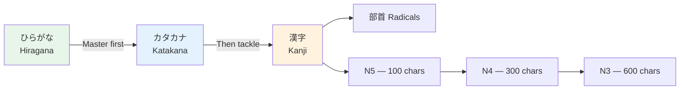

# Kanji N4 Essentials

> **~200 additional kanji for JLPT N4 (cumulative ~300). These expand your ability to read everyday texts.**

## 🎯 Intuition

**The Core Idea:** The ~170 additional kanji for JLPT N4 — building on your N5 foundation.
**Analogy:** Like expanding from basic sight words to reading simple books — these kanji cover everyday topics.
**Why It Matters:** N4 kanji let you read simple articles, menus, and basic correspondence.

## ⚙️ Core Mechanics

## Abstract Concepts

| Kanji | Meaning | On'yomi | Kun'yomi | Example |
|-------|---------|---------|----------|---------|
| 思 ![[kanjin4-001-omoi.mp3]] | think | SHI | omo(u) | 思い出 (omoide, memory) |
| 知 ![[kanjin4-002-chi.mp3]] | know | CHI | shi(ru) | 知識 (chishiki, knowledge) |
| 考 ![[kanjin4-003-kou.mp3]] | think/consider | KŌ | kanga(eru) | 参考 (sankō, reference) |
| 用 ![[kanjin4-004-you.mp3]] | use | YŌ | mochi(iru) | 用意 (yōi, preparation) |
| 強 ![[kanjin4-005-kyou.mp3]] | strong | KYŌ | tsuyo(i) | 勉強 (benkyō, study) |
| 弱 ![[kanjin4-006-jaku.mp3]] | weak | JAKU | yowa(i) | 弱い (yowai, weak) |
| 新 ![[kanjin4-007-shin.mp3]] | new | SHIN | atara(shii) | 新聞 (shinbun, newspaper) |
| 古 ![[kanjin4-008-ko.mp3]] | old | KO | furu(i) | 中古 (chūko, secondhand) |
| 多 ![[kanjin4-009-ta.mp3]] | many | TA | ō(i) | 多分 (tabun, probably) |
| 少 ![[kanjin4-010-shou.mp3]] | few | SHŌ | suku(nai) | 少し (sukoshi, a little) |
| 同 ![[kanjin4-011-dou.mp3]] | same | DŌ | ona(ji) | 同じ (onaji, the same) |
| 別 ![[kanjin4-012-betsu.mp3]] | different/separate | BETSU | waka(reru) | 別に (betsu ni, not really) |

## Verbs and Actions

| Kanji | Meaning | On'yomi | Kun'yomi | Example |
|-------|---------|---------|----------|---------|
| 持 ![[kanjin4-013-ji.mp3]] | hold/have | JI | mo(tsu) | 気持ち (kimochi, feeling) |
| 使 ![[kanjin4-014-shi.mp3]] | use | SHI | tsuka(u) | 大使館 (taishikan, embassy) |
| 作 ![[kanjin4-015-saku.mp3]] | make | SAKU | tsuku(ru) | 作文 (sakubun, essay) |
| 始 ![[kanjin4-016-shi.mp3]] | begin | SHI | haji(meru) | 開始 (kaishi, start) |
| 終 ![[kanjin4-017-owari.mp3]] | end | SHŪ | o(waru) | 最終 (saishū, final) |
| 待 ![[kanjin4-018-tai.mp3]] | wait | TAI | ma(tsu) | 期待 (kitai, expectation) |
| 送 ![[kanjin4-019-sou.mp3]] | send | SŌ | oku(ru) | 送料 (sōryō, shipping fee) |
| 返 ![[kanjin4-020-hen.mp3]] | return | HEN | kae(su) | 返事 (henji, reply) |
| 開 ![[kanjin4-021-kai.mp3]] | open | KAI | a(keru) | 開く (hiraku, to open) |
| 閉 ![[kanjin4-022-hei.mp3]] | close | HEI | shi(meru) | 閉める (shimeru, to close) |
| 止 ![[kanjin4-023-shi.mp3]] | stop | SHI | to(meru) | 中止 (chūshi, cancel) |
| 走 ![[kanjin4-024-sou.mp3]] | run | SŌ | hashi(ru) | 走る (hashiru, to run) |
| 歩 ![[kanjin4-025-ho.mp3]] | walk | HO | aru(ku) | 散歩 (sanpo, stroll) |
| 乗 ![[kanjin4-026-jou.mp3]] | ride | JŌ | no(ru) | 乗り物 (norimono, vehicle) |

## Nature and Weather

| Kanji | Meaning | On'yomi | Kun'yomi | Example |
|-------|---------|---------|----------|---------|
| 天 ![[kanjin4-027-ten.mp3]] | heaven/sky | TEN | ame | 天気 (tenki, weather) |
| 気 ![[kanjin4-028-ki.mp3]] | spirit/air | KI | - | 元気 (genki, energetic) |
| 風 ![[kanjin4-029-kaze.mp3]] | wind | FŪ | kaze | 台風 (taifū, typhoon) |
| 花 ![[kanjin4-030-hana.mp3]] | flower | KA | hana | 花火 (hanabi, fireworks) |
| 春 ![[kanjin4-031-haru.mp3]] | spring | SHUN | haru | 春休み (haruyasumi, spring break) |
| 夏 ![[kanjin4-032-natsu.mp3]] | summer | KA | natsu | 夏休み (natsuyasumi) |
| 秋 ![[kanjin4-033-aki.mp3]] | autumn | SHŪ | aki | 秋葉 (akiba, autumn leaves) |
| 冬 ![[kanjin4-034-fuyu.mp3]] | winter | TŌ | fuyu | 冬休み (fuyuyasumi) |

## Buildings and Society

| Kanji | Meaning | On'yomi | Kun'yomi | Example |
|-------|---------|---------|----------|---------|
| 家 ![[kanjin4-035-ie.mp3]] | house/home | KA | ie/uchi | 家族 (kazoku, family) |
| 室 ![[kanjin4-036-shitsu.mp3]] | room | SHITSU | muro | 教室 (kyōshitsu, classroom) |
| 店 ![[kanjin4-037-mise.mp3]] | store | TEN | mise | 喫茶店 (kissaten, cafe) |
| 社 ![[kanjin4-038-sha.mp3]] | company/shrine | SHA | yashiro | 会社 (kaisha, company) |
| 教 ![[kanjin4-039-kyou.mp3]] | teach | KYŌ | oshi(eru) | 教育 (kyōiku, education) |
| 医 ![[kanjin4-040-i.mp3]] | doctor | I | - | 医者 (isha, doctor) |
| 病 ![[kanjin4-041-byou.mp3]] | illness | BYŌ | ya(mu) | 病院 (byōin, hospital) |
| 院 ![[kanjin4-042-in.mp3]] | institution | IN | - | 大学院 (daigakuin, grad school) |

## Study Strategy for N4 Kanji
1. **Build on N5:** Many N4 kanji share radicals with N5 kanji
2. **Compound focus:** Most N4 kanji appear in 2-kanji compounds
3. **Read more:** Start with NHK Easy News and children's manga
4. **Review:** Keep reviewing N5 kanji while adding N4

## 🔬 Deep Dive

### Nuances and Exceptions
- Some characters have variant forms or readings that appear in names or classical texts.
- Context determines the correct reading — especially for kanji with multiple readings.

### Formal vs Informal Usage
- Most patterns have both polite (です/ます) and casual (dictionary form) variants.
- Choose formality based on your relationship with the listener and the situation.

### Common Mistakes by English Speakers
- Transferring English pronunciation habits to Japanese sounds.
- Missing register differences that are critical in Japanese social contexts.
- Underestimating the importance of non-verbal communication.

## 🏋️ Practice

### Warm-Up — Recognition
1. How many basic hiragana characters are there? → (46)
2. What are dakuten? → (Two dots that voice consonants: か→が)
3. Which writing system is used for foreign words? → (Katakana)

### Core Exercises — Production
1. **Write in hiragana:** sakura → さくら | tokyo → とうきょう
2. **Write in katakana:** coffee → コーヒー | America → アメリカ

### Challenge — Real World
Write a short self-introduction using all three scripts: your name in katakana, a greeting in hiragana, and at least one common kanji (人, 大, 日).

## References
- [[Sources Index]]
