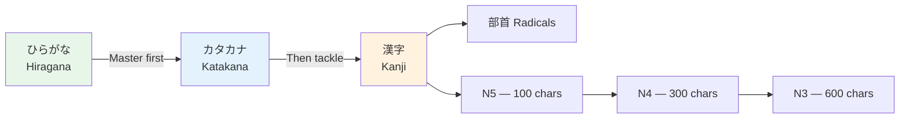

# Kanji N5 Essentials

> **The ~100 kanji needed for JLPT N5. These are the most common characters you'll encounter daily.**

## 🎯 Intuition

**The Core Idea:** The ~100 most fundamental kanji for JLPT N5 — your first kanji milestone.
**Analogy:** These are like learning 'the', 'and', 'is' in English — the most common building blocks of written Japanese.
**Why It Matters:** N5 kanji appear in every single page of Japanese text — mastering them unlocks basic reading.

## ⚙️ Core Mechanics

## Numbers

| Kanji | Meaning | On'yomi | Kun'yomi | Example Word |
|-------|---------|---------|----------|-------------|
| 一 ![[kanjin5-001-ichi.mp3]] | one | ICHI | hito(tsu) | 一人 (hitori, one person) |
| 二 ![[kanjin5-002-ni.mp3]] | two | NI | futa(tsu) | 二月 (nigatsu, February) |
| 三 ![[kanjin5-003-san.mp3]] | three | SAN | mi(ttsu) | 三つ (mittsu, three things) |
| 四 ![[kanjin5-004-shi.mp3]] | four | SHI | yo(ttsu) | 四月 (shigatsu, April) |
| 五 ![[kanjin5-005-go.mp3]] | five | GO | itsu(tsu) | 五分 (gofun, 5 minutes) |
| 六 ![[kanjin5-006-roku.mp3]] | six | ROKU | mu(ttsu) | 六時 (rokuji, 6 o'clock) |
| 七 ![[kanjin5-007-shichi.mp3]] | seven | SHICHI | nana(tsu) | 七月 (shichigatsu, July) |
| 八 ![[kanjin5-008-hachi.mp3]] | eight | HACHI | ya(ttsu) | 八百 (happyaku, 800) |
| 九 ![[kanjin5-009-kyuu.mp3]] | nine | KU/KYŪ | kokono(tsu) | 九時 (kuji, 9 o'clock) |
| 十 ![[kanjin5-010-juu.mp3]] | ten | JŪ | tō | 十分 (juppun, 10 minutes) |
| 百 ![[kanjin5-011-hyaku.mp3]] | hundred | HYAKU | - | 三百 (sanbyaku, 300) |
| 千 ![[kanjin5-012-sen.mp3]] | thousand | SEN | chi | 二千 (nisen, 2000) |
| 万 ![[kanjin5-013-man.mp3]] | ten thousand | MAN | - | 一万 (ichiman, 10,000) |
| 円 ![[kanjin5-014-en.mp3]] | yen/circle | EN | maru(i) | 百円 (hyakuen, 100 yen) |

## Time and Calendar

| Kanji | Meaning | On'yomi | Kun'yomi | Example |
|-------|---------|---------|----------|---------|
| 日 ![[kanjin5-015-nichi.mp3]] | day/sun | NICHI | hi | 今日 (kyō, today) |
| 月 ![[kanjin5-016-gatsu.mp3]] | month/moon | GETSU | tsuki | 来月 (raigetsu, next month) |
| 火 ![[kanjin5-017-hi.mp3]] | fire (Tue) | KA | hi | 火曜日 (kayōbi, Tuesday) |
| 水 ![[kanjin5-018-mizu.mp3]] | water (Wed) | SUI | mizu | 水曜日 (suiyōbi, Wednesday) |
| 木 ![[kanjin5-019-ki.mp3]] | tree (Thu) | MOKU | ki | 木曜日 (mokuyōbi, Thursday) |
| 金 ![[kanjin5-020-kin.mp3]] | gold (Fri) | KIN | kane | 金曜日 (kinyōbi, Friday) |
| 土 ![[kanjin5-021-tsuchi.mp3]] | earth (Sat) | DO | tsuchi | 土曜日 (doyōbi, Saturday) |
| 年 ![[kanjin5-022-nen.mp3]] | year | NEN | toshi | 今年 (kotoshi, this year) |
| 時 ![[kanjin5-023-toki.mp3]] | time/hour | JI | toki | 三時 (sanji, 3 o'clock) |
| 分 ![[kanjin5-024-fun.mp3]] | minute/part | FUN/BUN | wa(keru) | 十分 (juppun, 10 min) |
| 半 ![[kanjin5-025-han.mp3]] | half | HAN | naka(ba) | 半分 (hanbun, half) |
| 午 ![[kanjin5-026-uma.mp3]] | noon | GO | - | 午前 (gozen, AM) |
| 前 ![[kanjin5-027-mae.mp3]] | before | ZEN | mae | 前 (mae, in front) |
| 後 ![[kanjin5-028-nochi.mp3]] | after | GO | ato/ushi(ro) | 午後 (gogo, PM) |
| 今 ![[kanjin5-029-ima.mp3]] | now | KON | ima | 今 (ima, now) |
| 毎 ![[kanjin5-030-mai.mp3]] | every | MAI | - | 毎日 (mainichi, every day) |
| 週 ![[kanjin5-031-shuu.mp3]] | week | SHŪ | - | 先週 (senshū, last week) |

## People and Body

| Kanji | Meaning | On'yomi | Kun'yomi | Example |
|-------|---------|---------|----------|---------|
| 人 ![[kanjin5-032-nin.mp3]] | person | JIN/NIN | hito | 日本人 (nihonjin, Japanese person) |
| 男 ![[kanjin5-033-otoko.mp3]] | man | DAN | otoko | 男の子 (otoko no ko, boy) |
| 女 ![[kanjin5-034-onna.mp3]] | woman | JO | onna | 女の人 (onna no hito, woman) |
| 子 ![[kanjin5-035-ko.mp3]] | child | SHI | ko | 子供 (kodomo, children) |
| 友 ![[kanjin5-036-tomo.mp3]] | friend | YŪ | tomo | 友達 (tomodachi, friend) |
| 父 ![[kanjin5-037-chichi.mp3]] | father | FU | chichi | お父さん (otōsan, father) |
| 母 ![[kanjin5-038-haha.mp3]] | mother | BO | haha | お母さん (okāsan, mother) |
| 先 ![[kanjin5-039-saki.mp3]] | previous/teacher | SEN | saki | 先生 (sensei, teacher) |
| 生 ![[kanjin5-040-nama.mp3]] | life/born | SEI | i(kiru) | 学生 (gakusei, student) |

## Places and Directions

| Kanji | Meaning | On'yomi | Kun'yomi | Example |
|-------|---------|---------|----------|---------|
| 山 ![[kanjin5-041-yama.mp3]] | mountain | SAN | yama | 富士山 (Fujisan) |
| 川 ![[kanjin5-042-kawa.mp3]] | river | SEN | kawa | 小川 (Ogawa, surname) |
| 田 ![[kanjin5-043-ta.mp3]] | rice field | DEN | ta | 田中 (Tanaka, surname) |
| 上 ![[kanjin5-044-ue.mp3]] | up/above | JŌ | ue | 上手 (jōzu, skilled) |
| 下 ![[kanjin5-045-shita.mp3]] | down/below | KA/GE | shita | 地下鉄 (chikatetsu, subway) |
| 中 ![[kanjin5-046-naka.mp3]] | middle/inside | CHŪ | naka | 中国 (chūgoku, China) |
| 北 ![[kanjin5-047-kita.mp3]] | north | HOKU | kita | 北海道 (Hokkaidō) |
| 南 ![[kanjin5-048-minami.mp3]] | south | NAN | minami | 南口 (minamiguchi, south exit) |
| 東 ![[kanjin5-049-higashi.mp3]] | east | TŌ | higashi | 東京 (Tōkyō) |
| 西 ![[kanjin5-050-nishi.mp3]] | west | SEI/SAI | nishi | 関西 (Kansai) |
| 口 ![[kanjin5-051-kuchi.mp3]] | mouth/entrance | KO | kuchi | 入口 (iriguchi, entrance) |
| 道 ![[kanjin5-052-michi.mp3]] | road/way | DŌ | michi | 北海道 (Hokkaidō) |
| 駅 ![[kanjin5-053-eki.mp3]] | station | EKI | - | 東京駅 (Tōkyō-eki) |

## Actions

| Kanji | Meaning | On'yomi | Kun'yomi | Example |
|-------|---------|---------|----------|---------|
| 食 ![[kanjin5-054-shoku.mp3]] | eat | SHOKU | ta(beru) | 食事 (shokuji, meal) |
| 飲 ![[kanjin5-055-in.mp3]] | drink | IN | no(mu) | 飲み物 (nomimono, beverage) |
| 見 ![[kanjin5-056-ken.mp3]] | see | KEN | mi(ru) | 花見 (hanami, cherry viewing) |
| 聞 ![[kanjin5-057-bun.mp3]] | hear | BUN | ki(ku) | 新聞 (shinbun, newspaper) |
| 読 ![[kanjin5-058-doku.mp3]] | read | DOKU | yo(mu) | 読書 (dokusho, reading) |
| 書 ![[kanjin5-059-kaki.mp3]] | write | SHO | ka(ku) | 図書館 (toshokan, library) |
| 話 ![[kanjin5-060-hanashi.mp3]] | talk | WA | hana(su) | 電話 (denwa, phone) |
| 行 ![[kanjin5-061-gyou.mp3]] | go | KŌ | i(ku) | 旅行 (ryokō, travel) |
| 来 ![[kanjin5-062-rai.mp3]] | come | RAI | ku(ru) | 来年 (rainen, next year) |
| 入 ![[kanjin5-063-nyuu.mp3]] | enter | NYŪ | hai(ru) | 入口 (iriguchi, entrance) |
| 出 ![[kanjin5-064-shutsu.mp3]] | exit/go out | SHUTSU | de(ru) | 出口 (deguchi, exit) |
| 買 ![[kanjin5-065-bai.mp3]] | buy | BAI | ka(u) | 買い物 (kaimono, shopping) |

## Study Tips
1. **Learn in word pairs** — always learn at least 2 words per kanji
2. **Write the first 50** — physically writing helps memory
3. **Group by radical** — 日月火水木金土 ![[kanjin5-066-nichigetsukasuimoku-kindo.mp3]] share the calendar pattern
4. **Use Anki** — add each kanji as you learn it with example words

## 🔬 Deep Dive

### Nuances and Exceptions
- Some characters have variant forms or readings that appear in names or classical texts.
- Context determines the correct reading — especially for kanji with multiple readings.

### Formal vs Informal Usage
- Most patterns have both polite (です/ます) and casual (dictionary form) variants.
- Choose formality based on your relationship with the listener and the situation.

### Common Mistakes by English Speakers
- Transferring English pronunciation habits to Japanese sounds.
- Missing register differences that are critical in Japanese social contexts.
- Underestimating the importance of non-verbal communication.

## 🏋️ Practice

### Warm-Up — Recognition
1. How many basic hiragana characters are there? → (46)
2. What are dakuten? → (Two dots that voice consonants: か→が)
3. Which writing system is used for foreign words? → (Katakana)

### Core Exercises — Production
1. **Write in hiragana:** sakura → さくら | tokyo → とうきょう
2. **Write in katakana:** coffee → コーヒー | America → アメリカ

### Challenge — Real World
Write a short self-introduction using all three scripts: your name in katakana, a greeting in hiragana, and at least one common kanji (人, 大, 日).

## References
- [[Sources Index]]
