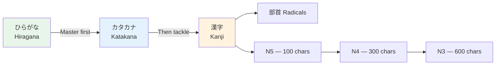

# Kanji — How Kanji Work

> **Kanji 漢字 , literally "Chinese characters" are the content-bearing backbone of written Japanese.**

## 🎯 Intuition

**The Core Idea:** Kanji are Chinese-origin characters that carry meaning — each one is a compact idea.
**Analogy:** Like how the dollar sign means dollar without spelling it out — kanji pack meaning into a single visual symbol.
**Why It Matters:** Kanji eliminate ambiguity in Japanese text where many words sound the same.

## ⚙️ Core Mechanics

Kanji (漢字 ![[kanjiwork-001-kanji.mp3]], literally "Chinese characters") are the content-bearing backbone of written Japanese.

## Structure of a Kanji

### Radicals (部首 ![[kanjiwork-002-bushu.mp3]] bushu)
Every kanji is built from smaller components called radicals. There are 214 traditional radicals.
- **Semantic radicals** hint at meaning: 水 ![[kanjiwork-003-mizu-kawa-umi.mp3]] (water) appears in 河 (river), 海 (sea), 波 (wave)
- **Phonetic components** hint at reading: 包 ![[kanjiwork-004-tsutsumi-awa-hou.mp3]] (hō) appears in 泡 (hō), 胞 (hō), 砲 (hō)
- Learn the 50 most common radicals first — they unlock pattern recognition
- **Deep dive:** [[Radicals — The Building Blocks]]

### Stroke Order
Kanji have a specific stroke order: top-to-bottom, left-to-right, outside-before-inside.

## Two Reading Systems

### On'yomi (音読み ![[kanjiwork-005-onyomi.mp3]]) — Chinese Reading
- Borrowed from Chinese pronunciation
- Usually used in **compound words** (two+ kanji together)
- Example: 山 ![[kanjiwork-006-yama-fujisan.mp3]] on'yomi = SAN → 富士山 (Fujisan)

### Kun'yomi (訓読み ![[kanjiwork-007-kunyomi.mp3]]) — Japanese Reading
- Native Japanese word assigned to the kanji
- Usually used when kanji stands alone or with hiragana
- Example: 山 ![[kanjiwork-008-yama-yama-wo-noboru.mp3]] kun'yomi = yama → 山を登る (yama o noboru)

### How to Know Which Reading

| Context | Reading | Example |
|---------|---------|---------|
| Kanji alone + hiragana ending | Kun'yomi | 食べる ![[kanjiwork-009-tabe-ru.mp3]] (taberu) |
| Two kanji compound | On'yomi | 食事 ![[kanjiwork-010-shokuji.mp3]] (shokuji) |
| Names | Either! | 山田 ![[kanjiwork-011-yamada.mp3]] = Yamada (kun) |
| Exceptions | Memorize | 今日 ![[kanjiwork-012-kyou.mp3]] = kyō (irregular) |

## Kanji Categories
1. **Pictographs (象形 ![[kanjiwork-013-shoukei-yama-kawa.mp3]]):** Direct pictures — 山 (mountain), 川 (river), 木 (tree)
2. **Ideographs (指事 ![[kanjiwork-014-shiji-ue-shita.mp3]]):** Abstract ideas — 上 (up), 下 (down), 中 (middle)
3. **Compound ideographs (会意 ![[kanjiwork-015-kaii-kyuu.mp3]]):** Combined meaning — 休 (person + tree = rest)
4. **Phono-semantic (形声 ![[kanjiwork-016-keisei.mp3]]):** Meaning radical + sound component — ~80% of all kanji

## Learning Strategy
See [[Kanji Learning Strategies]] for detailed approaches.

**The key insight:** Don't memorize kanji in isolation. Learn them as part of words, in context, with both readings.

## JLPT Kanji Progression

| Level | New Kanji | Cumulative | Key Milestone |
|-------|-----------|------------|---------------|
| N5 | ~100 | 100 | Basic signs, simple sentences |
| N4 | ~200 | 300 | Everyday written content |
| N3 | ~350 | 650 | Newspaper headlines |
| N2 | ~350 | 1,000 | Most written content |
| N1 | ~1,000 | 2,000 | Full literacy |

## Related Pages
- [[Kanji N5 Essentials]]
- [[Kanji N4 Essentials]]
- [[Kanji N3 Essentials]]
- [[Radicals — The Building Blocks]]
- [[Kanji Learning Strategies]]

## 🔬 Deep Dive

### Nuances and Exceptions
- Some characters have variant forms or readings that appear in names or classical texts.
- Context determines the correct reading — especially for kanji with multiple readings.

### Formal vs Informal Usage
- Most patterns have both polite and casual variants.
- Choose formality based on your relationship with the listener and the situation.

### Common Mistakes by English Speakers
- Transferring English pronunciation habits to Japanese sounds.
- Missing register differences that are critical in Japanese social contexts.
- Underestimating the importance of non-verbal communication.

## 🏋️ Practice

### Warm-Up — Recognition
1. How many basic hiragana characters are there? → (46)
2. What are dakuten? → (Two dots that voice consonants: か→が)
3. Which writing system is used for foreign words? → (Katakana)

### Core Exercises — Production
1. **Write in hiragana:** sakura → さくら | tokyo → とうきょう
2. **Write in katakana:** coffee → コーヒー | America → アメリカ

### Challenge — Real World
Write a short self-introduction using all three scripts: your name in katakana, a greeting in hiragana, and at least one common kanji (人, 大, 日).

## References
- [[Sources Index]]
