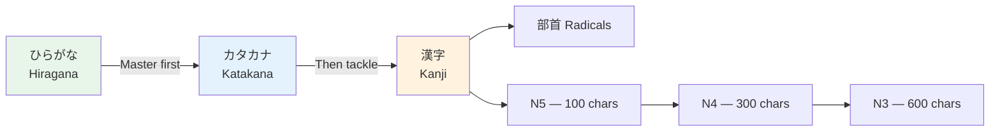

# Radicals — The Building Blocks

> **Radicals are the DNA of kanji. Learn the 50 most common and you'll recognize patterns in thousands of characters.**

## 🎯 Intuition

**The Core Idea:** Radicals are the building blocks inside kanji — learn these to decode any character.
**Analogy:** Like knowing Latin/Greek roots in English ('bio' = life, 'graph' = write) — radicals reveal kanji meaning.
**Why It Matters:** Recognizing radicals turns kanji from mysterious pictures into logical compositions.

## ⚙️ Core Mechanics

## What Are Radicals?
- Building blocks that make up every kanji
- 214 traditional radicals (Kangxi system)
- Each kanji has one "official" radical (used for dictionary lookup)
- Radicals often hint at meaning or category

## The 50 Most Important Radicals

### People and Body

| Radical | Name | Meaning | Found in |
|---------|------|---------|----------|
| 人 / 亻 ![[radical-001-nin-ninben.mp3]] | hito / ninben | person | 休 (rest), 体 (body), 作 (make) |
| 女 ![[radical-002-onna.mp3]] | onna | woman | 好 (like), 妹 (younger sister) |
| 子 ![[radical-003-ko.mp3]] | ko | child | 字 (character), 学 (study) |
| 口 ![[radical-004-kuchi.mp3]] | kuchi | mouth | 食 (eat), 味 (taste), 告 (tell) |
| 手 / 扌 ![[radical-005-te.mp3]] | te / tehen | hand | 持 (hold), 打 (hit), 押 (push) |
| 心 / 忄 ![[radical-006-kokoro.mp3]] | kokoro / risshinben | heart/mind | 思 (think), 急 (hurry), 情 (emotion) |
| 目 ![[radical-007-me.mp3]] | me | eye | 見 (see), 眠 (sleep) |

### Nature

| Radical | Name | Meaning | Found in |
|---------|------|---------|----------|
| 水 / 氵 ![[radical-008-mizu-sanzui.mp3]] | mizu / sanzui | water | 河 (river), 海 (sea), 泡 (bubble) |
| 火 / 灬 ![[radical-009-hi.mp3]] | hi / renga | fire | 熱 (heat), 照 (illuminate) |
| 木 ![[radical-010-ki.mp3]] | ki | tree/wood | 林 (grove), 森 (forest), 橋 (bridge) |
| 土 ![[radical-011-tsuchi.mp3]] | tsuchi | earth | 地 (ground), 場 (place) |
| 金 ![[radical-012-kin.mp3]] | kane | metal/gold | 鉄 (iron), 銀 (silver), 銅 (copper) |
| 日 ![[radical-013-nichi.mp3]] | hi/nichi | sun/day | 明 (bright), 時 (time), 暑 (hot) |
| 月 ![[radical-014-gatsu.mp3]] | tsuki | moon/month | 服 (clothes), 朝 (morning) |
| 雨 ![[radical-015-ame.mp3]] | ame | rain | 雪 (snow), 雲 (cloud), 電 (electricity) |
| 山 ![[radical-016-yama.mp3]] | yama | mountain | 岳 (peak), 島 (island) |

### Structures

| Radical | Name | Meaning | Found in |
|---------|------|---------|----------|
| 宀 ![[radical-017-ben.mp3]] | ukanmuri | roof | 安 (peace), 家 (house), 実 (truth) |
| 門 ![[radical-018-mon.mp3]] | mon/kado | gate | 間 (between), 開 (open), 関 (related) |
| 言 / 訁 ![[radical-019-gen.mp3]] | koto / gonben | speech | 話 (talk), 読 (read), 語 (language) |

## How to Use Radicals
1. **Pattern recognition:** See 氵 ![[radical-020-sanzui.mp3]] (sanzui)? The word relates to water/liquid
2. **Dictionary lookup:** Traditional kanji dictionaries are organized by radical
3. **Memory aid:** Break complex kanji into known radicals for mnemonics
4. **Example:** 休 ![[radical-021-kyuu-nin-ki.mp3]] = 人 (person) + 木 (tree) = person resting against a tree

## 🔬 Deep Dive

### Nuances and Exceptions
- Some characters have variant forms or readings that appear in names or classical texts.
- Context determines the correct reading — especially for kanji with multiple readings.

### Formal vs Informal Usage
- Most patterns have both polite (です/ます) and casual (dictionary form) variants.
- Choose formality based on your relationship with the listener and the situation.

### Common Mistakes by English Speakers
- Transferring English pronunciation habits to Japanese sounds.
- Missing register differences that are critical in Japanese social contexts.
- Underestimating the importance of non-verbal communication.

## 🏋️ Practice

### Warm-Up — Recognition
1. How many basic hiragana characters are there? → (46)
2. What are dakuten? → (Two dots that voice consonants: か→が)
3. Which writing system is used for foreign words? → (Katakana)

### Core Exercises — Production
1. **Write in hiragana:** sakura → さくら | tokyo → とうきょう
2. **Write in katakana:** coffee → コーヒー | America → アメリカ

### Challenge — Real World
Write a short self-introduction using all three scripts: your name in katakana, a greeting in hiragana, and at least one common kanji (人, 大, 日).

## References
- [[Japanese/Sources/Sources Index|Sources Index]]
