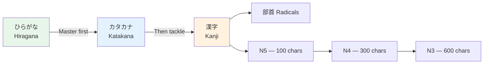

# Katakana Complete Guide

> **Katakana カタカナ  mirrors hiragana but is used for foreign words, onomatopoeia, emphasis, and scientific terms.**

## 🎯 Intuition

**The Core Idea:** Katakana is the phonetic alphabet for foreign words, sound effects, and emphasis — the twin of hiragana.
**Analogy:** Like CAPITAL LETTERS or italics in English — katakana stands out and signals foreign or special.
**Why It Matters:** You will see katakana on menus, in manga sound effects, and for any borrowed English words.

## How To Use This Page

Katakana is easy to recognize in a chart and hard to read quickly in the wild. Practice it with real loanwords from the start.

Use this page in three passes:

1. Learn the base chart by matching each katakana to its hiragana sound.
2. Drill confusing pairs: シ/ツ and ソ/ン.
3. Read common words aloud: コーヒー, タクシー, ホテル, スーパー.

## ⚙️ Core Mechanics

Katakana (カタカナ ![[kata-001-katakana.mp3]]) mirrors hiragana but is used for foreign words, onomatopoeia, emphasis, and scientific terms.

## Full Chart

| | a | i | u | e | o |
|--|---|---|---|---|---|
| - | ア ![[kata-002-a.mp3]] | イ ![[kata-003-i.mp3]] | ウ ![[kata-004-u.mp3]] | エ ![[kata-005-e.mp3]] | オ ![[kata-006-o.mp3]] |
| k | カ ![[kata-007-ka.mp3]] | キ ![[kata-008-ki.mp3]] | ク ![[kata-009-ku.mp3]] | ケ ![[kata-010-ke.mp3]] | コ ![[kata-011-ko.mp3]] |
| s | サ ![[kata-012-sa.mp3]] | シ ![[kata-013-shi.mp3]] | ス ![[kata-014-su.mp3]] | セ ![[kata-015-se.mp3]] | ソ ![[kata-016-so.mp3]] |
| t | タ ![[kata-017-ta.mp3]] | チ ![[kata-018-chi.mp3]] | ツ ![[kata-019-tsu.mp3]] | テ ![[kata-020-te.mp3]] | ト ![[kata-021-to.mp3]] |
| n | ナ ![[kata-022-na.mp3]] | ニ ![[kata-023-ni.mp3]] | ヌ ![[kata-024-nu.mp3]] | ネ ![[kata-025-ne.mp3]] | ノ ![[kata-026-no.mp3]] |
| h | ハ ![[kata-027-ha.mp3]] | ヒ ![[kata-028-hi.mp3]] | フ ![[kata-029-fu.mp3]] | ヘ ![[kata-030-he.mp3]] | ホ ![[kata-031-ho.mp3]] |
| m | マ ![[kata-032-ma.mp3]] | ミ ![[kata-033-mi.mp3]] | ム ![[kata-034-mu.mp3]] | メ ![[kata-035-me.mp3]] | モ ![[kata-036-mo.mp3]] |
| y | ヤ ![[kata-037-ya.mp3]] | - | ユ ![[kata-038-yu.mp3]] | - | ヨ ![[kata-039-yo.mp3]] |
| r | ラ ![[kata-040-ra.mp3]] | リ ![[kata-041-ri.mp3]] | ル ![[kata-042-ru.mp3]] | レ ![[kata-043-re.mp3]] | ロ ![[kata-044-ro.mp3]] |
| w | ワ ![[kata-045-wa.mp3]] | - | - | - | ヲ ![[kata-046-wo.mp3]] |
| n | ン ![[kata-047-n.mp3]] | | | | |

## When to Use Katakana
1. **Foreign loanwords:** コンピューター ![[kata-048-konpyuutaa.mp3]] (computer), ビール ![[kata-049-biiru.mp3]] (beer)
2. **Foreign names:** アメリカ ![[kata-050-amerika.mp3]] (America), マイケル ![[kata-051-maikeru.mp3]] (Michael)
3. **Onomatopoeia:** ワンワン ![[kata-052-wanwan.mp3]] (dog bark), ピカピカ ![[kata-053-pikapika.mp3]] (shiny)
4. **Emphasis:** Like CAPS or italics in English
5. **Scientific terms:** Plant/animal names in biology
6. **Company names:** Many modern companies use katakana

## Extended Katakana
Modern katakana adds sounds for foreign words:

| Katakana | Sound | Example |
|----------|-------|---------|
| ファ ![[kata-054-fa.mp3]] | fa | ファン ![[kata-055-fan.mp3]] (fan) |
| ティ ![[kata-056-ti.mp3]] | ti | パーティー ![[kata-057-paatii.mp3]] (party) |
| ディ ![[kata-058-di.mp3]] | di | ディズニー ![[kata-059-dizunii.mp3]] (Disney) |
| ウィ ![[kata-060-wi.mp3]] | wi | ウィンドウ ![[kata-061-windou.mp3]] (window) |
| ウェ ![[kata-062-we.mp3]] | we | ウェブ ![[kata-063-webu.mp3]] (web) |

## Special Rules
1. **Long vowels:** Use ー ![[kata-064-long-vowel-mark.mp3]] (dash) instead of doubling: コーヒー ![[kata-065-koohii.mp3]] (coffee)
2. **Double consonants:** Small ッ ![[kata-066-small-tsu.mp3]] before consonant: ベッド ![[kata-067-beddo.mp3]] (bed)
3. **Loan word adaptation:** English words adapted to Japanese phonology
   - "McDonald's" → マクドナルド ![[kata-068-makudonarudo.mp3]] (Makudonarudo)
   - "Smartphone" → スマートフォン ![[kata-069-sumaatofon.mp3]] (sumaatofon)

## Common Katakana Words

| Japanese | English | Category |
|----------|---------|----------|
| レストラン ![[kata-070-resutoran.mp3]] | Restaurant | Food |
| タクシー ![[kata-071-takushii.mp3]] | Taxi | Transport |
| ホテル ![[kata-072-hoteru.mp3]] | Hotel | Travel |
| インターネット ![[kata-073-intaanetto.mp3]] | Internet | Tech |
| アパート ![[kata-074-apaato.mp3]] | Apartment | Housing |
| スーパー ![[kata-075-suupaa.mp3]] | Supermarket | Shopping |
| アルバイト ![[kata-076-arubaito.mp3]] | Part-time job | Work |

## 🔊 Audio
- Practice reading katakana signs and menus
- Forvo.com for hearing how loan words are pronounced in Japanese

## Practice Tips
1. Read food packaging and signs (loaded with katakana)
2. Try converting English words to katakana yourself
3. Practice reading manga sound effects
4. Write your name in katakana

## Practice Ladder

### Recognition

1. Read one row at a time.
2. Pair each katakana with its hiragana sound: ア = あ, カ = か.
3. Drill シ/ツ and ソ/ン until the stroke direction feels obvious.
4. Read a menu or product label and circle every katakana word.

### Production

Write these in katakana:

| English | Katakana |
| --- | --- |
| coffee | コーヒー |
| taxi | タクシー |
| hotel | ホテル |
| supermarket | スーパー |
| internet | インターネット |

### Checkpoint

You are ready to move on when you can read common katakana words without converting each character back into hiragana first.

## Common Traps

- シ and ツ differ mainly by stroke direction and angle.
- ソ and ン are visually close; drill them as a pair.
- Katakana loanwords are Japanese words, not English pronounced with a Japanese accent. Learn the Japanese form as its own word.
- Long vowels usually use ー: コーヒー.

## References
- [[Sources Index]]
- [[chunk-jp-005]]
- [[chunk-jp-006]]
- [[chunk-jp-007]]
