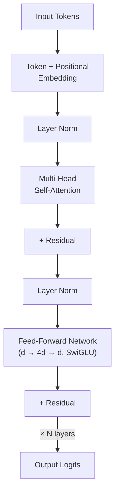

# Transformer Architecture

> **One-line summary** The transformer replaced recurrence with attention-based blocks, creating a scalable architecture that underlies modern large language models.

## 🎯 Intuition
**The Core Idea:** A transformer builds sequence representations by stacking attention and feed-forward blocks instead of processing tokens one step at a time.
**Analogy:** It is like a parallel assembly line rather than an RNN's conveyor belt: many parts of the sequence are processed together, with attention routing information wherever it is needed.
**Why It Matters:** The transformer is the neural network architecture behind all modern large language models. Introduced in "Attention Is All You Need" (Vaswani et al. 2017), it replaced recurrent networks with pure attention mechanisms, enabling massive parallelization and scaling to hundreds of billions of parameters. Its flexibility across encoder-only, decoder-only, and encoder-decoder variants made the scaling era possible.

---

## ⚙️ Core Mechanics
### How It Works
- The original transformer follows an encoder-decoder design.
- The encoder processes the input sequence through N identical layers, each containing multi-head self-attention followed by a position-wise feed-forward network (FFN).
- The decoder is similar but adds cross-attention to the encoder output and uses causal masking to prevent attending to future tokens.
- Each sub-layer, whether attention or FFN, is wrapped with a residual connection and layer normalization.

**Figure:** Decoder-only transformer block (pre-norm) — the dominant architecture in modern LLMs (GPT, LLaMA). Each layer applies attention then FFN, with residual connections throughout.

- In the original paper this used the post-norm arrangement: output = LayerNorm(x + Sublayer(x)).
- Modern LLMs typically use pre-norm, where normalization happens before the sub-layer, because this improves training stability at large scale.
- The feed-forward network in each layer is typically a two-layer MLP with a hidden dimension 4× the model dimension, using a nonlinearity like ReLU or, in modern models, SwiGLU.
- The FFN is where most of the model's parameters reside and is thought to store factual knowledge.
- **Encoder block**: self-attention → add & norm → FFN → add & norm
- **Decoder block**: causal self-attention → add & norm → cross-attention → add & norm → FFN → add & norm
- **Residual connections**: enable gradient flow through deep networks
- **Layer normalization**: Pre-norm (modern) vs post-norm (original); RMSNorm replacing LayerNorm in recent models
- **FFN**: typically d_model → 4×d_model → d_model, with SwiGLU activation in modern models
- **Parameter count**: ~12 × L × d² for an L-layer model (attention + FFN)
- **Modern decoder-only**: drop encoder entirely, use only causal decoder stack (GPT, LLaMA)

### Key Specifications

| Aspect | Pre-Norm | Post-Norm |
|--------|----------|-----------|
| Formula | x + Sublayer(Norm(x)) | Norm(x + Sublayer(x)) |
| Training stability | Better at scale | Can be unstable |
| Used by | LLaMA, GPT-3+, most modern LLMs | Original transformer, early BERT |

### Key Facts
- The original transformer is an encoder-decoder architecture.
- Residual connections and normalization are central to stable deep stacking.
- Most parameters live in the FFN rather than in the attention mechanism.
- Modern LLMs usually use decoder-only stacks derived from the original design.

---

## 🔬 Deep Dive
### Technical Details
The encoder processes the input sequence through N identical layers, each consisting of multi-head self-attention and a position-wise feed-forward network. The decoder mirrors this structure but adds cross-attention to encoder outputs and applies causal masking so future tokens cannot be attended to during generation. In the original transformer, each sub-layer is wrapped as:

output = LayerNorm(x + Sublayer(x))

This post-norm arrangement was used in the original paper, but modern large-scale models generally prefer pre-norm, expressed as x + Sublayer(Norm(x)), because it improves training stability. Recent models often replace LayerNorm with RMSNorm. The FFN is typically a two-layer MLP with shape d_model → 4×d_model → d_model, using ReLU in the original era and often SwiGLU in modern models. This component holds most of the model's parameters and is often viewed as the main store of factual knowledge. A rough parameter-count heuristic is ~12 × L × d² for an L-layer model when accounting for both attention and FFN contributions. Modern decoder-only models, including GPT and LLaMA, drop the encoder entirely and retain only the causal decoder stack.

### Limitations and Criticisms
- The original post-norm arrangement can be unstable at large scale compared with pre-norm alternatives.
- Standard transformer blocks inherit attention's scaling and memory bottlenecks on long sequences.
- The architecture is versatile, but full encoder-decoder stacks are often more expensive than decoder-only variants for general-purpose language modeling.

### Impact and Legacy
The transformer made large-scale modern AI training feasible because, unlike RNNs, it can be fully parallelized across sequence positions during training. Its modularity produced encoder-only, decoder-only, and encoder-decoder families, each of which became dominant in different application settings. The architecture's predictable scaling with more parameters, data, and compute drove the investment and engineering effort behind today's frontier models.

---

## 🏋️ Practice
### Warm-Up (5 min)
1. What are the two main sub-layers inside a standard transformer block?
2. Why do modern LLMs usually prefer pre-norm over post-norm?
3. Why is the FFN often said to hold most of the model's parameters?

### Core Problems
1. Compare an encoder block and a decoder block, identifying exactly where causal masking and cross-attention appear.
2. For a transformer with L layers and model width d, use the ~12 × L × d² heuristic to estimate parameter growth and explain which components dominate the total.

### Challenge
1. Analyze why decoder-only transformers became dominant for modern LLMs even though the original transformer was encoder-decoder, and identify which trade-offs drove that shift.

---

*See also:* [[LLM/Architecture Variants/Decoder-Only Models|Decoder-Only Models]] — the dominant variant in modern LLMs; [[LLM/Architecture Variants/State Space Models and Mamba|Mamba]] — the leading non-transformer alternative

## Supporting Chunks
### Supporting Chunks
- [[LLM/_chunks/chunk-llm-001 Scaled Dot-Product Attention Formula|Scaled dot-product attention formula]]
- [[LLM/_chunks/chunk-llm-002 Multi-Head Attention Parallel Projections|Multi-head attention parallel projections]]
- [[LLM/_chunks/chunk-llm-003 Positional Encoding for Permutation-Invariant Attention|Positional encoding for permutation-invariant attention]]
- [[LLM/_chunks/chunk-llm-004 Residual Connections and Layer Normalization|Residual connections and layer normalization]]
- [[LLM/_chunks/chunk-llm-035 LLaMA Architecture Choices Became Standard|LLaMA architecture choices became standard]]
- [[LLM/_chunks/chunk-llm-161 LayerNorm Normalizes Across Features Not Batch|LayerNorm normalizes across features]]
- [[LLM/_chunks/chunk-llm-163 Pre-LN vs Post-LN Placement Affects Training Stability|Pre-LN vs post-LN placement]]
- [[LLM/_chunks/chunk-llm-164 LayerNorm Is a Core Transformer Building Block|LayerNorm as a core transformer building block]]

## References
- [[LLM/_raw/raw-llm-001 Attention Is All You Need|raw-llm-001 Attention Is All You Need]]
- [[LLM/_raw/raw-llm-009 LLaMA Open Foundation Language Models|raw-llm-009 LLaMA Open Foundation Language Models]]
- [[LLM/_raw/raw-llm-041 Layer Normalization|raw-llm-041 Layer Normalization]]
- [[LLM/Sources/Sources Index]]
