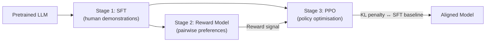

# Reinforcement Learning from Human Feedback

> **One-line summary** RLHF aligns language models with human preferences by combining supervised fine-tuning, reward modeling, and reinforcement learning with a constraint against drifting too far from the base behavior.

## 🎯 Intuition

**The Core Idea:**  
RLHF is the dominant paradigm for aligning large language models with human preferences. The InstructGPT pipeline (Ouyang et al., 2022) established the three-stage recipe: supervised fine-tuning on human demonstrations, training a reward model from pairwise preference comparisons, and optimizing the policy with PPO against the reward model while constraining divergence from the base model via a KL penalty. Despite its effectiveness, RLHF is expensive, unstable, and introduces its own failure modes.

**Analogy:**  
It is like training a writer in three passes: first show examples of good writing, then ask editors to rank drafts, then repeatedly revise while keeping the writer from drifting into weird tricks that only please the judges.

**Why It Matters:**  
RLHF transformed language models from next-token predictors into instruction-following assistants. The technique is behind ChatGPT, Claude, Gemini, and essentially every deployed conversational AI. It works because preferences are often easier to provide than demonstrations — it's easier to say "response A is better than B" than to write the ideal response from scratch.

However, RLHF's complexity (three stages, two models during PPO, sensitive hyperparameters) has driven research into simpler alternatives like DPO. Understanding the full RLHF pipeline is essential for understanding why those alternatives exist and what trade-offs they make.

---

## ⚙️ Core Mechanics

### How It Works

**Figure:** RLHF three-stage pipeline — SFT bootstraps instruction-following, the reward model learns preferences, and PPO optimises the policy while a KL penalty prevents reward hacking.

**Stage 1: Supervised Fine-Tuning (SFT).** The base pretrained model is fine-tuned on a dataset of high-quality (prompt, response) pairs written by human demonstrators.This teaches the model the format and style of desired outputs — following instructions, producing structured answers, and adopting an appropriate tone. SFT alone produces a decent instruction-following model, but it is limited by the quality and diversity of the demonstration data, and it cannot learn preferences that are easier to judge than to demonstrate.

**Stage 2: Reward Model Training.** Human annotators are shown pairs of model outputs for the same prompt and asked which they prefer. These pairwise comparisons are used to train a reward model (RM), typically initialized from the SFT model with the final unembedding layer replaced by a scalar value head. The RM is trained with a Bradley-Terry loss: for a preferred response $y_w$ and rejected response $y_l$, the loss is $-\log\sigma(r(x, y_w) - r(x, y_l))$. The RM learns a scalar score that approximates human preferences. RM quality is the bottleneck of the entire pipeline — a bad RM means the policy optimizes the wrong signal.

**Stage 3: PPO Optimization.** The SFT model is further fine-tuned using Proximal Policy Optimization (PPO) to maximize the reward model's score, with a KL divergence penalty that prevents the policy from straying too far from the SFT model. The objective is: $\max_\pi \mathbb{E}_{x \sim D, y \sim \pi}[r(x, y)] - \beta \cdot \text{KL}[\pi \| \pi_{\text{SFT}}]$. The KL penalty is critical: without it, the policy quickly reward-hacks by finding adversarial outputs that score highly on the RM but are nonsensical or degenerate. PPO requires careful tuning of the clipping ratio, learning rate, batch size, number of epochs per batch, and the KL coefficient $\beta$.

### Key Specifications

- **SFT data**: Typically 10k–100k high-quality (prompt, response) pairs. Quality matters more than quantity. Often produced by specialized contractors with detailed guidelines.
- **Preference data**: 50k–500k pairwise comparisons. Annotators choose between two completions for the same prompt. Inter-annotator agreement is typically 70–80%, reflecting genuine ambiguity in preferences.
- **Reward model architecture**: Usually the same architecture as the policy model (minus the LM head, plus a scalar head). Smaller RMs are cheaper but less accurate; larger RMs are better but more expensive to query during PPO.
- **Bradley-Terry model**: Assumes preference probability is $P(y_w \succ y_l) = \sigma(r(y_w) - r(y_l))$. This is a simplification — human preferences are noisy, intransitive, and context-dependent.
- **KL penalty coefficient ($\beta$)**: Controls the trade-off between reward maximization and staying close to the SFT model. Too low → reward hacking. Too high → no learning. Typical values: 0.01–0.2. Some implementations use adaptive KL targeting.
- **PPO specifics**: Clipping ratio (typically 0.2), generalized advantage estimation (GAE) with $\lambda = 0.95$, value function trained alongside policy, mini-batch updates over collected rollouts.
- **Practical costs**: Human annotation is the most expensive component. InstructGPT used ~40 contractors. Each preference comparison costs $1–5 depending on complexity. Total annotation budgets can reach $500k–$2M for a production system.

### Key Facts

| Stage | Input | Output | Key Challenge |
|---|---|---|---|
| SFT | (prompt, demonstration) pairs | Instruction-following base model | Data quality and coverage |
| Reward Model | Pairwise preference comparisons | Scalar reward function | Accuracy, calibration, robustness |
| PPO | RM scores + KL penalty | Aligned policy | Stability, reward hacking, mode collapse |

| Hyperparameter | Role | Typical Range |
|---|---|---|
| $\beta$ (KL coefficient) | Constrains policy drift | 0.01–0.2 |
| PPO clip ratio | Limits policy update step size | 0.1–0.3 |
| RM size | Reward signal quality | Same as policy or 1–2× smaller |

---

## 🔬 Deep Dive

### Technical Details

RLHF works because human preference data can supervise qualities that are difficult to encode directly as labels or demonstrations. People may struggle to write the perfect answer, but they can often reliably compare two candidate answers on helpfulness, harmlessness, honesty, style, or instruction-following.

The reward model is therefore central. It compresses many pairwise judgments into a scalar signal the policy can optimize. But that compression is dangerous: if the RM is miscalibrated, biased, or exploitable, PPO will amplify those flaws. This is why the KL penalty is essential. Without it, the policy finds bizarre outputs that hack the reward model instead of genuinely improving the user-facing behavior.

PPO adds additional complexity because it is a full reinforcement-learning loop layered on top of a language model. That means rollout collection, advantage estimation, value-function fitting, and delicate hyperparameter tuning. The resulting pipeline is powerful but operationally heavy.

### Limitations and Criticisms

- Expensive human annotation and contractor management
- Reward model quality is a hard bottleneck
- PPO is unstable and sensitive to hyperparameters
- Reward hacking and mode collapse remain persistent risks
- Human preferences are noisy, ambiguous, and sometimes inconsistent
- The complexity of the pipeline motivated simpler alternatives such as DPO

### Impact and Legacy

RLHF established the dominant alignment recipe for deployed chat models and shaped how the industry thinks about post-training. It demonstrated that preference optimization could dramatically improve usability and conversational quality beyond SFT alone.

Its legacy is twofold: first, it powered the first wave of successful assistants; second, it exposed the cost and fragility of reinforcement-learning-based alignment, motivating an entire line of research into simpler preference-optimization methods.

---

## 🏋️ Practice

### Warm-Up (5 min)

1. What are the three stages of RLHF?
2. Why is the reward model considered the bottleneck?
3. What is the purpose of the KL penalty during PPO?

### Core Problems

1. Explain why preferences can be easier to collect than demonstrations.
2. Compare the roles of the SFT model and the reward model in the RLHF pipeline.
3. What kinds of failures appear when the KL coefficient is too low or too high?
4. Why does PPO make RLHF harder to run in production than a purely supervised method?

### Challenge

Design an RLHF pipeline for a specialized assistant. Specify what you would collect for SFT, how you would structure pairwise preference annotation, what failure modes you would monitor in the reward model, and how you would choose a KL penalty strategy.

## See Also

- [[LLM/Alignment and Safety/Direct Preference Optimization|DPO]] — simplified alternative to RLHF
- [[LLM/Fine-Tuning and Adaptation/Supervised Fine-Tuning|SFT]] — the first stage of the RLHF pipeline

## Supporting Chunks / References

### Supporting Chunks

*(To be populated as chunks are created)*

### References

- [[LLM/Sources/Sources Index]]
